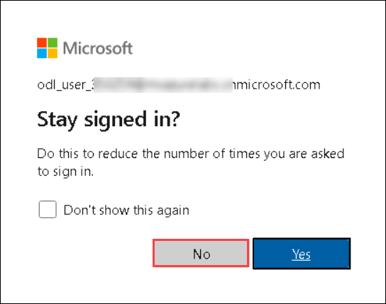
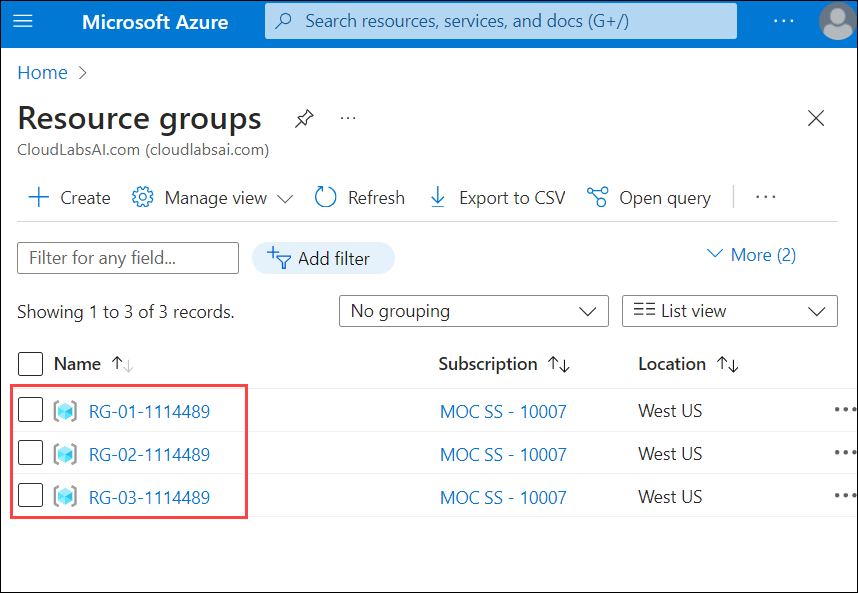
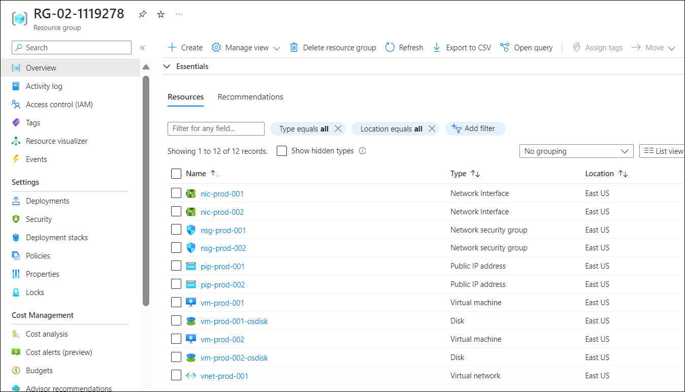
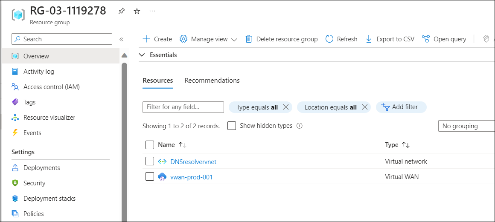

# Exercise 1: Getting Started with Azure 

## Overview

In this exercise, you will log in to the Azure Portal and review the pre-deployed resources that are part of the lab environment.

## Instructions

### Getting Started with Lab

1. Once the environment is provisioned, a virtual machine and lab guide will get loaded in your browser. Use this virtual machine throughout the workshop to perform the lab.

    

1. To get the lab environment details, you can select the **Environment Details** tab. Additionally, the credentials will also be emailed to your email address provided at registration.

    
    
1. You can also open the Lab Guide in a separate full window by selecting the **Split Window** icon at the bottom right corner.

     

## Task 1: Log in to Azure Portal and verify the pre-deployed resources

1. Let us start by logging into the Azure Portal to check the resources deployed for the lab environment. In the virtual machine (VM) on the left, click on the Azure portal desktop icon as shown below.

   
   
1. On the **Sign in to Microsoft Azure** window, you will see the login screen, enter the following username and click on **Next**.

   * Email/Username: <inject key="AzureAdUserEmail"></inject>

   

1. Now enter the following password and click on **Sign in**. 

   * Password: <inject key="AzureAdUserPassword"></inject>
   
   

1. First-time users are often prompted to **Stay Signed In**, if you see any such pop-up, click on **No**.

   

1. If you see the pop-up **You have free Azure Advisor recommendations!**, close the window to continue the lab.

1. If a **Welcome to Microsoft Azure** popup window appears, click **Maybe Later** to skip the tour.

1. Now you can see Azure Portal Dashboard, click on **Resource groups** from the Navigate panel to see the resource groups.

   

1. You should see this list of pre-deployed resource groups with resources that will be used in this lab:

     

   - RG1. Core network infrastructure related: virtual WAN and its related resources, VPN Gateway, Shared Services VNet, DNS Private resolver, Private DNS Zone, DNS forwarding ruleset.

      

   - RG2. Workload related: Spoke vNets, Spoke1-VM, Spoke2-VM, storage account etc.

      

   - RG3. On-premises related resources, vNets, Lab-VM (with DNS role and Telnet client enabled), DB-VM (with SQL express or MySQL) and Virtual Network Gateway

      
    
1. Now, click on **Next** from the lower right corner to move to the next page.

## Summary

In this exercise, you signed in to the Azure Portal and reviewed the pre-deployed resource groups.
