# Exercise 3: Provision Hybrid Connectivity

## Scenario 

Contoso, a global manufacturing company, is in the process of digitally transforming its operations. As part of this initiative, Contoso has decided to adopt a hybrid cloud strategy to leverage the benefits of both on-premises and cloud resources. The company needs to establish hybrid connectivity between its on-premises data center and the Microsoft Azure cloud to enable seamless data exchange, application deployment, and disaster recovery. 

## Overview

In this exercise, you will provision connectivity from on-premises to Azure via Site-to-Site VPN (S2S VPN), with static routing, and verify connectivity between on-premises and Azure. 

This lab will emulate an on-premises site using another separate VNet in Azure with a Virtual Network Gateway as the VPN device. 

## Solution Architecture

  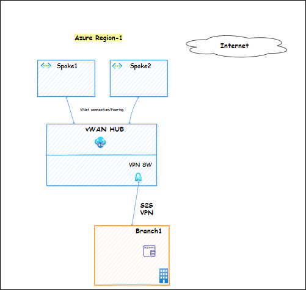
  
## Task 1: Configure Virtual WAN to connect to the on-premises environment.

1. In the search bar of the Azure portal, type **Public IP addresses  (1)**, then select **Public IP addresses  (2)** under **Services**.

   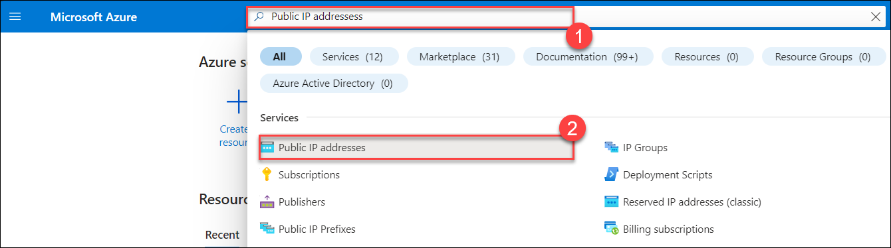

1. Select the Azure virtual network gateway public IP address **onprem-pip-vpn-gateway-001**.

     

1. On the right side of the overview pane view find the IP address and hover the right side of the **Public IP address** to copy to the clipboard or record it on notepad.

   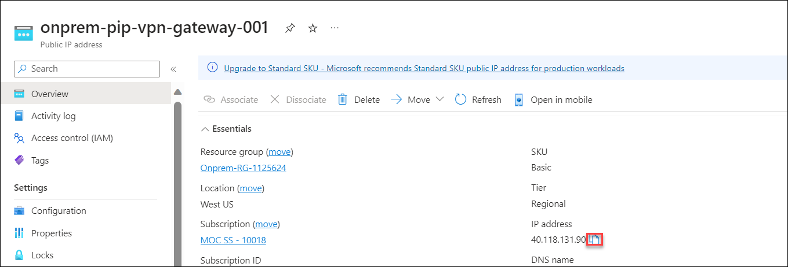

1. In the search bar of the Azure portal, type **Virtual WANs (1)**, then click on **Virtual WANs (2)** under **Services**.

      

1. On the **Virtual WANs** page, select **vwan-prod-001**.

    

1. On the **vwan-prod-001** Page, select **VPN sites (1)** under connectivity, then click on **Create site (2)**.

    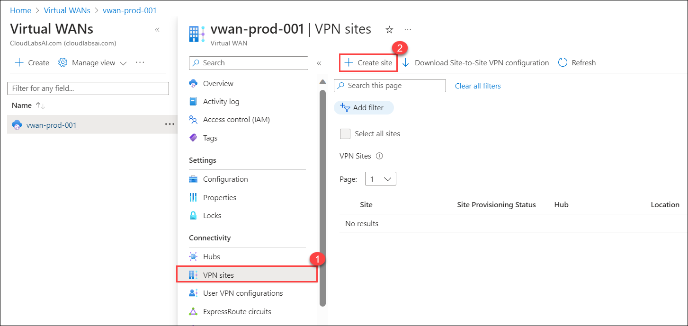

1. On the **Basics** page, fill in the following information:

   - **Subscription (1)**: Leave as it as **default** 
   - **Resource group (2)**: Select **Sharedservices-RG-<inject key="DeploymentID" enableCopy="false"/>**
   - **Region (3)**: Select **<inject key="Region" enableCopy="false"/>**
   - **Name (4)**: Enter **on-prem**
   - **Device vendor (5)**: Enter **generic**
   
      >**Note:** This is an informative field but does not have any effect on the configuration.
   
   - **Private address space (6)**: Enter On-prem vNet address space i.e. `10.1.0.0/16`
   -  Click on **Next : Links > (7)**

      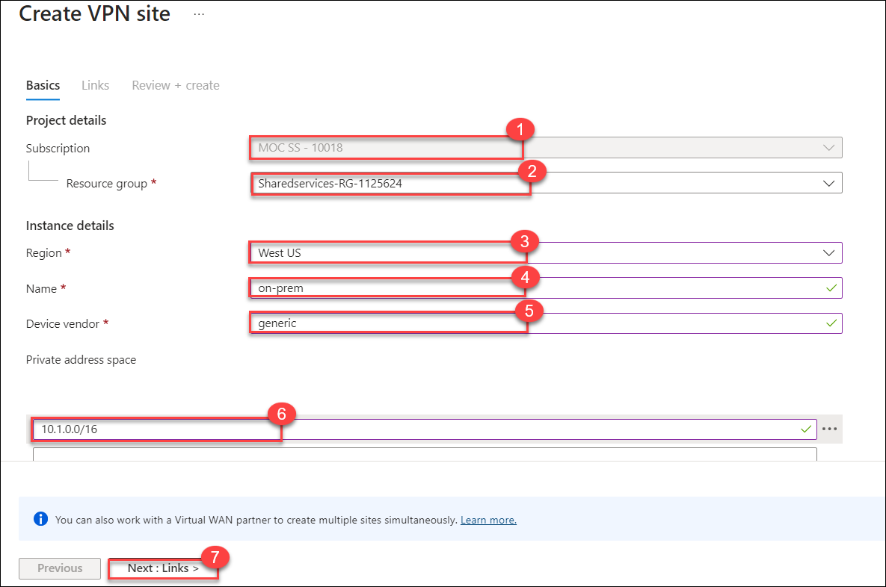

1. On the **Links** page, fill in the following information:
  
    - **Link name**: Enter **Onprem-ISP**
    - **Link speed**: Enter **1000**
    - **Link provider name**: Enter **ISP-provider**
    - **Link IP address/FQDN**: Enter **Public IP of onprem-pip-vpn-gateway-001** that you copied in step 3.
    - Click on **Next : Review + Create >**

      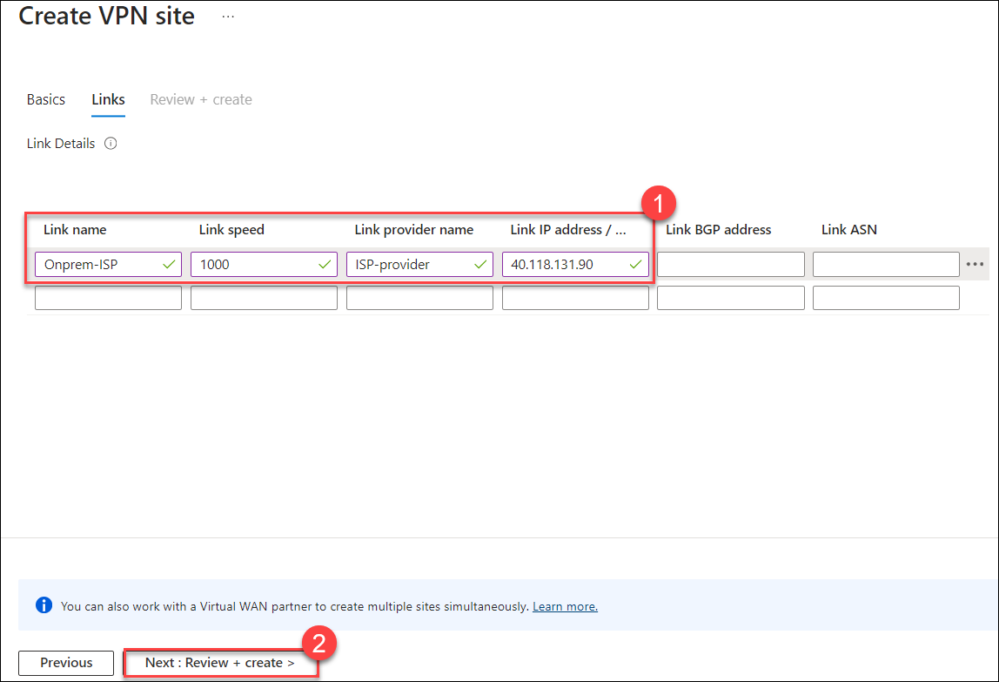

      >**Note:** These are an informative fields but does not have any effect to the configuration.
1. Review the configuration, and click the **Create**, and wait for the deployment to get succeed.

      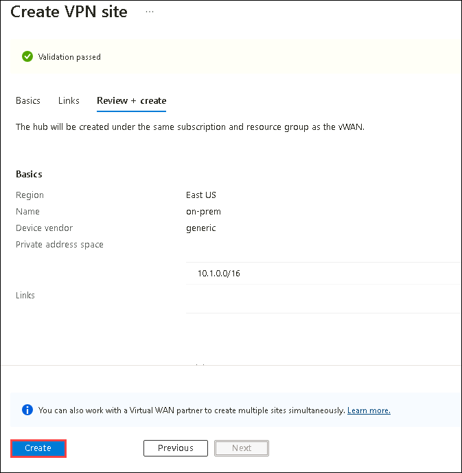

1. Go back to the **Basics** tab of **vwan-prod-001** page, select **Hubs (1)** under the **Connectivity** section from the left navigation pane and then click on **vwan-hub-prod-001 (2)**.

      

1. Select **VPN (Site to site) (1)** Under the hub, perform the following steps:

   - Click the **View/Configure (2)**. 
   - Under the Edit VPN Gateway, record in Notepad the **Public IP address for VPN Gateway instance 0 (3)**. This Public IP will be used in later on-premises VPN step configuration.
   - Click on **Cancel (4)**. 

      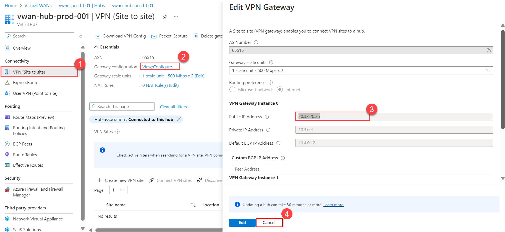

1. On the **VPN (Site to site)** Under Gateway configuration click on **Clear all filters**.

   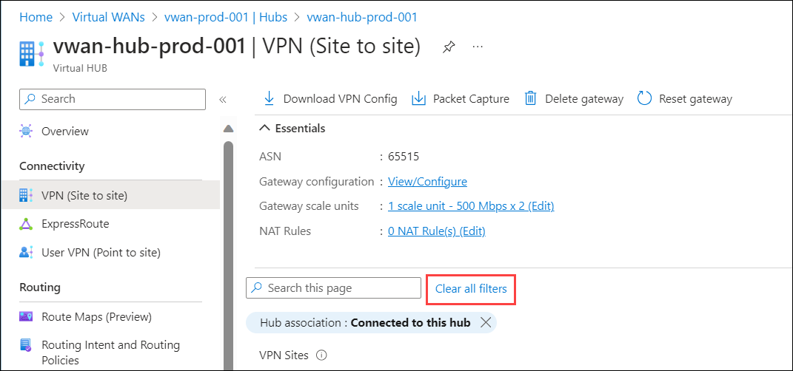

1. Select the VPN site **on-prem (1)** checkbox, then click on the **Connect VPN sites (2)**.

    

   >**Note:** If the page doesn't comeup as expected, then try to refresh the page, and after refreshing, perform step-13 again.

1. On the **Connect sites** Page, enter the following details.

- **Pre-shared key PSK (1)** : Enter **0123456789**

- Click on the **Connect (2)**. 

    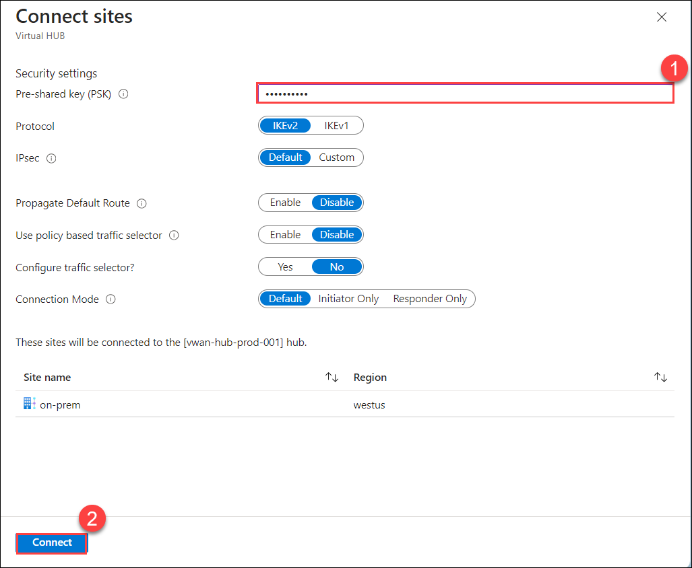

   >**Note**: You will use this same Pre-shared key PSK in a later step to complete the VPN connectivity from the on-premises VPN configuration. 

15. Wait for the Connection to be **completed**.

    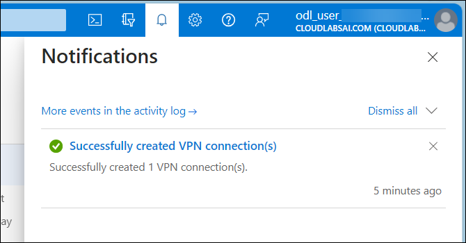

## Task 2: Configure the on-premises environment to connect to Azure.  
    
1. Navigate back to the Azure portal, in the search box, type **local network gateway (1)** and select **Local network gateways (2)** from the results.

     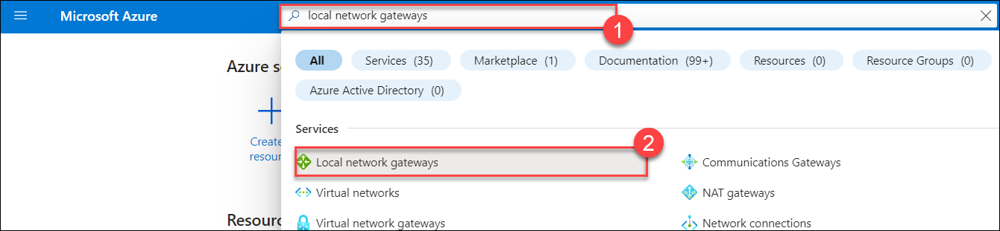

1. On the **Local network gateways** page, click on **+ Create**. 

    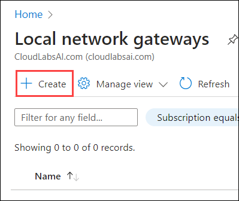

1. On the **Basics** page, fill in the following information:
   
   - **Subscription (1)**: Leave as it as **default** 
   - **Resource group (2)**: Select **Onprem-RG-<inject key="DeploymentID" enableCopy="false"/>**
   - **Region (3)**: Select **<inject key="Region" enableCopy="false"/>**
   - **Name (4)**: Enter **lng-azure-001**
   - **Endpoint (5)**: Select **IP address**
   - **IP address (6)**: Enter **Public IP address of VPN Gateway instance 0** 
   - **Address space (s) (7)**: Enter 
    
      - Address space of **vnet-spoke1-<inject key="DeploymentID" enableCopy="false"/> (10.2.0.0/16)**. 
      - Address space of **vnet-spoke2-<inject key="DeploymentID" enableCopy="false"/> (10.3.0.0/16)**.
      - Address space of **vwan-hub-prod-001 (10.4.0.0/16)**.
      - Address space of **vnet-shared-services-<inject key="DeploymentID" enableCopy="false"/> (10.5.0.0/16)**
   -  Click on **Review + create (8)**

      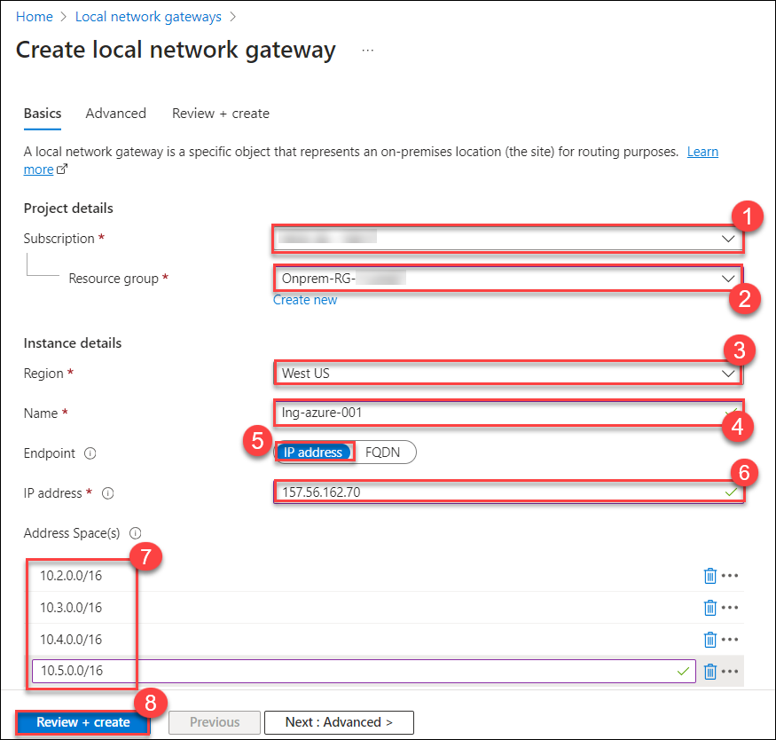

1. Review the configuration, and click the **Create**.

   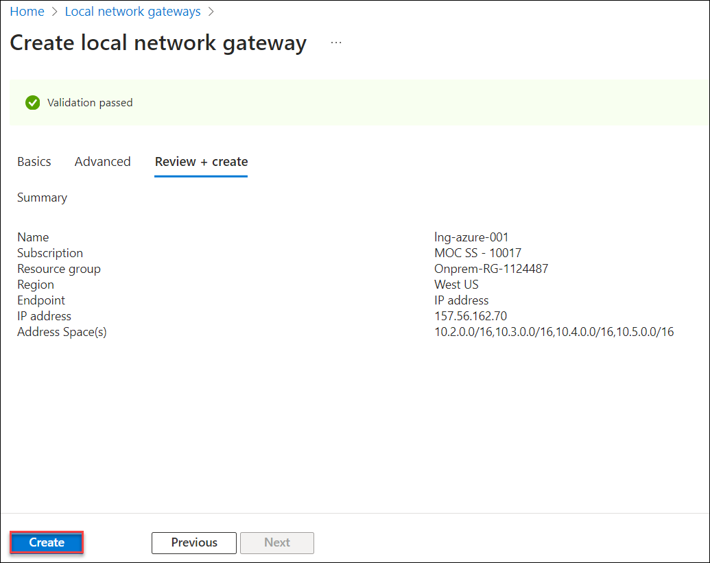

1. Monitor the deployment status on the **lng-azure-001** deployment overview page. In a minute or so, you should see a confirmation of the successful deployment and then click on **Go to the resource**. This action will redirect you to the resource overview page.

   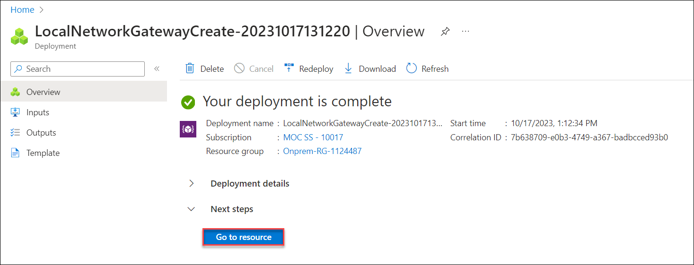
   
## Task 3. Create the VPN connection to on-premises.  

1. On the **lng-azure-001** page, select **Connections (1)** which is under **Settings** blade and click on **+ Add (2)**.

   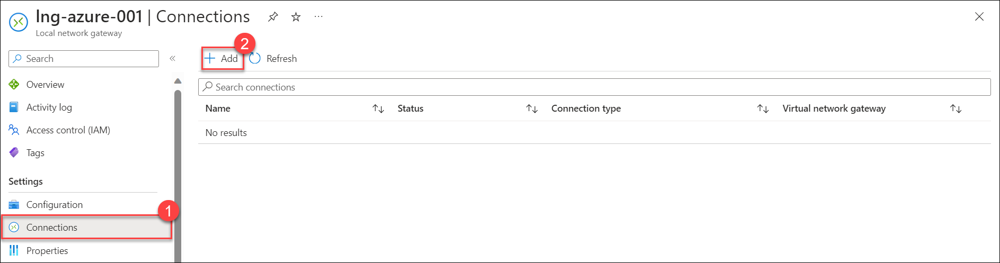

1. On the **Basics** tab, enter the following information:

   - **Subscription (1)**: Leave it as **default**
   - **Resource group (2)**: Select **Onprem-RG-<inject key="DeploymentID" enableCopy="false"/>** from the drop-down.
   - **Connection type (3)**: Select **Site-to-site (IPsec)** from the drop-down.
   - **Name (4)**: Enter **vpn-connection-azure-001**
   - **Region (5)**: Select **<inject key="Region" enableCopy="false"/>** from the drop-down.
   -  Click on **Next : Settings > (6)**   

      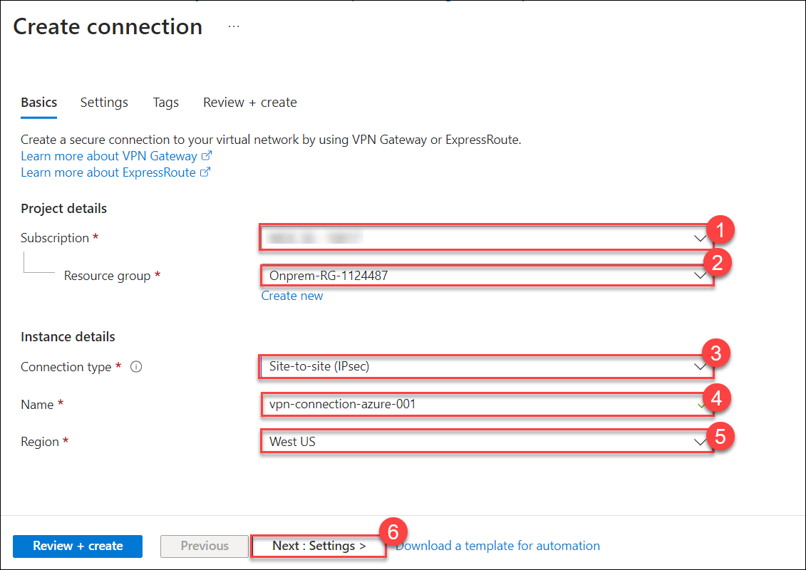

1. On the **Settings** tab, enter the following information:

   - **Virtual network gateway (1)**: Select **vpn-gateway-prod-001** from the drop-down.
   - **Local network gateway (2)**: Select **lng-azure-001** from the drop-down.
   - **Shared key(PSK) (3)**: Enter **0123456789**
   - Click on **Review + create (4)**

     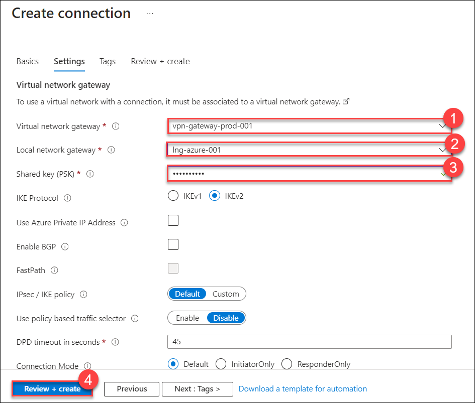
  
1. Review the configuration, and click on the **Create**.

   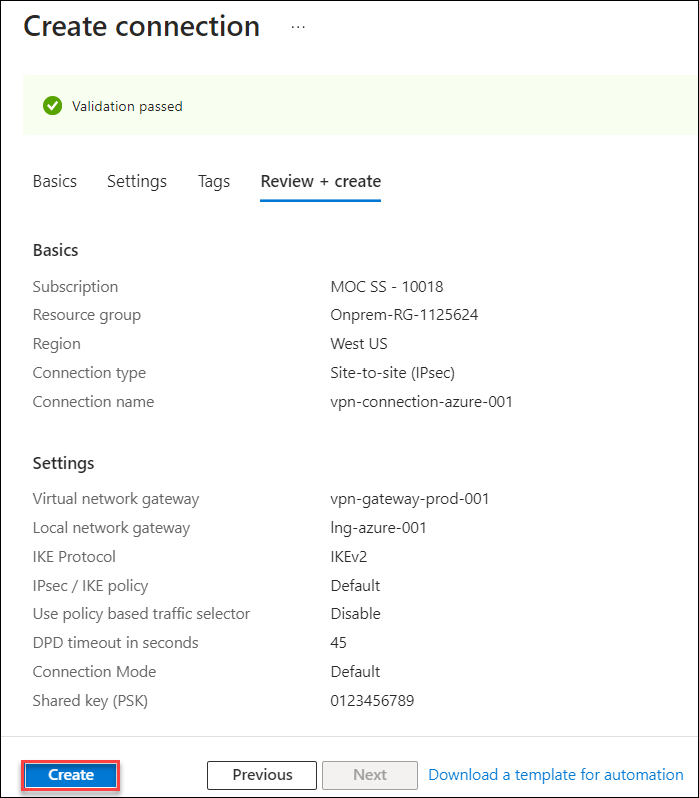

1. Wait for the Deployment to be **completed**.

   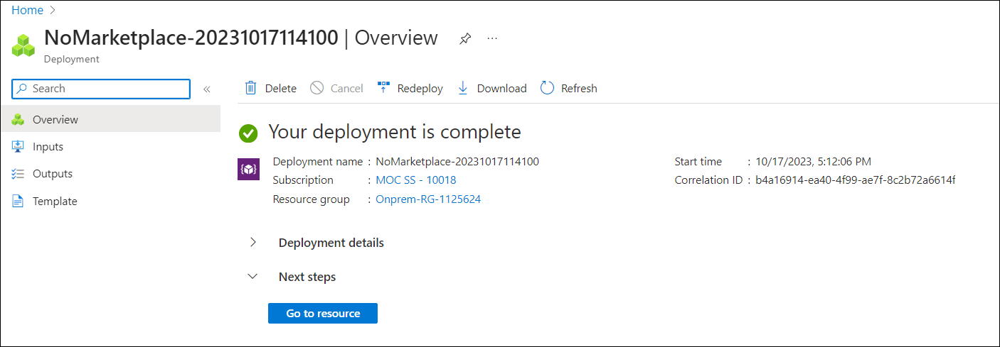

 ## Task 4. Validate Hybrid connectivity.  

1. From the Azure Portal, type **Virtual network gateway (1)** in the search box and select **Virtual network gateways (2)** from the results.

   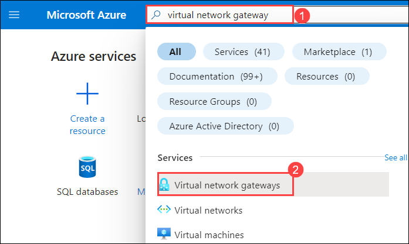
   
1. On the **Virtual network gateways** page, select **vpn-gateway-prod-001**.

   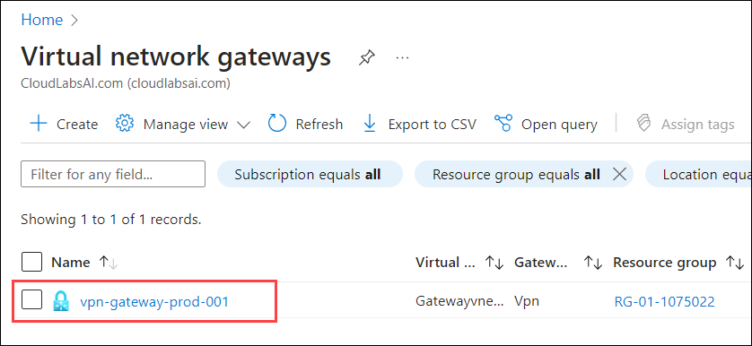

1. On the **vpn-gateway-prod-001** page, select **Connections (1)** review the vpn-connection-azure-001 shows **Connected (2)**. 
    
   

   >**Note**: This may take a few minutes to connect. Refresh the page if needed. 

1. Click on the **vpn-connection-azure-001** and review additional information, then close the connection. 

   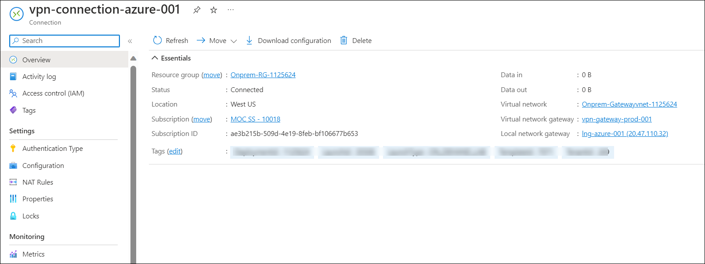

1. In the search bar of the Azure portal, type **Virtual WANs (1)**, then click on **Virtual WANs** under **Services**.

      

1. On the **Virtual WANs** page, select **vwan-prod-001**.

     

1. On the **Basics** tab of **vwan-prod-001** page, select **Hubs (1)** under the **Connectivity** section from the left navigation pane and then click on **vwan-hub-prod-001 (2)**.

      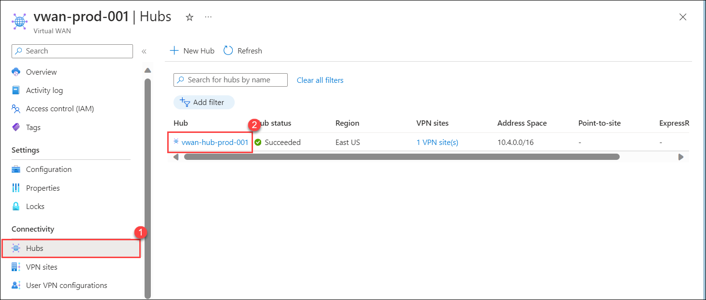

1. Under Connectivity select **VPN (Site to site) (1)**. Inspect the VPN Site is successfully **Connected (2)**. 
  
   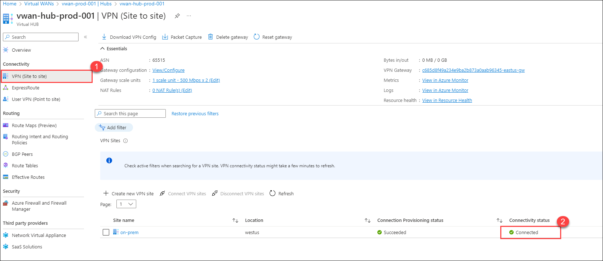

   >**Note**: VPN site may take some time to get connected,  Keep refreshing the page until the status changes to **Connected**.

## Summary:

In this exercise, you have covered the following:

- Created VPN and configured dynamic routing.
- Configured the on-premises environment to connect to Azure.
- Created the VPN connection to on-premises.
- Validated Hybrid connectivity.
  
