# Exercise 3: Provision Hybrid Connectivity

## Scenario 

Contoso, a global manufacturing company, is in the process of digitally transforming its operations. As part of this initiative, Contoso has decided to adopt a hybrid cloud strategy to leverage the benefits of both on-premises and cloud resources. The company needs to establish hybrid connectivity between its on-premises data center and the Microsoft Azure cloud to enable seamless data exchange, application deployment, and disaster recovery. 

## Overview

In this exercise, you will provision connectivity from on-premises to Azure via Site-to-Site VPN (S2S VPN), with static routing, and verify connectivity between on-premises and Azure. 

This lab will emulate an on-premises site using another separate VNet in Azure with a Virtual Network Gateway as the VPN device. 

## Task 1: Configure Virtual WAN to connect to the on-premises environment.

1. In the search bar of the Azure portal, type **Public IP addresses  (1)**, then select **Public IP addresses  (2)** under **Services**.

   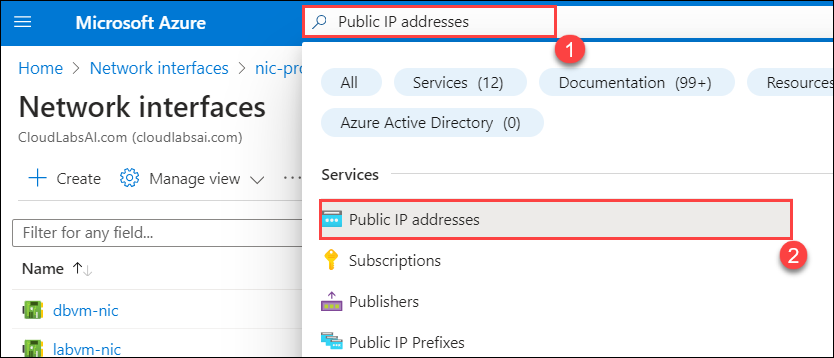

1. Select the Azure virtual network gateway public IP address **pip-vpn-gateway-001**.

     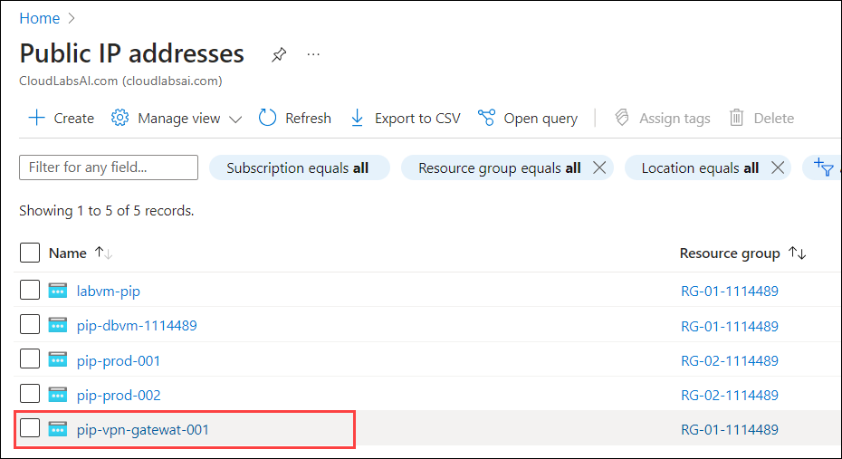

1. On the right side of the overview pane view find the IP address and hover the right side of the public IP to copy to the clipboard or record it on notepad.

   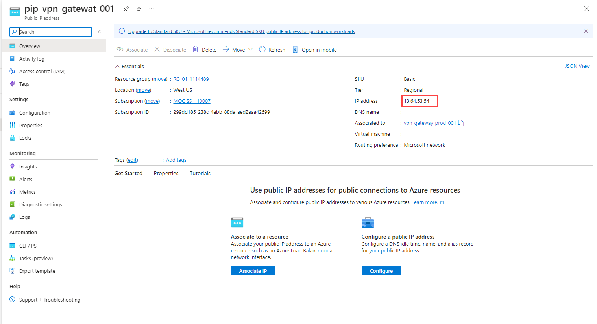

1. In the search bar of the Azure portal, type **Virtual wan (1)**, then click on **Virtual WANs (2)** under **Services**.

      

1. On the **Virtual WANs** page, select **vwan-prod-001**.

    

1. On the **vwan-prod-001** Page, select **VPN sites (1)** under connectivity, then click on **Create site (2)**.

    

1. On the **Basic** page, fill in the following information:

   - **Subscription (1)** : Leave as it as **default** 
   - **Resource group (2)** : Select **RG-03-<inject key="DeploymentID" enableCopy="false"/>**
   - **Region (3)** : Select **<inject key="Region" enableCopy="false"/>**
   - **Name (4)** : Enter **on-prem**
   - **Device vender (5)** : Enter **generic**
   - **Private address space (6)** : Enter **LabVM-<inject key="DeploymentID" enableCopy="false"/>** address space.
   -  Click on **Next : Links > (7)**

      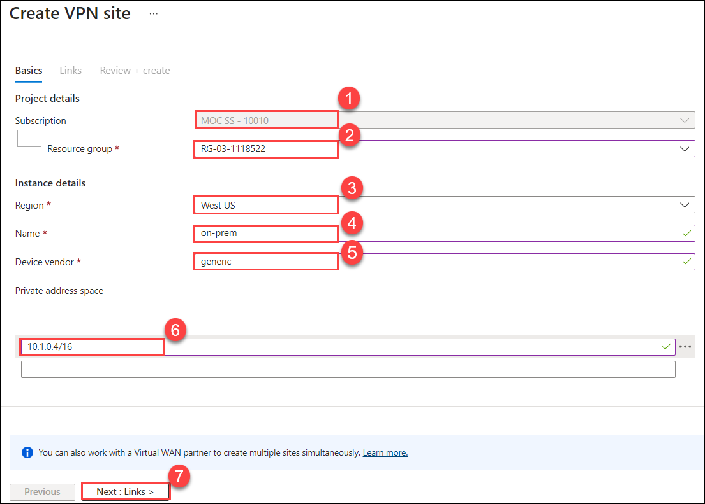

1. On the **Links** page, fill in the following information:
  
    - **Link name (1)** : Enter **Onprem-ISP**
    - **Link speed (2)**: Enter **1000**
    - **Link provider name (3)**: Enter **ISP-provider**
    - **Link IP address/FQDN (4)**: Enter **Public IP of on-prem VPN gateway**.
    - Click on **Next : Review + Create > (5)**

      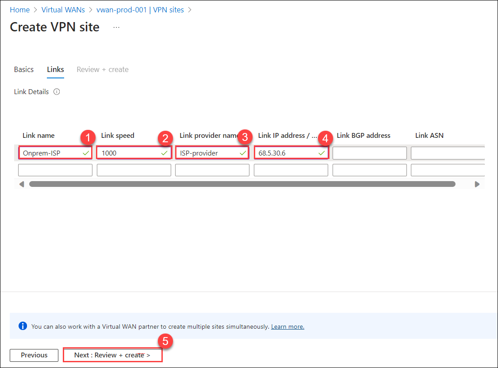

1. Review the configuration, and click the **Create**.

      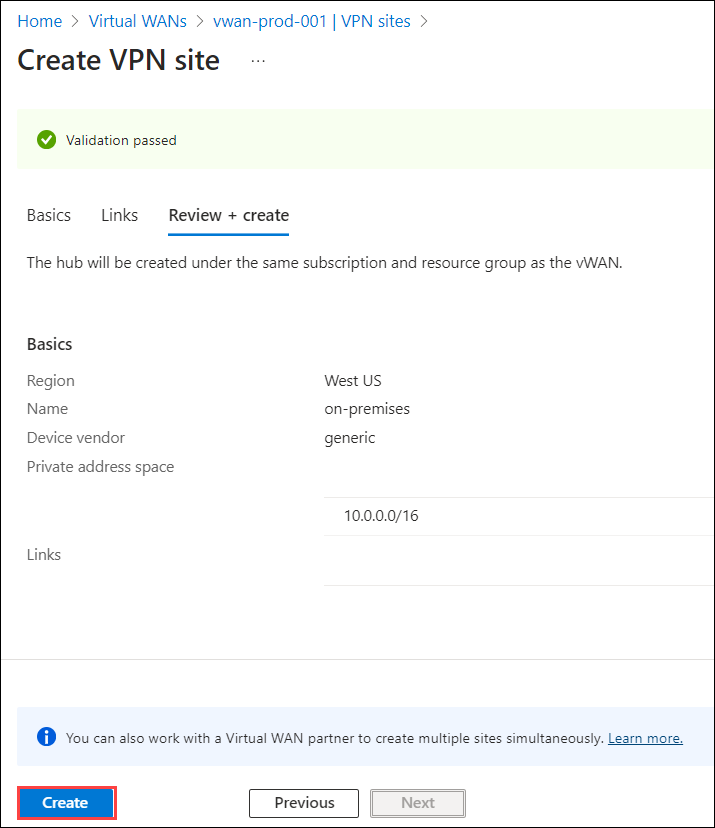

1. Go back to the **Basics** tab of **vwan-prod-001 | Hubs** page, select **Hubs (1)** under the **Connectivity** section from the left navigation pane and then click on **vwan-hub-prod-001 (2)**.

      

1. Select **VPN (site to site) (1)** Under Gateway configuration and Click on **Create VPN gateway (2)**.

      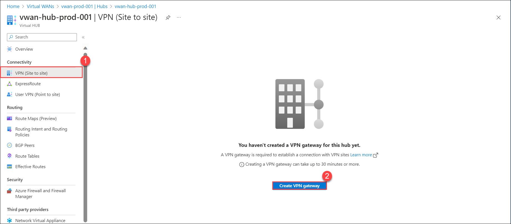

1. On the **Create VPN Gateway** page, perform the following steps:

   - **Gateway scale units (1)** : Select **1 scale unit - 500 Mbps x 2** from the drop-down.

   - **Routing preference (2)** : Select **Internet**

   - Click on **Create(3)**.

     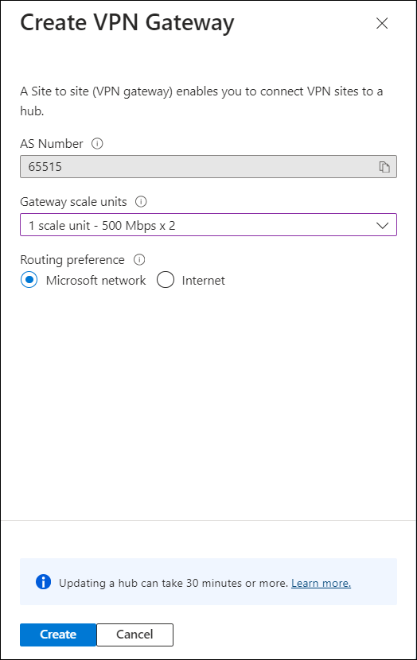

   >**Note** : This may take up-to 30 minutes for the update. wait for it to get update.

1. Under the hub, perform the following steps:

   - Click the **View/Configure hyperlink (1)**. 
   - Under the Edit VPN Gateway, record in Notepad the **Public IP address for VPN Gateway instance 0 (2)**. This Public IP will be used in later on-premises VPN step configuration.
   - Click on **cancel (3)**. 

      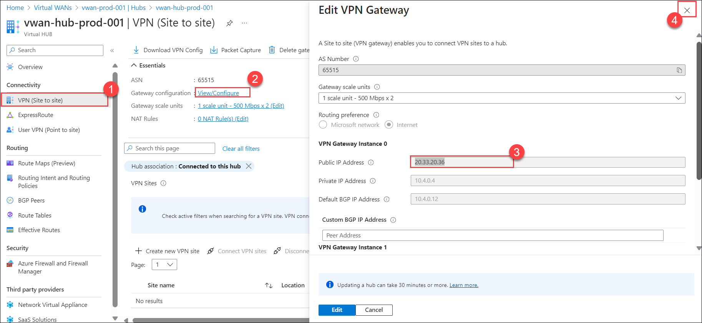

1. On the **VPN (site to site)** Under Gateway configuration click on **Clear all filters**.

   

1. Select the VPN site **on-premises (1)** then click on the **Connect VPN sites (2)**.

    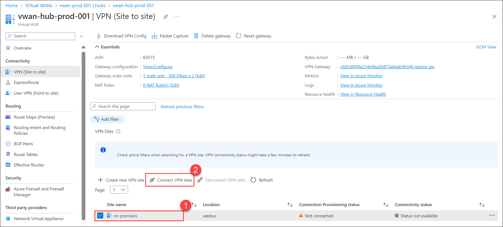

1. On the **Connect sites** Page, enter the following details.

- **Pre-shared key PSK (1)** : Enter **0123456789**

- Click on the **Connect (2)**. 

    

   >**Note**: Record Pre-shared key PSK in Notepad as you will be using it a step later to complete the VPN connectivity from the on-premises VPN configuration. 

1. Wait for the Connection to be **completed**.

    

## Task 2: Configure the on-premises environment to connect to Azure.  
    
1. Navigate back to the Azure portal, in the search box, type **Local Network gateway (1)** and select **Local Network gateway (2)** from results.

     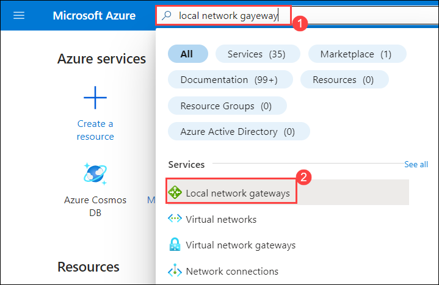

1. On the **Local network gateway** page, click on **Create**. 

    

1. On the **Basic** page, fill in the following information:
   
   - **Subscription (1)** : Leave as it as **default** 
   - **Resource group (2)** : Select **RG-01-<inject key="DeploymentID" enableCopy="false"/>**
   - **Region (3)** : Select **<inject key="Region" enableCopy="false"/>**
   - **Name (4)** : Enter **lng-prod-001**
   - **Endpoint (5)** : Select **IP address**
   - **IP address (6)** : Enter **Public IP address of VPN Gateway instance 0** 
   - **Address space (s) (7)** : Enter 
    
      - Address space of **vnet-prod-001 (10.2.0.0/16)**. 
      - Address space of **vnet-prod-002 (10.3.0.0/16)**.
      - Address space of **vwan-hub-prod-001 ( 10.4.0.0/16)**.
      - Address space of **DNSresolvervnet(10.5.0.0/16)**
   -  Click on **Review + create (8)**

      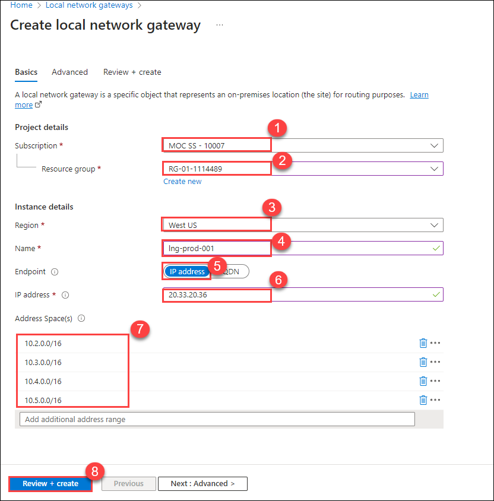

1. Review the configuration, and click the **Create**.
  
   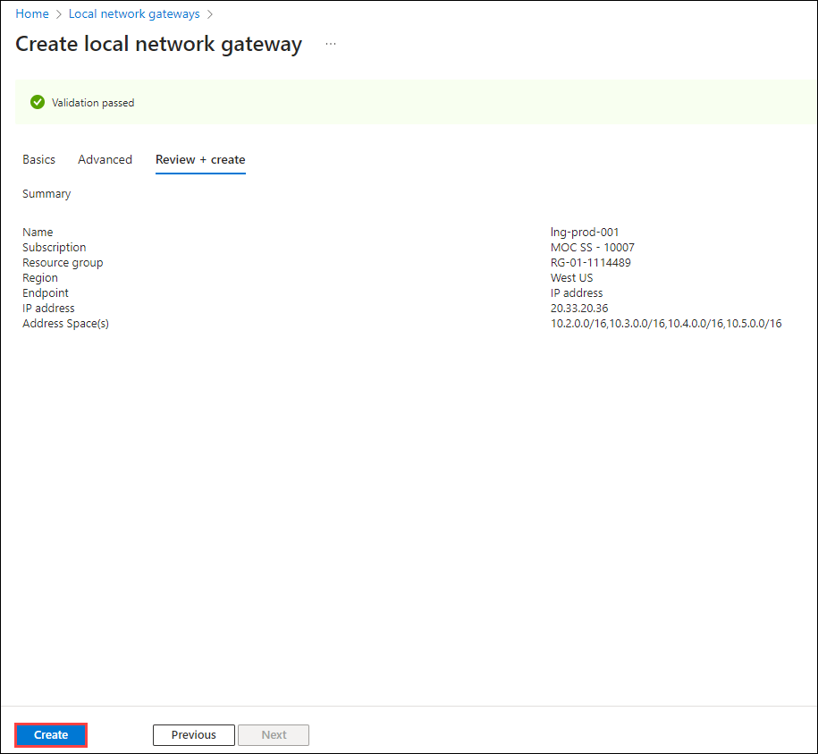

1. Monitor the deployment status on the **lng-prod-001** deployment overview page. In a minute or so, you should see a confirmation of the successful deployment and then click on Go to the resource. This action will redirect you to the resource overview page.

   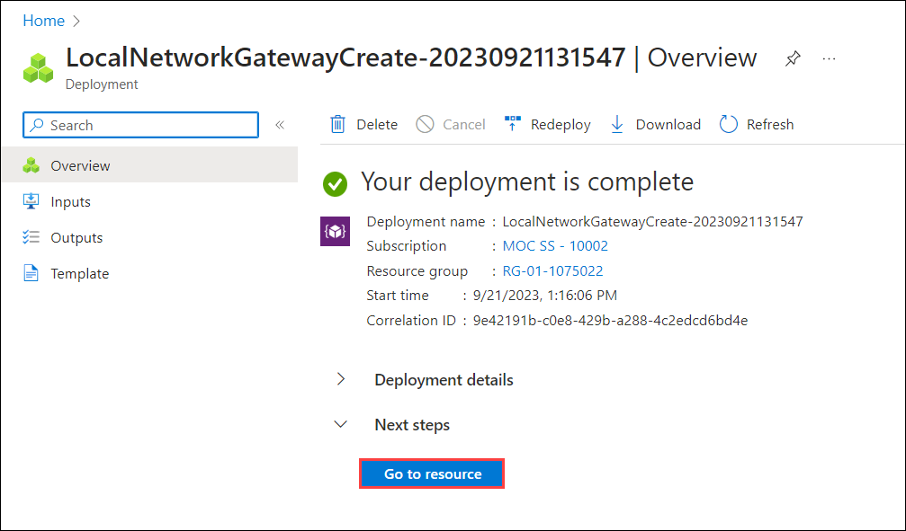

## Task 3. Create the VPN connection to on-premises.  

1. On the **lng-prod-001** page, select **Connections (1)** which is under **Settings** blade and click on **+Add (2)**.

   

1. On the **Basics** tab, enter the following information:

   - **Subscription (1)** : Leave it as **default**
   - **Resource group (2)** : Select **RG-01-<inject key="DeploymentID" enableCopy="false"/>** from the drop-down.
   - **Connection type (3)** : Select **Site-to-site (IPsec)** from the drop-down.
   - **Name (4)** : Enter **vpn-connection-001**
   - **Region (5)** : Select **<inject key="Region" enableCopy="false"/>** from the drop-down.
   -  Click on **Next : Settings > (6)**   

     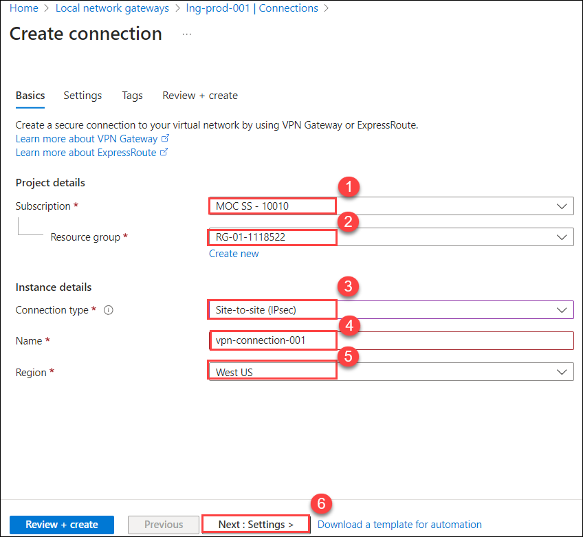

1. On the **Settings** tab, enter the following information:

   - **Virtual network gateway (1)** : Select **vpn-gateway-prod-001**
   - **Local network gateway (2)** : Select **lng-prod-001**
   - **Shared key(PSK) (3)** : Enter **0123456789**
   - Click on **Review + create (4)**

     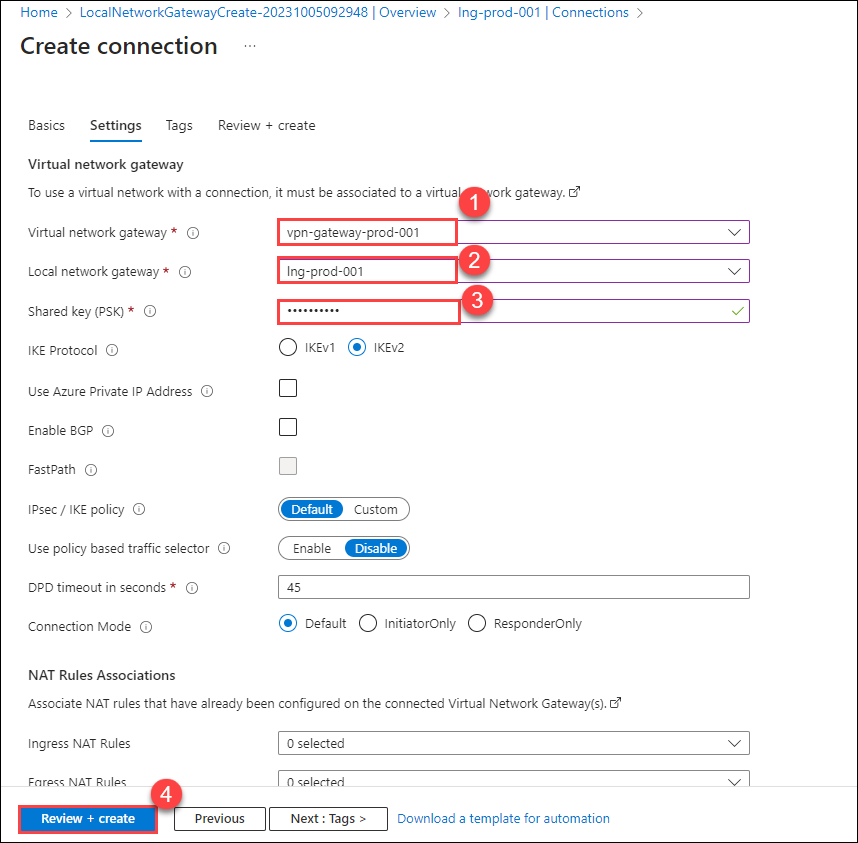
  
1. Review the configuration, click on the **Create**.
  
   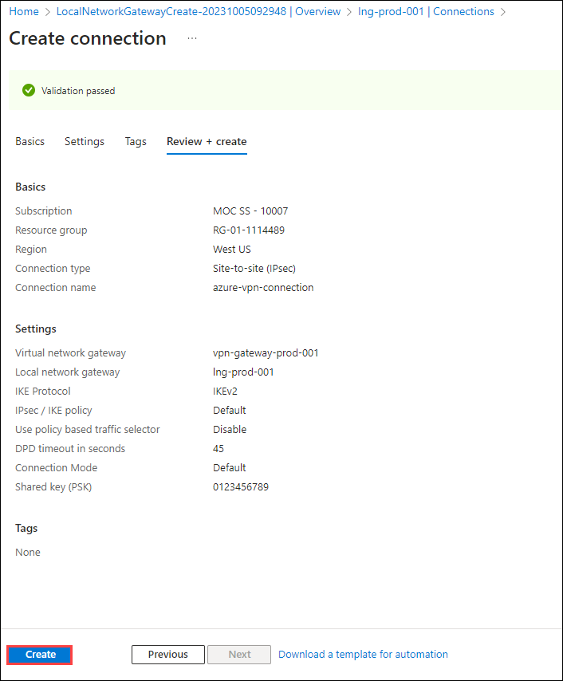

1. Wait for the Deployment to be **completed**.

    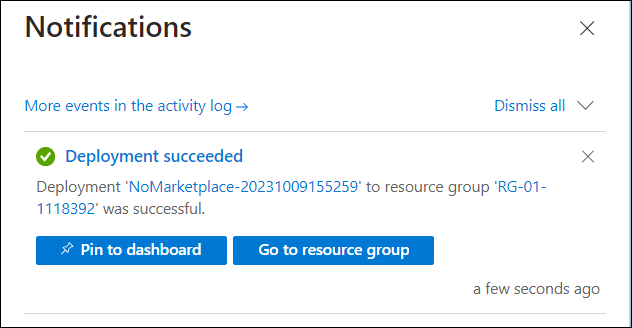

 ## Task 4. Validate Hybrid connectivity.  

1. From the Azure Portal, type **Virtual Network gateway (1)** in the search box and select **Virtual Network gateway (2)** from the results.

   
   
1. On the **Virtual network gateways** page, select **vpn-gateway-prod-001**.

   

1. On the **vpn-gateway-prod-001** page, select **Connections (1)** review the azure-vpn-connection shows **connected (2)**. 
    
   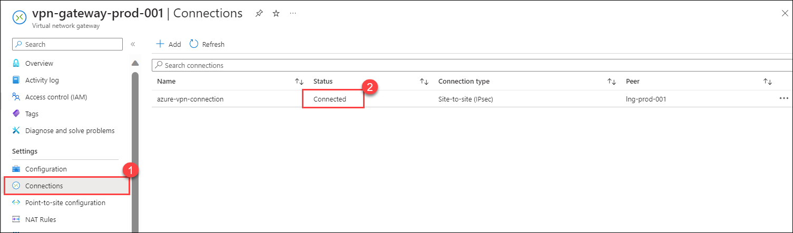

   **Note**: This may take a few minutes to Connect. Refresh the page if needed. 

1. Click on the **azure-vpn-connection** and review additional information, then close the connection. 

   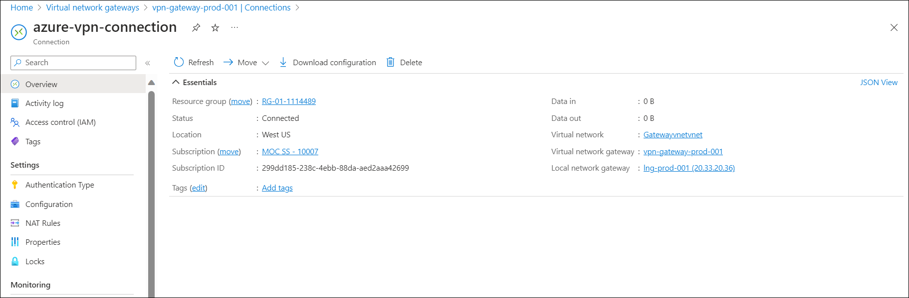

1. In the search bar of the Azure portal, type **Virtual wan (1)**, then click on **Virtual WANs** under **Services**.

      

1. On the **Virtual WANs** page, select **vwan-prod-001**.

     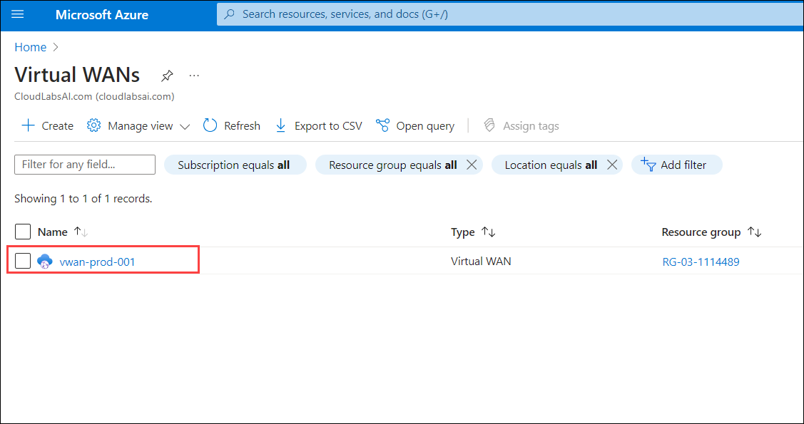

1. On the **Basics** tab of **vwan-prod-001 | Hubs** page, select **Hubs (1)** under the **Connectivity** section from the left navigation pane and then click on **vwan-hub-prod-001 (2)**.

      

1. Under Connectivity select **VPN (site to site) (1)**. Inspect the VPN Site is successfully **connected (2)**. 
  
   

   >**Note** : VPN site may take some time to get connected,  Keep refreshing the page until the status changed to **Connected**.

## Summary:

In this exercise, you have covered the following:

- Created VPN and configured dynamic routing.
- Configured the on-premises environment to connect to Azure.
- Created the VPN connection to on-premises.
- Validated Hybrid connectivity.
  
