# Exercise 4: Validate access to your application on Azure

## Scenario

Now that Contoso has their network ready, they want to host their Contoso Insurance application on a server that provides more control and flexibility over the computing environment. Contoso wants to provide their hosted application to internal users for testing.

## Overview

In this exercise, you will review the pre-deployed Virtual Machine on each spoke VNet, create network security group rules to allow required traffic and you will then test connectivity across your network.
​
## Task 1. Configure access from on-premises to the Spoke1 VNet. 

1. In the search bar of the Azure portal, type **Virtual machines (1)**, then select **Virtual machines (2)** from results.

   

1. From the **Virtual machines** page, select **vm-prod-001**.

     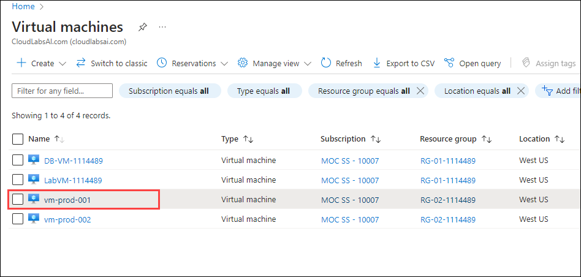

1. On the right side of the **overview** pane view find the IP address and hover the right side of the **public IP address** to copy to the clipboard or record it on notepad.

   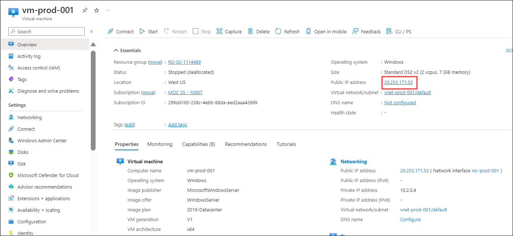

1. Go back to **Virtual machines** page and select **vm-prod-002**.

   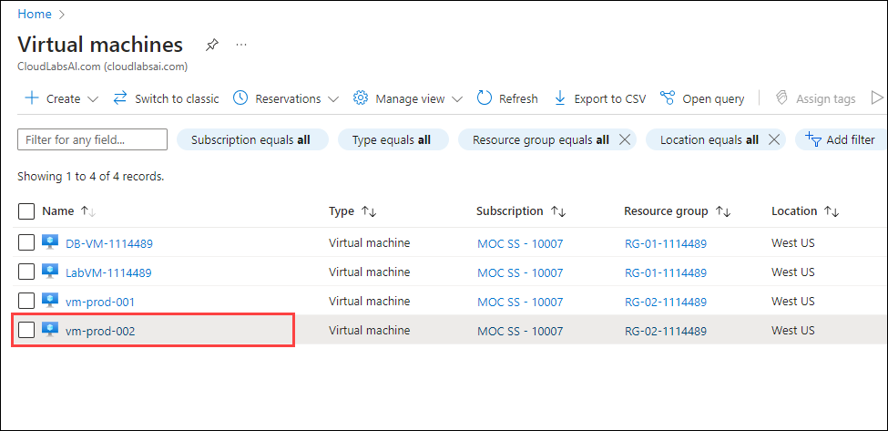

1. On the right side of the **overview** pane view find the IP address and hover the right side of the **public IP address** to copy to the clipboard or record it on notepad.

   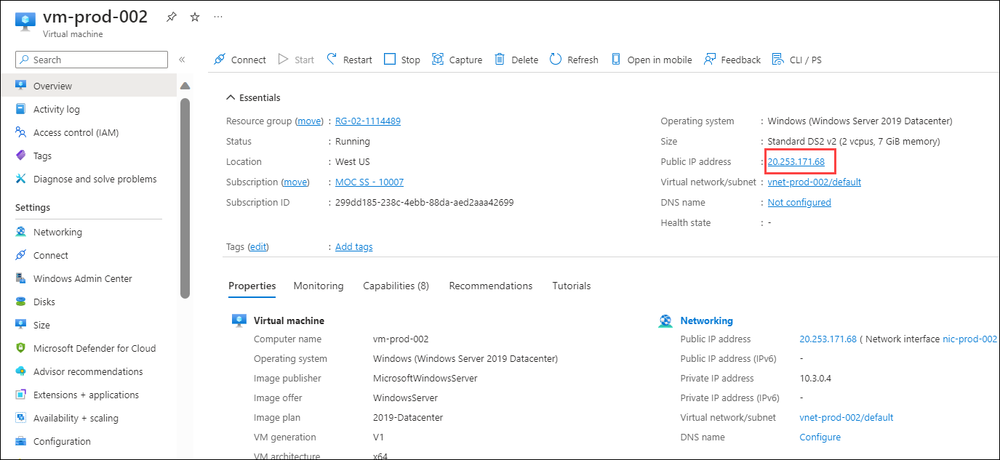

1. Go back to **Virtual machines** page, and select **LabVM-<inject key="DeploymentID" enableCopy="false"/>**.

   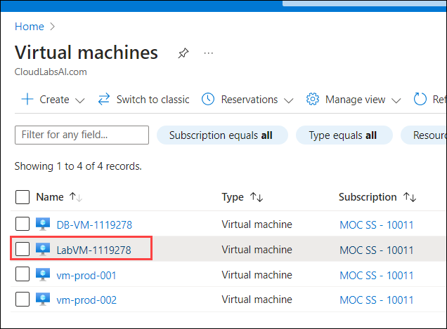

1. On the right side of the **overview** pane view find the IP address and hover the right side of the **public IP address** to copy to the clipboard or record it on notepad.

   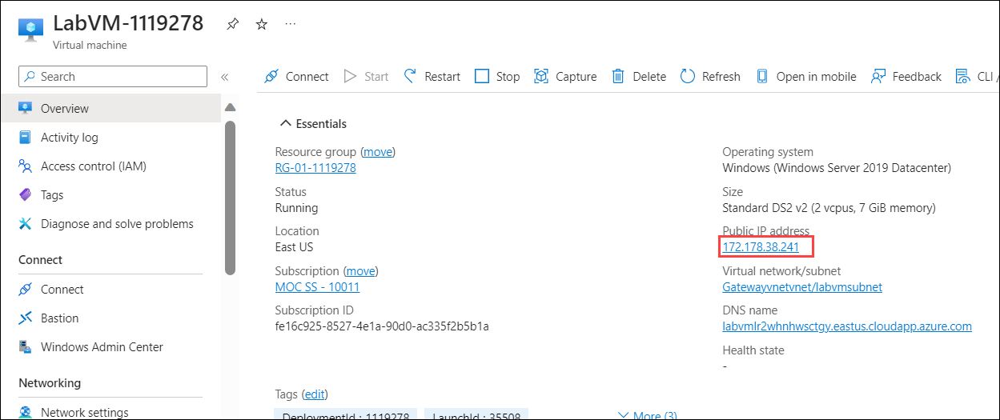

1. In the search bar of the Azure portal, type **Network Security Groups (1)**, then select **Network Security Groups (2)** from results.

   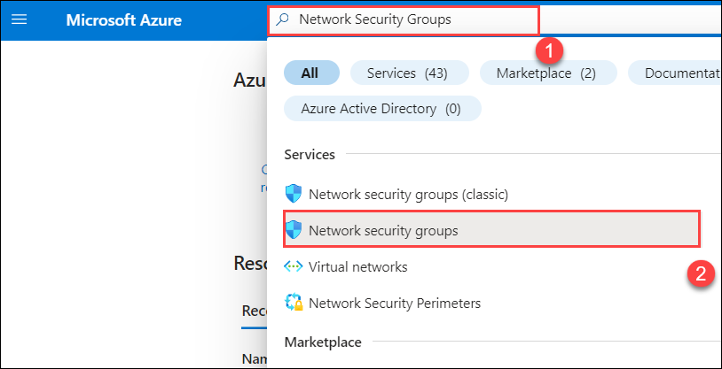

1. On the **Network Security Groups** page, Select the **nsg-prod-001**. 

    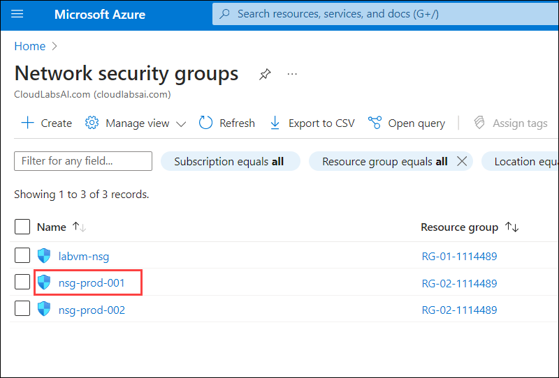

1. From the left menu, select the **Inbound security rules (1)** and click the **+Add(2)**. 

    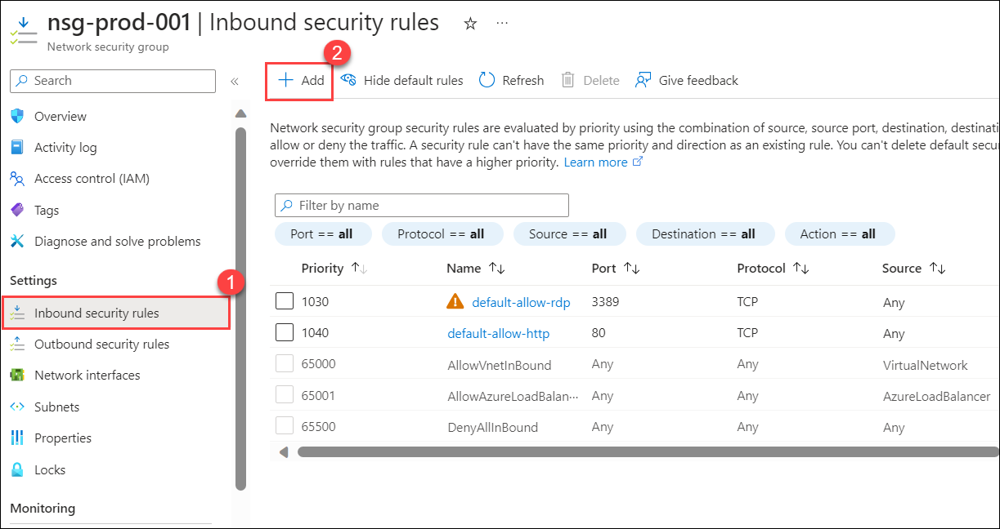
   
1. Fill out as per the screen below to **allow** on-premises **HTTP** access to the **vm-prod-001-VM**. Then click **Add**. 

    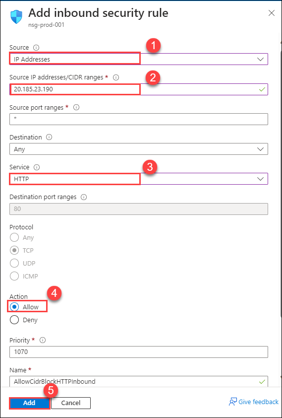

1. Repeat the steps per below **deny** on-premises **RDP** access to the **vm-prod-001-VM** then click **Add**. 

    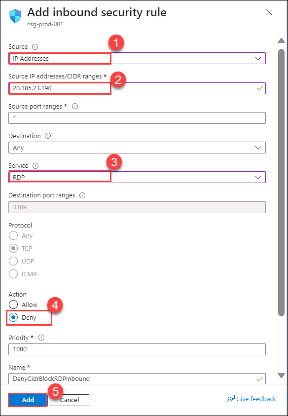

   >**Note**: Make sure in the **Source IP addresses/CIDR ranges** text box for **HTTP** allow rule and **RDP** deny inbound rule, you have pasted **vm-prod-001** public IP that you copied previously.

## Task 2. Configure access from on-premises to the  Spoke 2 VNet.  

1. In the search bar of the Azure portal, type **Network Security Groups (1)**, then select **Network Security Groups (2)** from results.

   

1. On the **Network Security Groups** page, Select the **nsg-prod-002**. 

    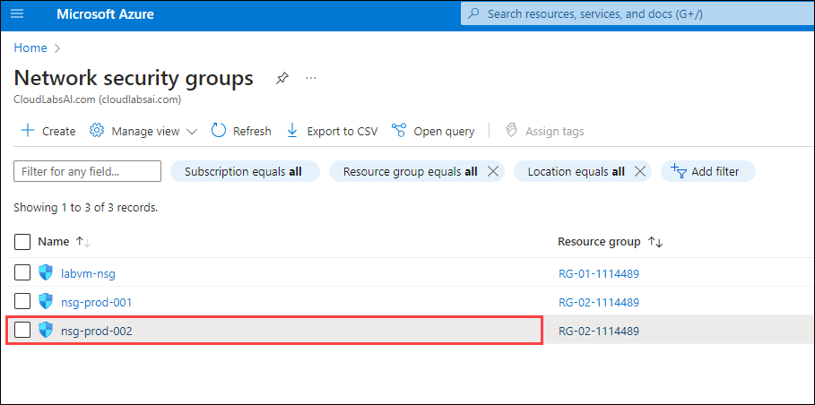

1. From the left menu, select the **Inbound security rules (1)** and click the **+Add(2)**.

    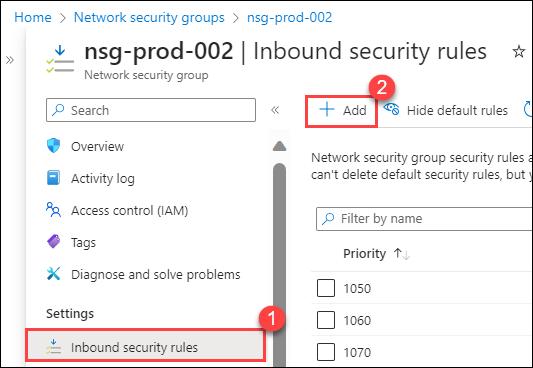

1. Fill out as per the screen below to **allow** on-premises **HTTP** access to the vm-prod-002-VM. Then click **Add**. 

   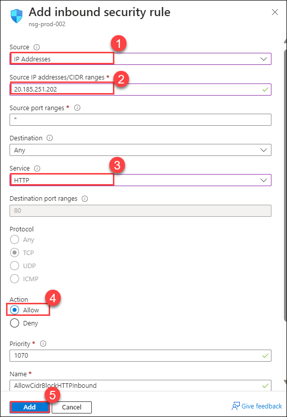

1. Repeat the steps per below to **allow** on-premises **RDP** access to the vm-prod-002-VM then click **Add**.  

   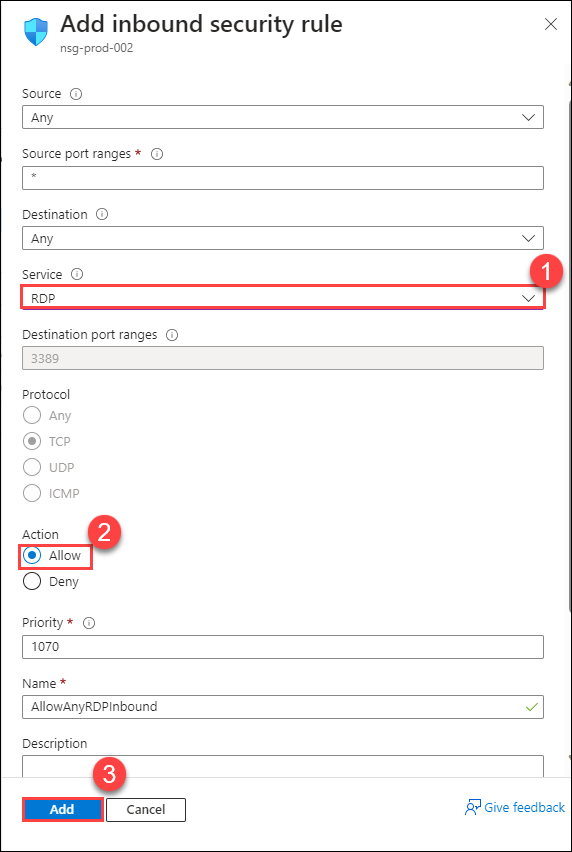

   >**Note**: Make sure in the **Source IP addresses/CIDR ranges** text box for **RDP and HTTP** Inbound allow rule, you have pasted **vm-prod-002** public IP that you copied previously.

1. On the Left menu, select **Outbound security rules (1)** then click on the **+ Add (2)**.

   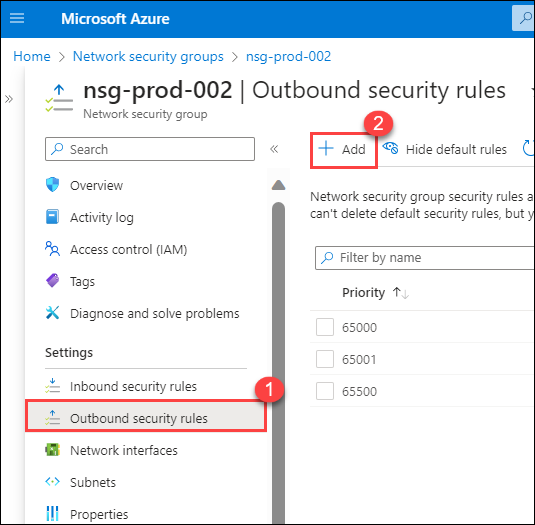

1. Fill out as per the screen below to **deny** LabVM-<inject key="DeploymentID" enableCopy="false"/> **RDP** access to the vm-prod-002-VM. Then click **Add**.

    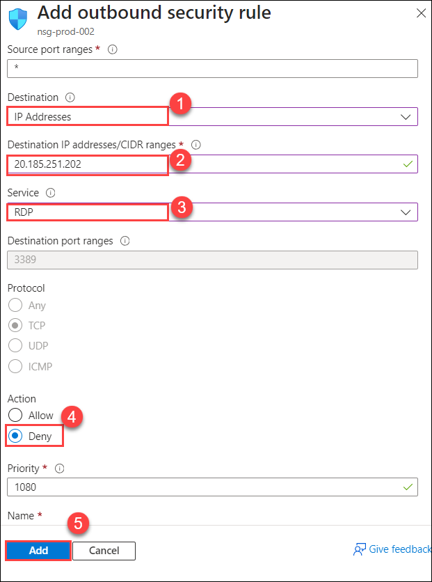

   
   >**Note**: Make sure in the **Destination IP addresses/CIDR ranges** text box you have pasted **LabVM-<inject key="DeploymentID" enableCopy="false"/>** public IP that you copied previously.

1. Validate network security rules and connectivity.

1. From your **LabVM-<inject key="DeploymentID" enableCopy="false"/>** Search for **Windows Powershell ISE (1)** and open a **Windows Powershell ISE (2)**.

   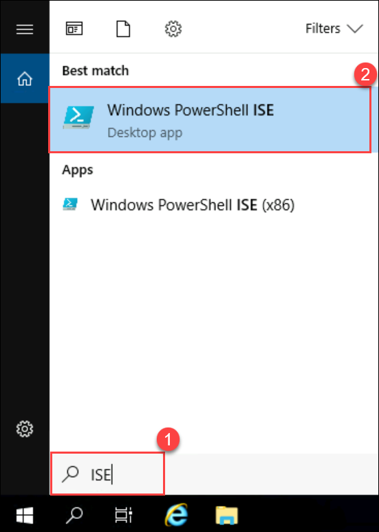

1. From the **Administrator: Windows PowerShell ISE** console, run the following to test VM-prod-001 **RDP** connection.

    ```
      Test-NetConnection -ComputerName 10.2.0.4 -Port 3389 -InformationLevel 'Detailed'
      ```
1. You can Notice that **TcpTestSucceeded** is **False**:

   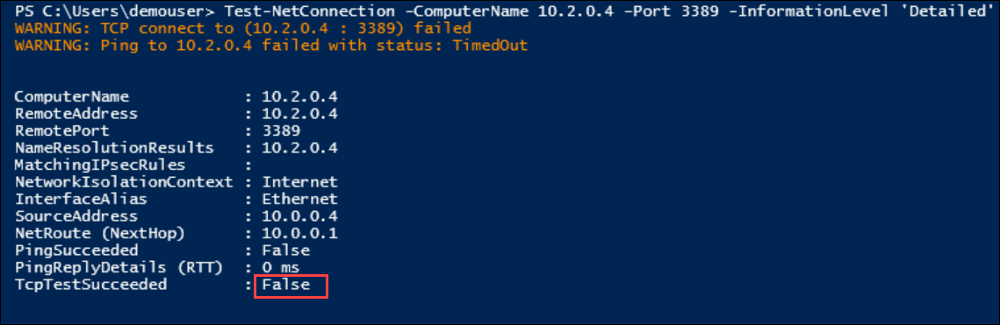

1. From the **Administrator: Windows PowerShell ISE** console, run the following to test VM-prod-001 **HTTP** connection.

    ```
      Test-NetConnection -ComputerName 10.2.0.4 -Port 80 -InformationLevel 'Detailed'
      ```
1. You can Notice that **TcpTestSucceeded** is **False**.

   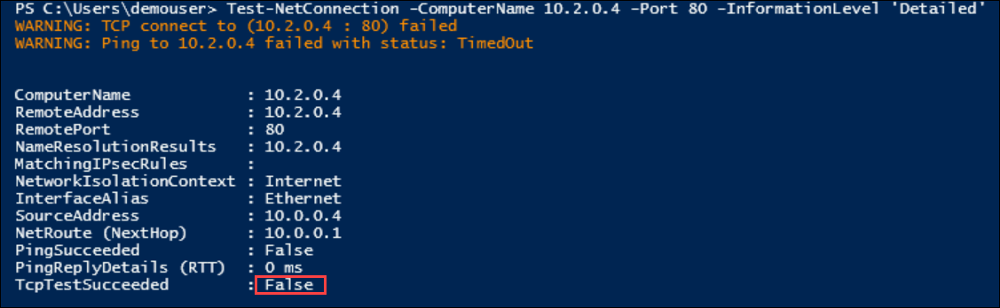

1. From the **Administrator: Windows PowerShell ISE** console, run the following to test VM-prod-002 **RDP** connection.

    ```
      Test-NetConnection -ComputerName 10.3.0.4 -Port 3389 -InformationLevel 'Detailed'
      ```
1. You can Notice that **TcpTestSucceeded** is **False**.

   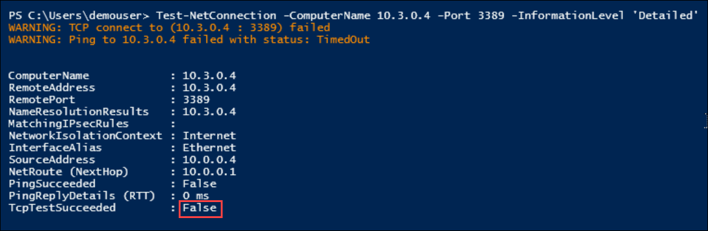


1. From the **Administrator: Windows PowerShell ISE** console, run the following to test VM-prod-002 **HTTP** connection.

    ```
      Test-NetConnection -ComputerName 10.3.0.4 -Port 80 -InformationLevel 'Detailed'
      ```
1. You can Notice that **TcpTestSucceeded** is **False**.

   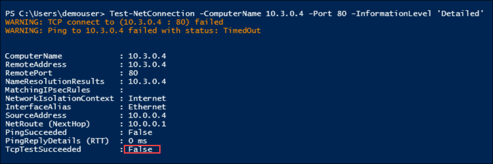

1. From your **LabVM-<inject key="DeploymentID" enableCopy="false"/>** Search for **Remote Desktop Connection (1)** and open a **Remote Desktop Connection  (2)**.:

    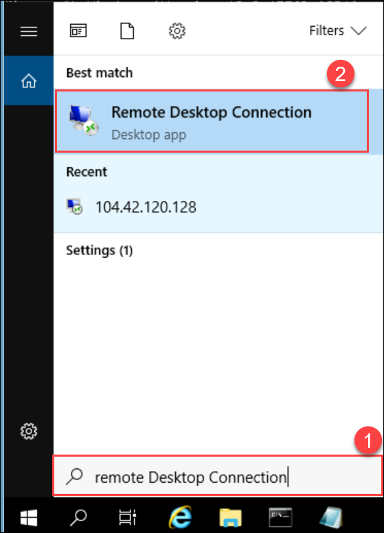

1. In the Computer text bot enter the **public IP of vm-prod-001-VM (1)** and click on **Connect (2)**

   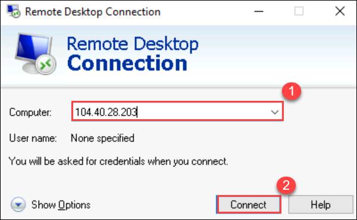

1. On the **Enter Your credentials** pop-up fill the following details:

   - **Username (1)** : Enter **.\demouser**
   - **Password (2)** : Enter **<inject key="adminPassword"></inject>**
   - Click on **OK (3)**

   

1. You may receive a warning certificate during the sign-in process. Click **Yes** or to create the connection and connect to your deployed VM. You should connect successfully.

   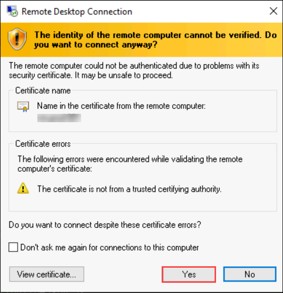

1. You are Successfully able to **connect** to the Virtual machine.

   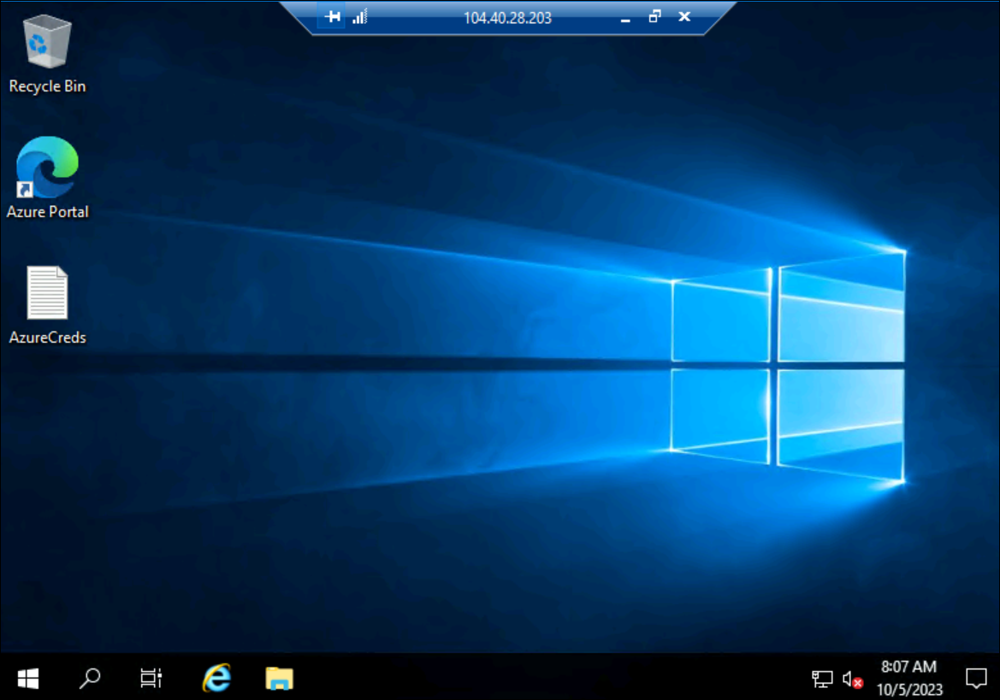

1. In the RDP session of **VM-prod-001** and inside **VM-prod-001** Search for **Windows Powershell ISE (1)** and open a **Windows Powershell ISE (2)**.

   

1. From the **Administrator: Windows PowerShell ISE** console, run the following to test VM-prod-002 **RDP** connection.

    ```
      Test-NetConnection -ComputerName 10.3.0.4 -Port 3389 -InformationLevel 'Detailed'
      ```
1. You can Notice that **TcpTestSucceeded** is **True**.

   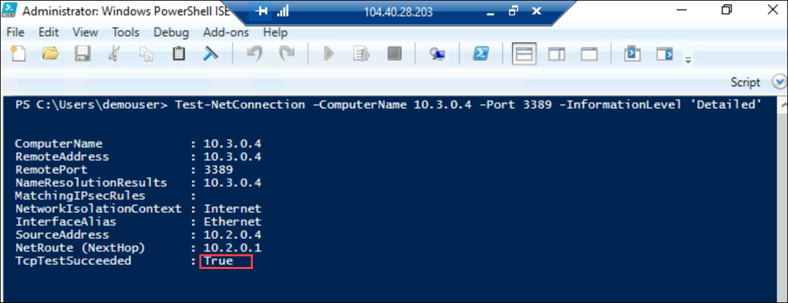

1. From the **Administrator: Windows PowerShell ISE** console, run the following to test VM-prod-002 **HTTP** connection.

    ```
      Test-NetConnection -ComputerName 10.3.0.4 -Port 80 -InformationLevel 'Detailed'
      ```
1. You can Notice that **TcpTestSucceeded** is **True**.

    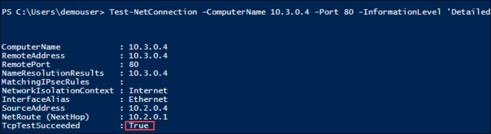

1. From your **LabVM-<inject key="DeploymentID" enableCopy="false"/>** Search for **Remote Desktop Connection (1)** and open a **Remote Desktop Connection  (2)**.:

    

1. In the Computer text bot enter the public IP of **vm-prod-002-VM (1)** and click on **Connect (2)**

     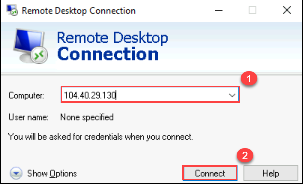

1. On the **Enter Your credentials** pop-up fill the following details:

   - **Username (1)** : Enter **.\demouser**
   - **Password (2)** : Enter **<inject key="adminPassword"></inject>**
   - Click on **OK (3)**

     

1. You may receive a warning certificate during the sign-in process. Click **Yes** or to create the connection and connect to your deployed VM. You should connect successfully.

   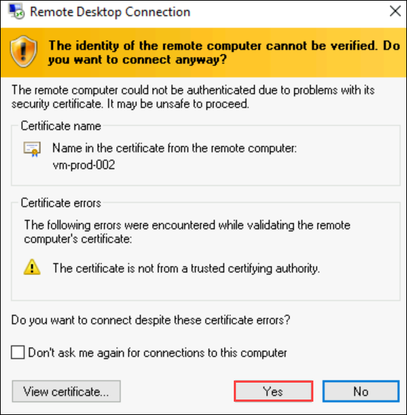

1. Inside **vm-prod-002-VM** Search for **Windows Powershell ISE (1)** and open a **Windows Powershell ISE (2)**.

    

1. From the **Administrator: Windows PowerShell ISE** console, run the following to test VM-prod-001 **RDP** connection.

    ```
      Test-NetConnection -ComputerName 10.2.0.4 -Port 3389 -InformationLevel 'Detailed'
      ```
1. You can Notice that **TcpTestSucceeded** is **True**.

   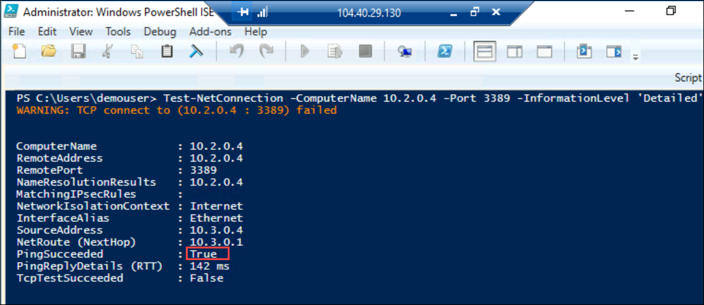

1. From the **Administrator: Windows PowerShell ISE** console, run the following to test VM-prod-001 **HTTP** connection.

    ```
      Test-NetConnection -ComputerName 10.2.0.4 -Port 80 -InformationLevel 'Detailed'
      ```
1. You can Notice that **TcpTestSucceeded** is **True**.

    


## Task 3: Validate network security rules and connectivity.  

1. From your **LabVM-<inject key="DeploymentID" enableCopy="false"/>** Search for **command prompt (1)** and open a **command prompt (2)**.

    

1. In the command prompt run the following command: 

   ```
   curl <vm-prod-001-VM-IP> 
   ``` 

   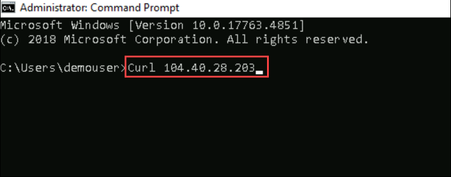

1. In LabVM-<inject key="DeploymentID" enableCopy="false"/> open a new tap on the **microsoft edge** and browse **vm-prod-001** public IP address to access the web page.

   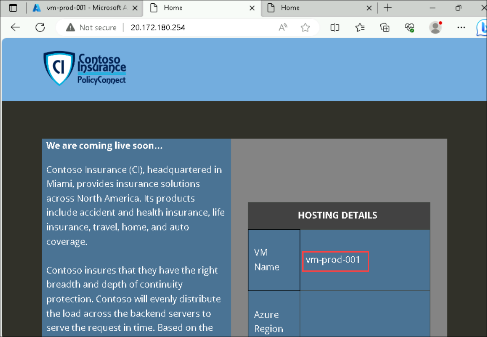

1. You should be able to retrieve the **website content** from the vm-prod-001-VM. 

   

1. From your **LabVM-<inject key="DeploymentID" enableCopy="false"/>** Search for **Remote Desktop Connection (1)** and open a **Remote Desktop Connection  (2)**:

    

1. In the Computer text bot enter the **public IP of vm-prod-001-VM (1)** and click on **Connect (2)**

   

1. On the **Enter Your credentials** pop-up fill the following details:

   - **Username (1)** : Enter **.\demouser**
   - **Password (2)** : Enter **<inject key="VM1AdminPassword"></inject>**
   - Click on **OK (3)**

   

    > **Note**: You should **not** be able to connect. Click on **OK**.

    

1. Go back to the command prompt and in the command prompt run the following command:

   ```
      curl <vm-prod-002-VM-IP> 
      ``` 

   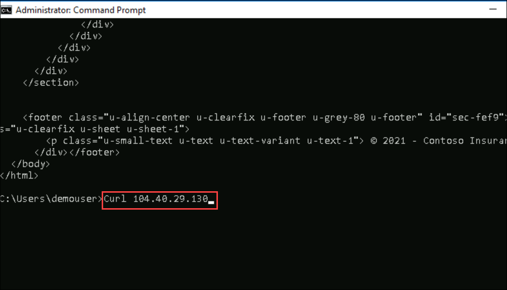

1. You should be able to retrieve the website content from the **vm-prod-001-VM**. 

    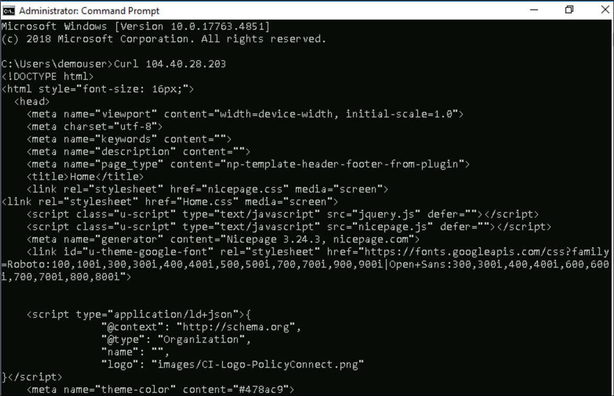

1. In LabVM-<inject key="DeploymentID" enableCopy="false"/> open a new tap on the **microsoft edge** and browse **vm-prod-002** public IP address to access the web page.

   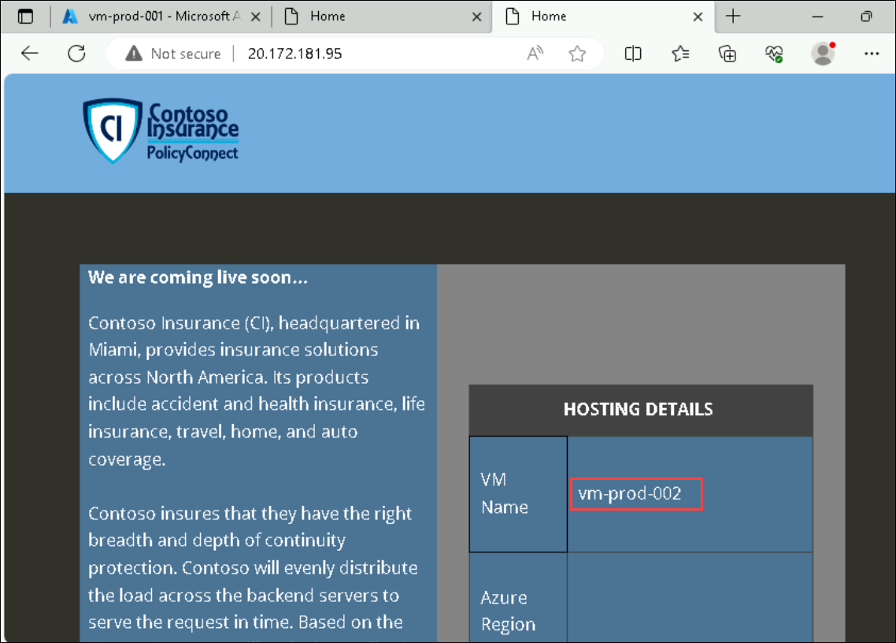

1. From your **LabVM-<inject key="DeploymentID" enableCopy="false"/>** Search for **Remote Desktop Connection (1)** and open a **Remote Desktop Connection  (2)**:

    

1. In the Computer text bot enter the **public IP of vm-prod-002-VM (1)** and click on **Connect (2)**.

   

1. On the **Enter Your credentials** pop-up fill the following details:

   - **Username (1)** : Enter **.\demouser**
   - **Password (2)** : Enter **<inject key="VM2AdminPassword"></inject>**
   - Click on **OK (3)**

   

1. You may receive a warning certificate during the sign-in process. Click **Yes** or to create the connection and connect to your deployed VM. You should connect successfully.

   

1. You are Successfully able to **connect** to the Virtual machine.

   

1. From your **vm-prod-002** Search for **Remote Desktop Connection (1)** and open a **Remote Desktop Connection  (2)**:

    

1. In the Computer text bot enter the **public IP of LabVM-<inject key="DeploymentID" enableCopy="false"/> (1)** and click on **Connect (2)**

   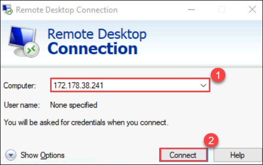

1. On the **Enter Your credentials** pop-up fill the following details:

   - **Username (1)** : Enter **.\demouser**
   - **Password (2)** : Enter **<inject key="LabVMAdminPassword"></inject>**
   - Click on **OK (3)**

    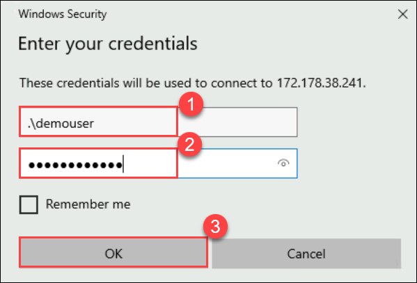

     > **Note**: You should **not** be able to connect. Click on **OK**.
    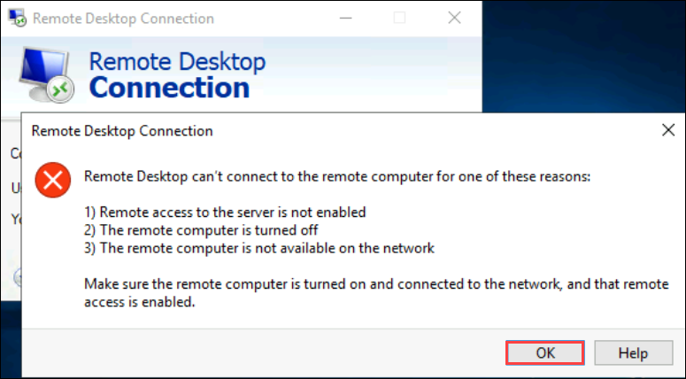

## Summary

In this exercise, you have covered the below topics:

- Configured access from on-premises to the Spoke 1 VNet.
- Configured access from on-premises to the  Spoke 2 VNet


