# Exercise 4: Validate access to your application on Azure

## Scenario

Now that Contoso has their network ready, they want to host their Contoso Insurance application on a server that provides more control and flexibility over the computing environment. Contoso wants to provide its hosted application to internal users for testing.

## Overview

In this exercise, you will review the pre-deployed Virtual Machine on each spoke VNet, create network security group rules to allow required traffic and you will then test connectivity across your network.
​
## Task 1. Configure access from on-premises to the Spoke1 VNet. 

1. In the search bar of the Azure portal, type **Virtual machines (1)**, then select **Virtual machines (2)** from the results.

   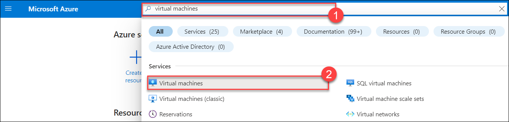

1. From the **Virtual machines** page, select **spoke1VM<inject key="DeploymentID" enableCopy="false"/>**.

     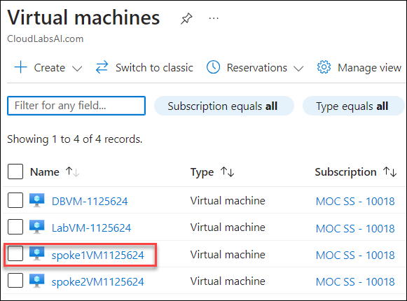

1. On the right side of the **Overview** pane view find the IP address and hover the right side of the **Public IP address** to copy it to the clipboard or record it on Notepad.

   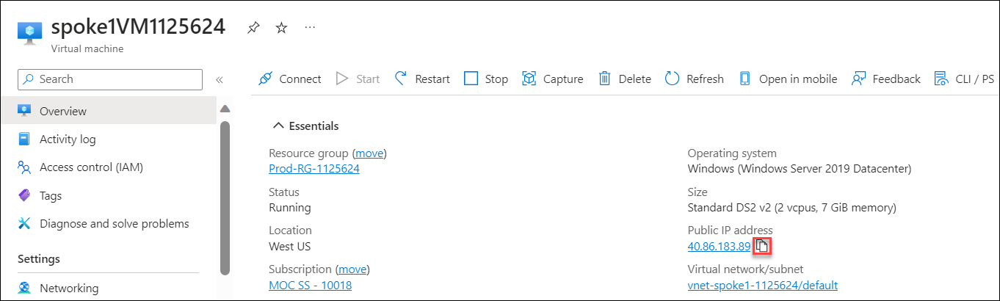

1. Go back to **Virtual machines** page and select **spoke2VM<inject key="DeploymentID" enableCopy="false"/>**.

   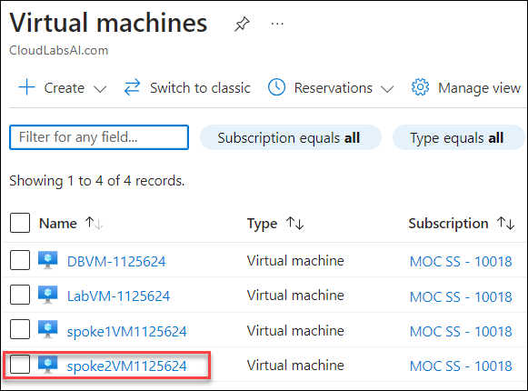

1. On the right side of the **Overview** pane view find the IP address and hover the right side of the **Public IP address** to copy it to the clipboard or record it on Notepad.

   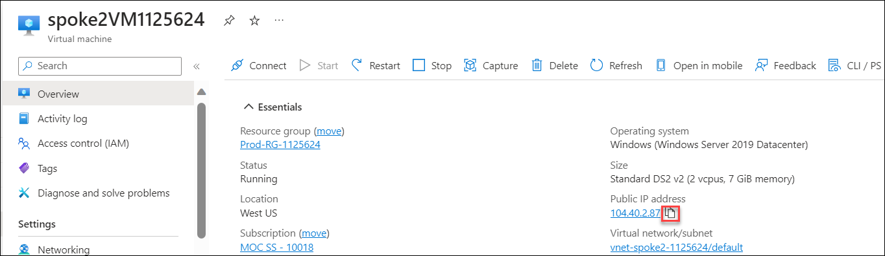

1. Go back to **Virtual machines** page, and select **LabVM-<inject key="DeploymentID" enableCopy="false"/>**.

   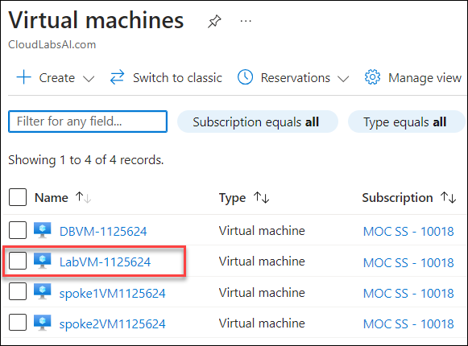

1. On the right side of the **Overview** pane view find the IP address and hover the right side of the **Public IP address** to copy it to the clipboard or record it on Notepad.

   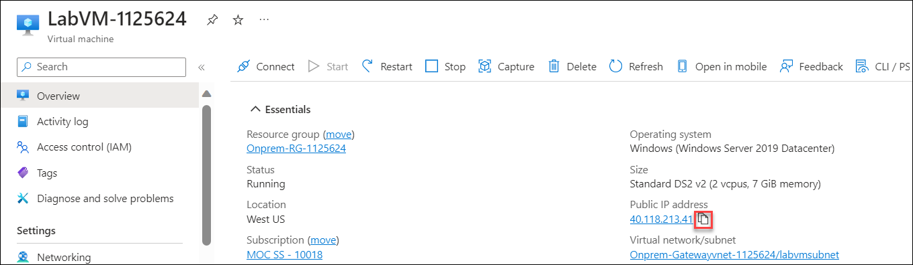

1. In the search bar of the Azure portal, type **Network Security Groups (1)**, then select **Network security groups (2)** from the results.

   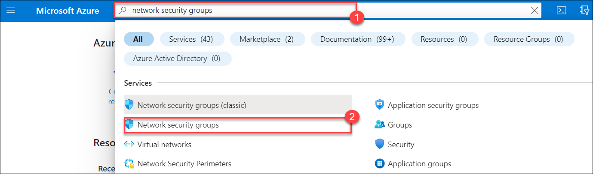

1. On the **Network security groups** page, Select the **nsg-spoke1-<inject key="DeploymentID" enableCopy="false"/>**. 

    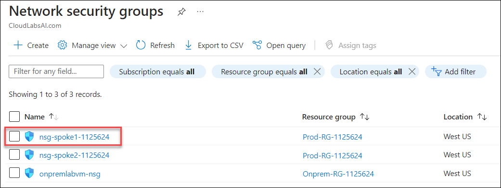

1. From the left menu, select the **Inbound security rules (1)** and click the **+ Add (2)**. 

   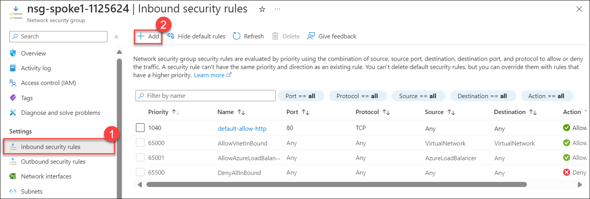
   
1. Fill out as per the screen below to **allow** on-premises **HTTP** access to the **spoke1VM<inject key="DeploymentID" enableCopy="false"/>** as follows: 

     - **Source (1)**: Select **IP Addresses** from the drop-down.

      - **Source IP addresses/CIDR ranges (2)**: Enter **spoke1VM<inject key="DeploymentID" enableCopy="false"/>** public IP that you copied previously.

      - **Service (3)**: Select **HTTP** from the drop-down.

      - **Action (4)**: Select **Allow**

      - Click on **Add (5)**

         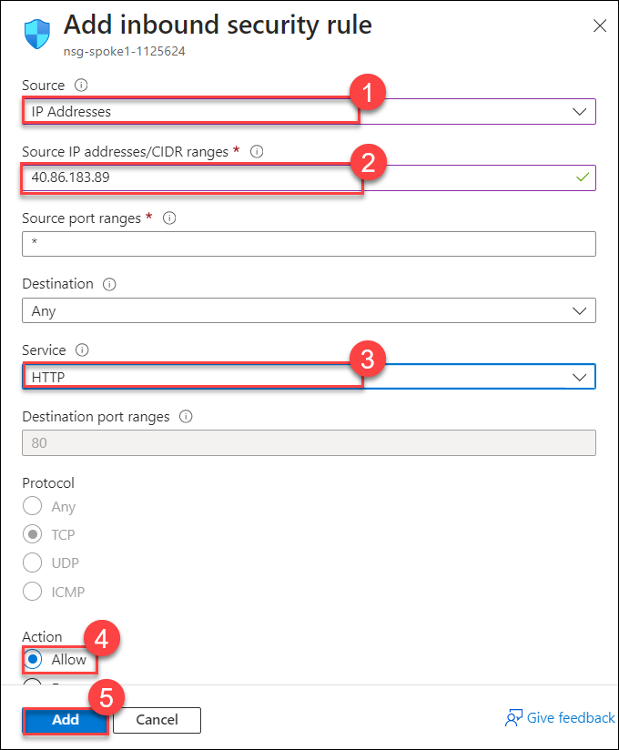

1. Repeat the steps per below **deny** on-premises **RDP** access to the **spoke1VM<inject key="DeploymentID" enableCopy="false"/>** as follows:

   - **Source (1)**: Select **IP Addresses** from the drop-down.

   - **Source IP addresses/CIDR ranges (2)**: Enter **spoke1VM<inject key="DeploymentID" enableCopy="false"/>** public IP that you copied previously.

   - **Service (3)**: Select **RDP** from the drop-down.

   - **Action (4)**: Select **Deny**

   - Click on **Add (5)**

      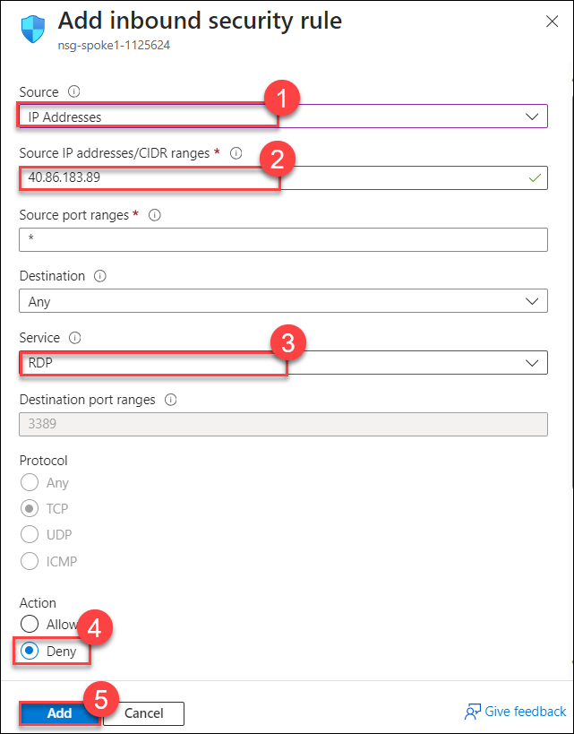

## Task 2. Configure access from on-premises to the  Spoke 2 VNet.  

1. In the search bar of the Azure portal, type **Network Security Groups (1)**, then select **Network security groups (2)** from the results.

   

1. On the **Network security groups** page, Select the **nsg-spoke2-<inject key="DeploymentID" enableCopy="false"/>**. 

    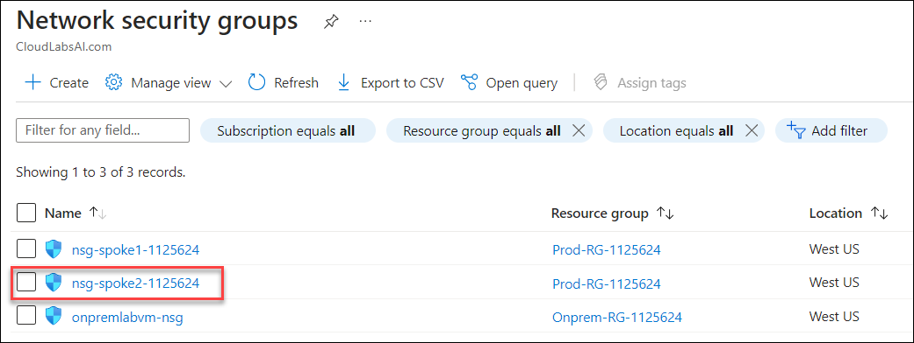

1. From the left menu, select the **Inbound security rules (1)** and click the **+ Add (2)**.

   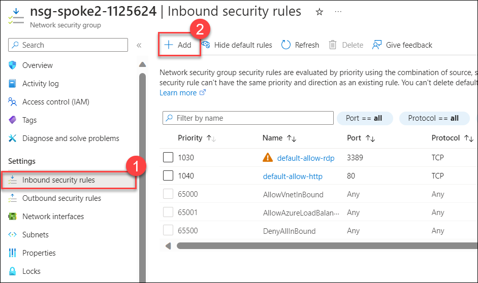

1. Fill out as per the screen below to **allow** on-premises **HTTP** access to the **spoke2VM<inject key="DeploymentID" enableCopy="false"/>** as follows:

   - **Source (1)**: Select **IP Addresses** from the drop-down.

   - **Source IP addresses/CIDR ranges (2)**: Enter **spoke2VM<inject key="DeploymentID" enableCopy="false"/>** public IP that you copied previously.

   - **Service (3)**: Select **HTTP** from the drop-down.

   - **Action (4)**: Select **Allow**

   - Click on **Add (5)**

      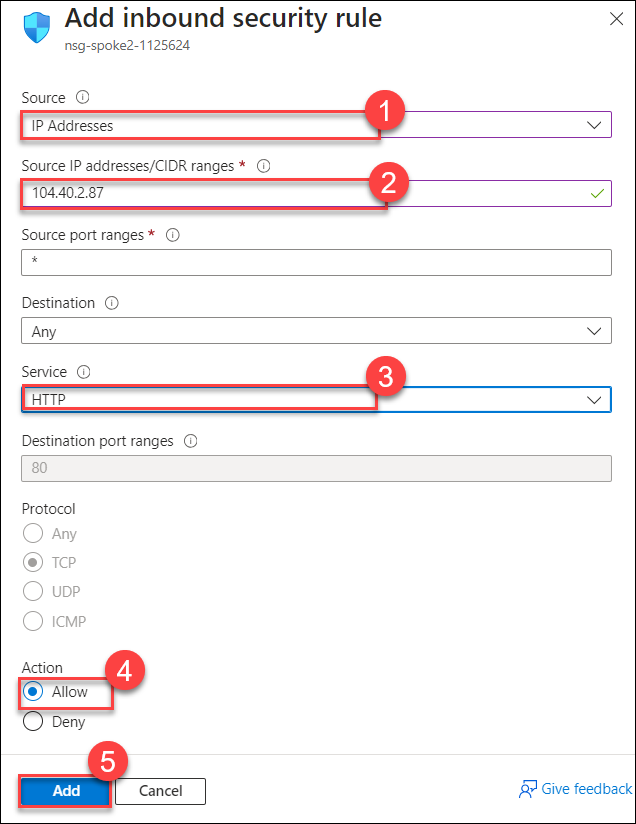

1. Repeat the steps per below to **allow** on-premises **RDP** access to the **spoke2VM<inject key="DeploymentID" enableCopy="false"/>** as follows:

   - **Source (1)**: Select **IP Addresses** from the drop-down.

   - **Source IP addresses/CIDR ranges (2)**: Enter **spoke2VM<inject key="DeploymentID" enableCopy="false"/>** public IP that you copied previously.

   - **Service (3)**: Select **RDP** from the drop-down.

   - **Action (4)**: Select **Allow**

   - Click on **Add (5)**

      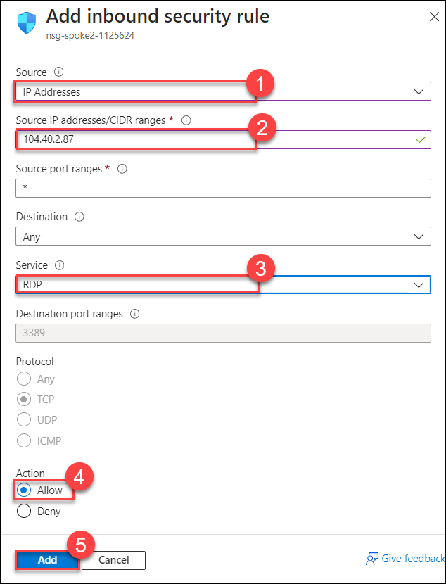

1. On the Left menu, select **Outbound security rules (1)** then click on the **+ Add (2)**.

   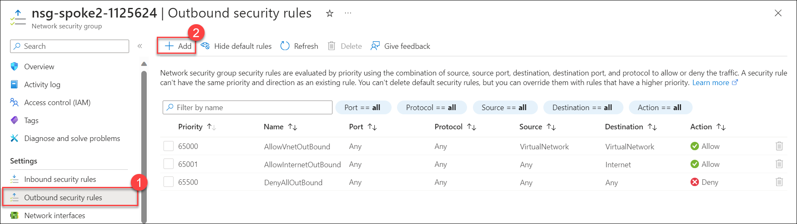

1. Fill out as per the screen below to **deny** LabVM-<inject key="DeploymentID" enableCopy="false"/> **RDP** access to the **spoke2VM<inject key="DeploymentID" enableCopy="false"/>** as follows:

   - **Destination (1)**: Select **IP Addresses** from the drop-down.

   - **Destination IP addresses/CIDR ranges (2)**: Enter **LabVM-<inject key="DeploymentID" enableCopy="false"/>** public IP that you copied previously.

   - **Service (3)**: Select **RDP** from the drop-down.

   - **Action (4)**: Select **Deny**

   - Click on **Add (5)**

      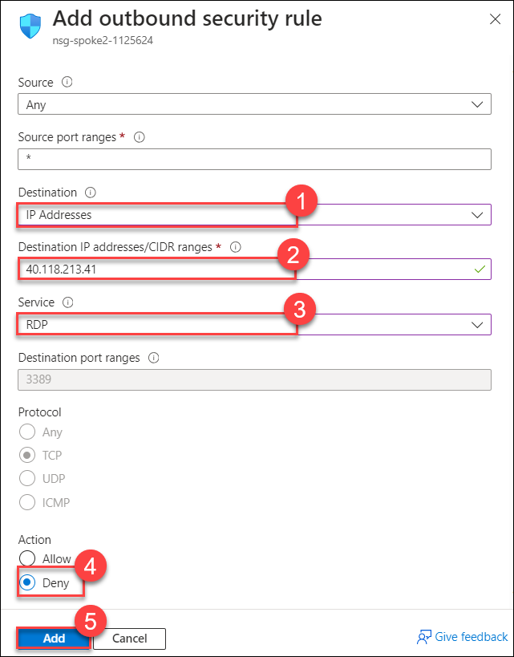

## Task 3: Validate network security rules and connectivity.  

1. From your **LabVM-<inject key="DeploymentID" enableCopy="false"/>** Search for **command prompt (1)** and open a **Command prompt (2)**.

    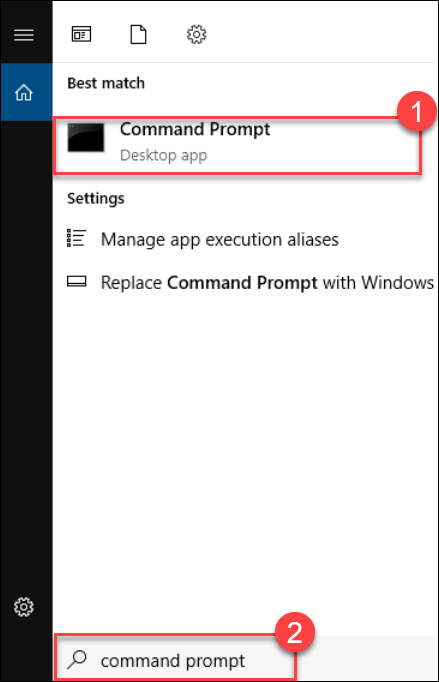

1. In the command prompt run the following command:
   ```
   curl spoke1VMDID-VM-IP 
   ``` 

   >**Note**: Make sure to replace **spoke1VM<inject key="DeploymentID" enableCopy="false"/>-VM-IP** with the **spoke1VM<inject key="DeploymentID" enableCopy="false"/>** public IP that you copied previously.

   

1. You should be able to retrieve the **website content** from the spoke1VM<inject key="DeploymentID" enableCopy="false"/>. 

   

1. In LabVM-<inject key="DeploymentID" enableCopy="false"/> open a new tab on the **Microsoft edge** and browse **spoke1VM<inject key="DeploymentID" enableCopy="false"/>** Public IP address to access the web page.

   

   
1. From your **LabVM-<inject key="DeploymentID" enableCopy="false"/>** Search for **Remote Desktop Connection (1)** and open a **Remote Desktop Connection (2)**.

   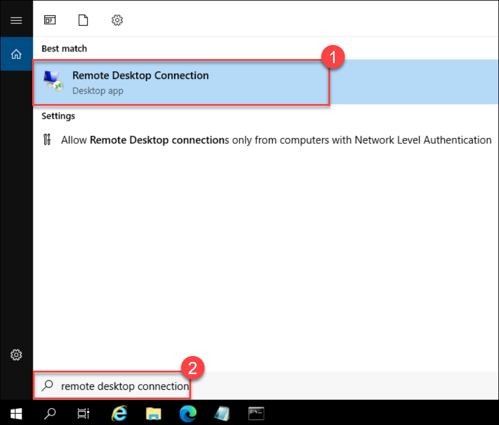

1. In the Computer text bot enter the **Public IP of spoke1VM<inject key="DeploymentID" enableCopy="false"/> (1)** and click on **Connect (2)**

   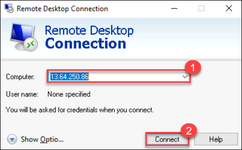

1. You will recieve an error, select **OK**.

    

1. Go back to the command prompt and in the command prompt run the following command:

   ```
   curl spoke2VMDID-VM-IP
   ``` 

      >**Note**: Make sure to replace **spoke2VM<inject key="DeploymentID" enableCopy="false"/>-VM-IP** with the **spoke2VM<inject key="DeploymentID" enableCopy="false"/>** public IP that you copied previously.

   

1. You should be able to retrieve the website content from the **spoke2VM<inject key="DeploymentID" enableCopy="false"/>**. 

    

1. In LabVM-<inject key="DeploymentID" enableCopy="false"/> open a new tab on the **Microsoft edge** and browse **spoke2VM<inject key="DeploymentID" enableCopy="false"/>** Public IP address to access the web page.

   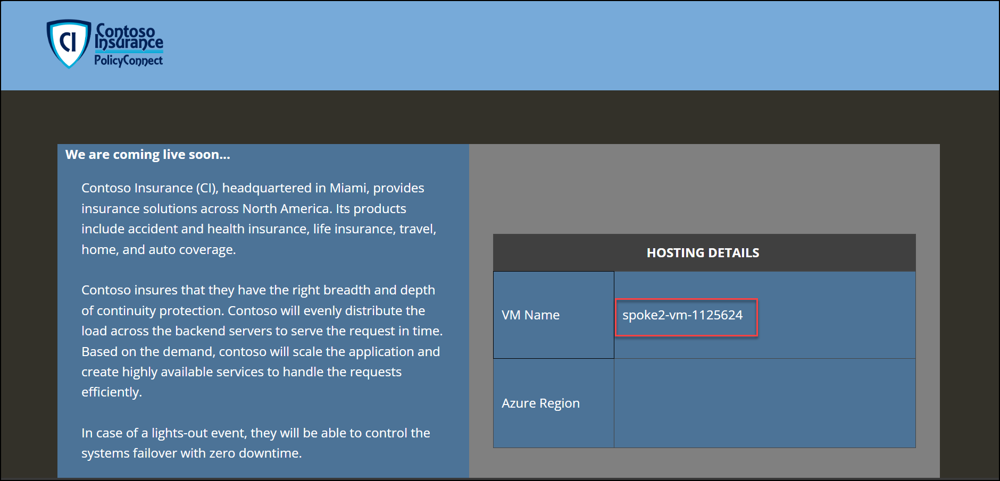

1. From your **LabVM-<inject key="DeploymentID" enableCopy="false"/>** Search for **Remote Desktop Connection (1)** and open a **Remote Desktop Connection (2)**.

    

1. In the Computer text box enter the **Public IP of spoke2VM<inject key="DeploymentID" enableCopy="false"/> (1)** and click on **Connect (2)**.

   

1. On the **Enter your credentials** pop-up fill the following details:

   - **Username (1)**: Enter **.\demouser**

   - **Password (2)**: Enter **<inject key="VM2AdminPassword"></inject>**

   - Click on **OK (3)**

     

1. You may receive a warning certificate during the sign-in process. Click **Yes** or to create the connection and connect to your deployed VM. You should connect successfully.

   

1. You are Successfully able to **connect** to the Virtual machine.

   

1. From your **spoke2VM<inject key="DeploymentID" enableCopy="false"/>** Search for **Remote Desktop Connection (1)** and open a **Remote Desktop Connection (2)**.

    

1. In the Computer text box enter the **Public IP of LabVM-<inject key="DeploymentID" enableCopy="false"/> (1)** and click on **Connect (2)**

   

1. You will recieve an error, select **OK**.

     

1. Minimize, the **spoke2VM<inject key="DeploymentID" enableCopy="false"/>** VM. In the search bar of the Azure portal, type **Network Security Groups (1)**, then select **Network security groups (2)** from the results.

   

1. On the **Network security groups** page, Select the **nsg-spoke1-<inject key="DeploymentID" enableCopy="false"/>**. 

    

1. From the left menu, select the **Inbound security rules (1)** and click the **+ Add (2)**. 

   
   
1. Fill out as per the screen below to **allow** on-premises **RDP** access to the **spoke1VM<inject key="DeploymentID" enableCopy="false"/>** as follows:

   - **Service (1)**: Select **RDP** from the drop-down.

   - **Action (2)**: Select **Allow**

   - **Priority (3)**: Enter **100**
    
   - Click on **Add (4)**

      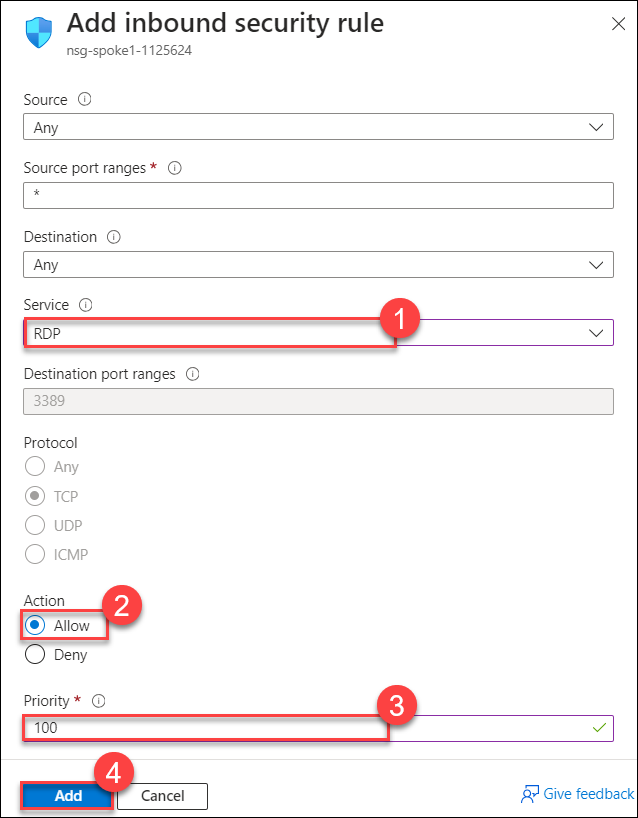

      >**Note**: We need to allow **RDP** traffic to **spoke1VM<inject key="DeploymentID" enableCopy="false"/>** for **Exercise 5**.

## Summary

In this exercise, you have covered the below topics:

- Configured access from on-premises to the Spoke 1 VNet.
- Configured access from on-premises to the  Spoke 2 VNet
