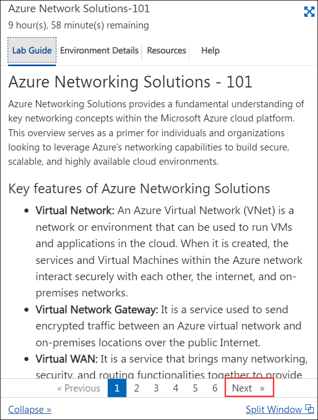

## **Exercise 1: Getting Started with Scalable Cloud Networking with Azure Virtual WAN Workshop**
 
Welcome to your Scalable Cloud Networking with Azure Virtual WAN workshop! We've prepared a seamless environment for you to explore and learn about Azure services. Let's begin by making the most of this experience:

## Overview

In this exercise, you'll log in to the Azure Portal and review the pre-deployed resources that are part of the lab environment.

## Instructions
 
## **Accessing Your Lab Environment**
 
Once you're ready to dive in, your virtual machine and lab guide will be right at your fingertips within your web browser.
 

## **Virtual Machine & Lab Guide**
 
Your virtual machine is your workhorse throughout the workshop. The lab guide is your roadmap to success.
 
## **Exploring Your Lab Resources**
 
To get a better understanding of your lab resources and credentials, navigate to the **Environment Details** tab.
 
 
 
## **Utilizing the Split Window Feature**
 
For convenience, you can open the lab guide in a separate window by selecting the **Split Window** icon at the bottom right corner.

 
## **Managing Your Virtual Machine**
 
Feel free to start, stop, or restart your virtual machine as needed from the **Resources** tab. Your experience is in your hands!
 

 
## **Let's Get Started with Azure Portal**
 
1. On your virtual machine, click on the Azure Portal icon as shown below:
 
    

1. You'll see the **Sign into Microsoft Azure** tab. Here, enter your credentials:
 
   - **Email/Username:** <inject key="AzureAdUserEmail"></inject>
 
    
 
1. Next, provide your password:
 
   - **Password:** <inject key="AzureAdUserPassword"></inject>
 
   
 
1. If prompted to stay signed in, you can click **No**.

    
 
1. If a **Welcome to Microsoft Azure** pop-up window appears, simply click **Maybe Later** to skip the tour.

1. Now you can see the Azure Portal Dashboard, click on **Resource groups** from the Navigate panel to see the resource groups.

   

1. You should see this list of pre-deployed resource groups with resources that will be used in this lab:

     

   - **Onprem-RG-<inject key="DeploymentID" enableCopy="false"/>**: On-premises related resources, vNets, Lab-VM (with DNS role and Telnet client enabled), DB-VM (with SQL Express or MySQL) and Virtual Network Gateway

      

   - **Prod-RG-<inject key="DeploymentID" enableCopy="false"/>**: Workload related: vm-Prod vNets, vm-prod-001, vm-prod-002, storage account etc.

      

   - **Sharedservices-RG-<inject key="DeploymentID" enableCopy="false"/>**: Core network infrastructure related: virtual WAN and its related resources, VPN Gateway, DNSresolvevnet.

      
    
1. Now, click on **Next** from the lower right corner to move to the next page.

   

## Summary

In this exercise, you signed in to the Azure Portal and reviewed the pre-deployed resource groups.

Now you're all set to explore the powerful world of technology. Feel free to reach out if you have any questions along the way. Enjoy your workshop!
