# Scalable Cloud Networking with Azure Virtual WAN

### Overall Estimated Duration: 8 hours

## Overview

Contoso Insurance is a well-known brand in the industry. They are planning to launch a new Contoso Insurance portal in the market to start providing their insurance services online. Their development team has already developed the portal. They are all set to launch their new Contoso Insurance portal. Before they launch it, they want to get it tested by internal and beta users. To start testing the application they have chosen Azure as their cloud platform as Azure offers a massive range of IaaS facilities required for any business like computing, networking, storage, security, and much more.

Contoso wants to migrate its on-premises infrastructure to the Azure cloud to modernize its operations, improve scalability, and enhance security. Contoso needs to provision a comprehensive Azure Network Topology, including both the Platform and Application Landing Zone, to support its diverse workloads and applications as part of this digital transformation initiative. The company also needs to establish hybrid connectivity between its on-premises data center and the Microsoft Azure cloud to enable seamless data exchange, application deployment, and disaster recovery.

## Objective

In this Hands-on Lab, you will learn about Azure networking fundamentals. You will get Hands-on experience with Azure resources and how to use networking resources and establish connections from Cloud to On-premise resources.

- **Provision your Azure Network Topology (Platform and Application Landing Zone):** Set up a structured network environment using Azure Virtual WAN for efficient connectivity across platforms and applications, enabling scalable and flexible networking solutions.
- **Provision Hybrid Connectivity:** Establish seamless hybrid connections between on-premises infrastructure and Azure to enhance network integration, facilitating a smooth transition to cloud-based resources.
- **Validate access to your application on Azure:** Confirm that users can reliably access Azure-hosted applications, ensuring optimal performance and availability while monitoring for potential access issues.
- **Configure private access to PaaS resources:** Implement private endpoints to secure and optimize access to Azure PaaS resources, enhancing data protection and compliance while reducing exposure to public internet vulnerabilities.

## Prerequisites

Participants should have:

- **Basic Networking Knowledge:** Understanding of networking concepts such as IP addressing, routing, and VPNs.
- **Familiarity with Azure Portal:** Proficiency in navigating the Azure Portal to create and manage resources.
- **Knowledge of Azure Virtual WAN:** Awareness of Azure Virtual WAN architecture, components, and capabilities.
- **Understanding of Hybrid Environments:** Familiarity with hybrid cloud strategies and how on-premises networks integrate with Azure.
- **Security Best Practices:** Knowledge of cloud security principles and best practices for securing network access and data.

## Architechture

In a scalable cloud networking architecture utilizing Azure Virtual WAN, a **Virtual Network** serves as the foundational layer, providing an isolated environment for resources. Within this network, **Virtual Machines** can be deployed to run applications and services, enabling dynamic scaling based on demand. A **Virtual Network Gateway** facilitates secure communication between on-premises networks and Azure, supporting both site-to-site VPN and ExpressRoute connections. To optimize DNS resolution within the Azure environment, a **DNS Private Resolver** is implemented, ensuring that domain name queries are handled securely and efficiently. Coupled with a **Private DNS Zone**, it enables resource names to be resolved without exposing them to the public internet. Finally, **DNS Forwarding Rulesets** are configured to direct DNS queries to the appropriate resolvers, allowing seamless access to resources across the network while maintaining privacy and security. This architecture not only enhances connectivity and security but also supports the scalability required for modern cloud applications.

## Architechture Diagram

## Explanation of Components

The architecture for this lab involves the following key components:

- **Virtual Network:** An Azure Virtual Network (VNet) is a network or environment that can be used to run VMs and applications in the cloud. When it is created, the services and Virtual Machines within the Azure network interact securely with each other, the internet, and on-premises networks.
- **Virtual Network Gateway:** It is a service used to send encrypted traffic between an Azure virtual network and on-premises locations over the public Internet.
- **Virtual WAN:** It is a service that brings many networking, security, and routing functionalities together to provide a single operational interface.
- **DNS Private Resolver:** It is a service that bridges an on-premises DNS with Azure DNS.
- **Private DNS Zone:** It provides a reliable, secure DNS service to manage and resolve domain names in a virtual network without the need to add a custom DNS solution.
- **DNS Forwarding Ruleset:** It is a setup with rules pointing to the on-prem dns zone and linked to hub vnet and using the private dns resolver outbound endpoint.

## Getting Started with the Lab

Welcome to your Scalable Cloud Networking with Azure Virtual WAN workshop! We've prepared a seamless environment for you to explore and learn about Azure services. Let's begin by making the most of this experience:
 
## Accessing Your Lab Environment
 
Once you're ready to dive in, your virtual machine and lab guide will be right at your fingertips within your web browser.
 
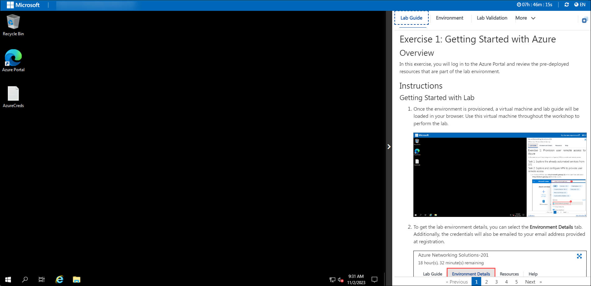

### Virtual Machine & Lab Guide
 
Your virtual machine is your workhorse throughout the workshop. The lab guide is your roadmap to success.
 
## Exploring Your Lab Resources
 
To get a better understanding of your lab resources and credentials, navigate to the **Environment** tab.
 
 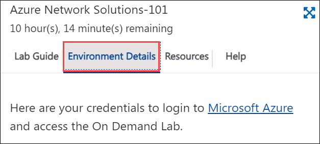
 
## Utilizing the Split Window Feature
 
For convenience, you can open the lab guide in a separate window by selecting the **Split Window** icon at the top right corner.

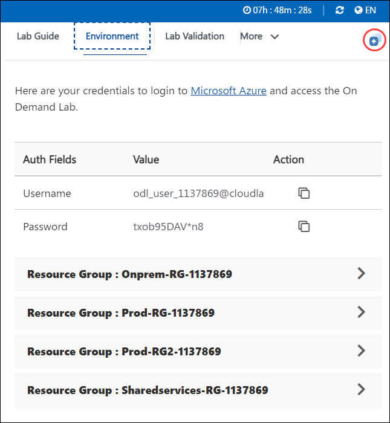
 
## Managing Your Virtual Machine
 
Feel free to start, stop, or restart your virtual machine as needed from the **Resources** tab. Your experience is in your hands!
 
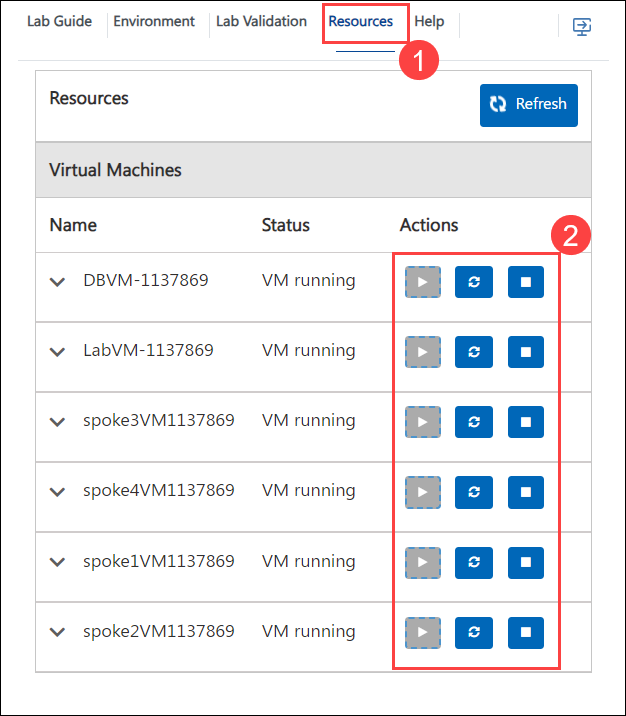
 
## Let's Get Started with Azure Portal
 
1. On your virtual machine, click on the Azure Portal icon as shown below:
 
    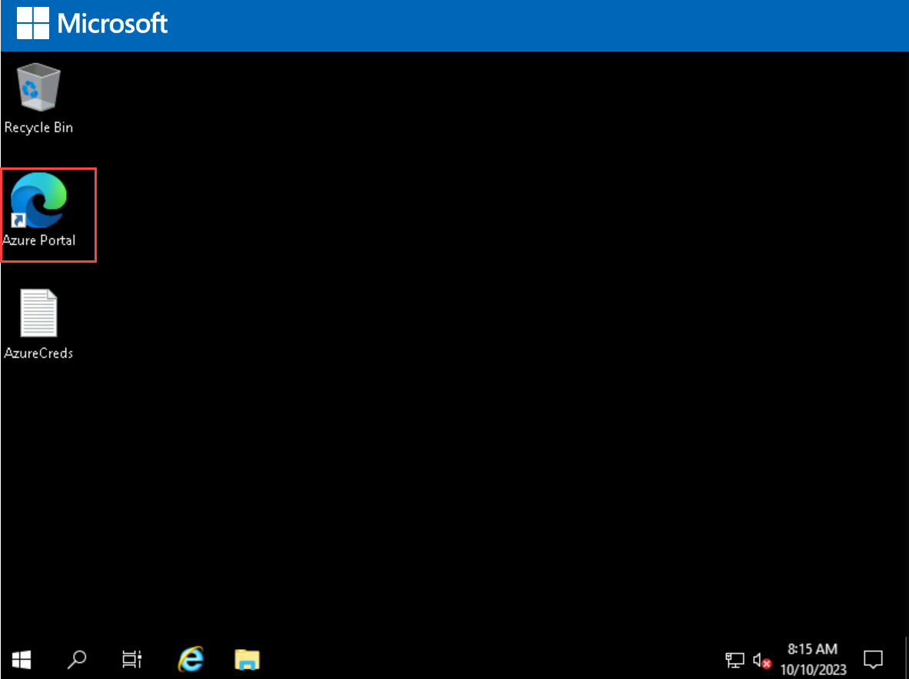

1. You'll see the **Sign into Microsoft Azure** tab. Here, enter your credentials:
 
   - **Email/Username:** <inject key="AzureAdUserEmail"></inject>
 
    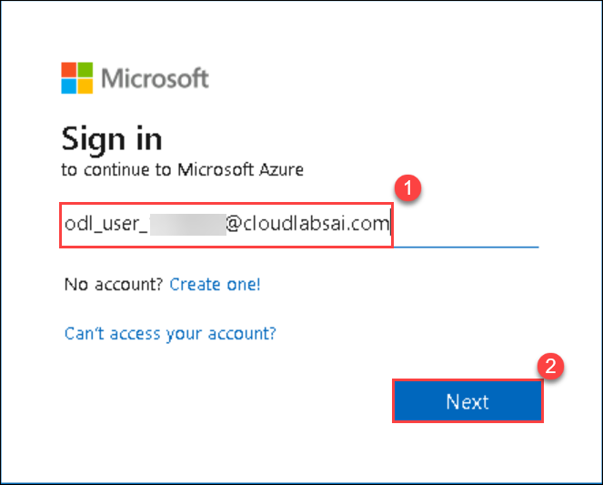
 
1. Next, provide your password:
 
   - **Password:** <inject key="AzureAdUserPassword"></inject>
 
   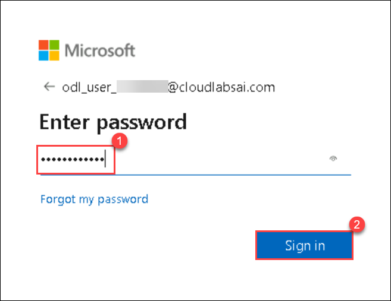

1. If you see the pop-up Action Required, click **Ask Later**.

   

   >**NOTE:** Do not enable MFA, select **Ask Later**.

1. If prompted to stay signed in, you can click **No**.

    
 
1. If a **Welcome to Microsoft Azure** pop-up window appears, simply click **Maybe Later** to skip the tour.

1. Now you can see the Azure Portal Dashboard, click on **Resource groups** from the Navigate panel to see the resource groups.

   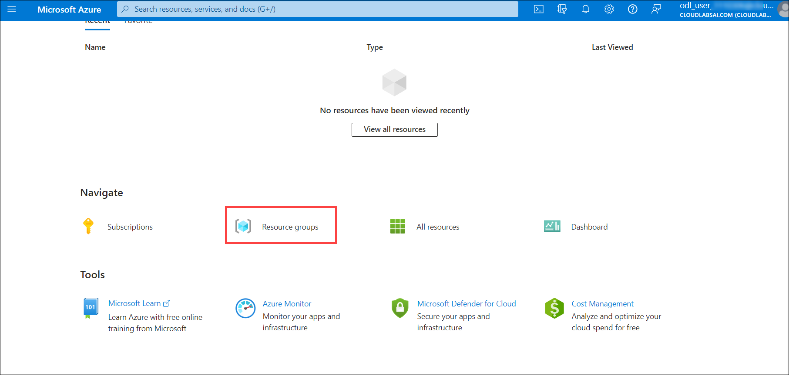

1. You should see this list of pre-deployed resource groups with resources that will be used in this lab:

     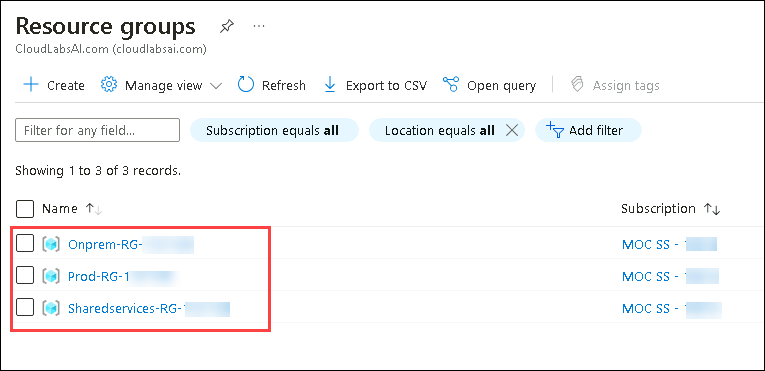

   - **Onprem-RG-<inject key="DeploymentID" enableCopy="false"/>**: On-premises related resources, vNets, Lab-VM (with DNS role and Telnet client enabled), DB-VM (with SQL Express or MySQL) and Virtual Network Gateway

      

   - **Prod-RG-<inject key="DeploymentID" enableCopy="false"/>**: Workload related: vm-Prod vNets, vm-prod-001, vm-prod-002, storage account etc.

      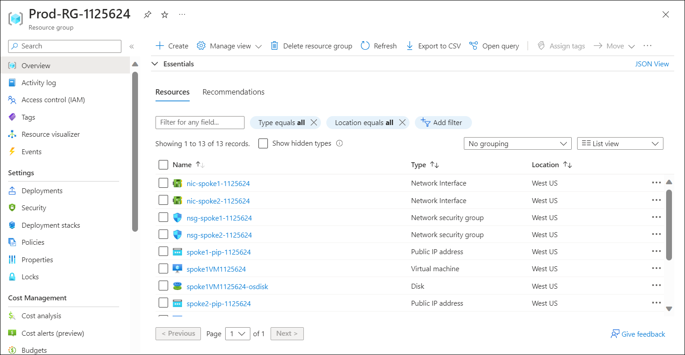

   - **Sharedservices-RG-<inject key="DeploymentID" enableCopy="false"/>**: Core network infrastructure related: virtual WAN and its related resources, VPN Gateway, DNSresolvevnet.

      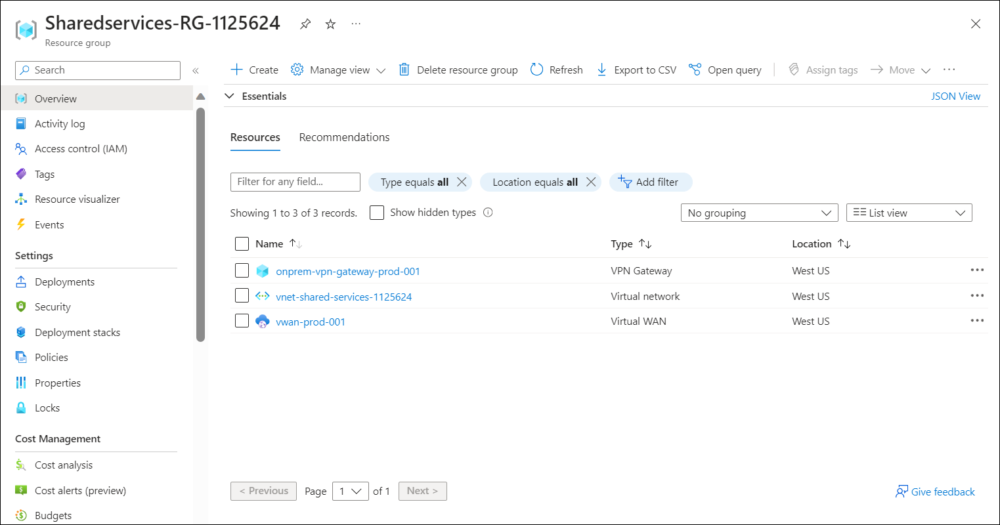
    
## Support Contact
 
The CloudLabs support team is available 24/7, 365 days a year, via email and live chat to ensure seamless assistance at any time. We offer dedicated support channels tailored specifically for both learners and instructors, ensuring that all your needs are promptly and efficiently addressed.

Learner Support Contacts:
- Email Support: cloudlabs-support@spektrasystems.com
- Live Chat Support: https://cloudlabs.ai/labs-support

Now, click on **Next** from the lower right corner to move on to the next page.

### Happy Learning!!

