## Task 1: Provision Virtual Network 

In this task, you will create a virtual network.

1.  In the Azure Portal, from the upper left corner select the **menu (1)** icon with three lines as highlighted below and then select **+ Create a resource (2)**.

      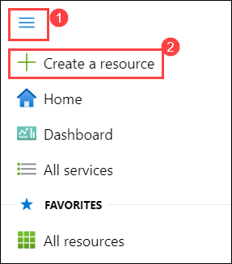
     
1.  In the search box, type **Virtual Network (1)** and select **(2)** to open it.

     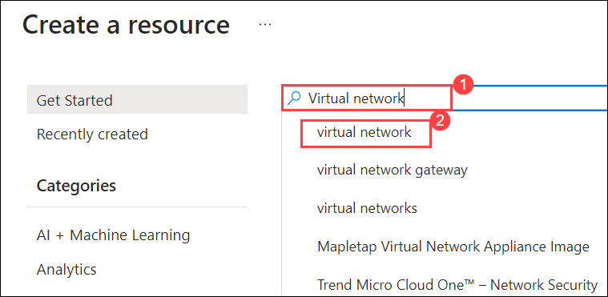
     
1.  Within the Marketplace page, from the Virtual Network card, click on **Create (1)** and select **Virtual Network (2)**.

     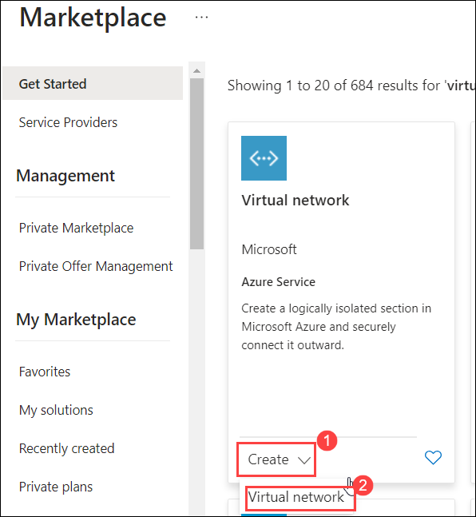

1. On the **Basics** tab of **Create virtual network**, enter the following information:

    -  **Subscription (1):** Select your Subscription
  
    -  **Resource group (2):** Select **RG-01-<inject key="DeploymentID" enableCopy="false"/>** resource group from the drop down list

    -  **Name (3):**  Enter **vnet-prod-001**

    -  **Location (4):** Select **East US**

    - Click on **Next(5)**
  
   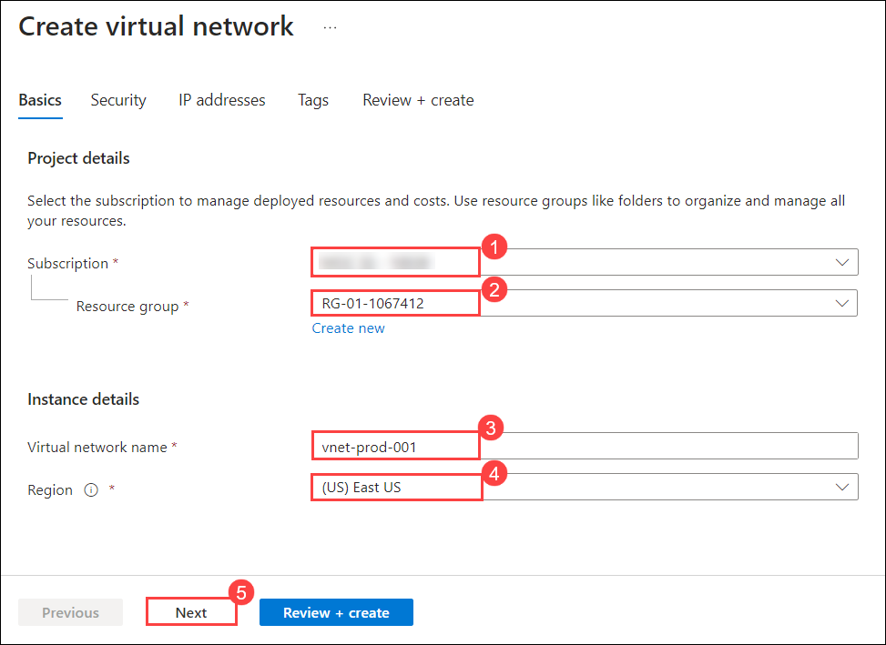

1. Leave everything as **default** under **Security** tab and click on **Next**.

    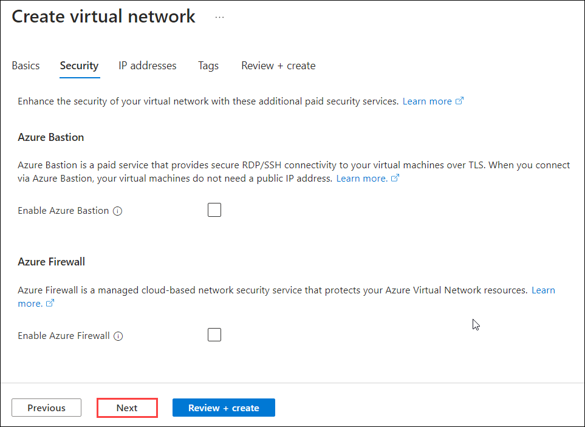

1. On the **IP address** tab enter the following information:

    - **IPv4 address space** : Replace the existing IP address with **10.1.0.0/16 (1)**
    - **Subnets** : Click on edit symbol **(2)** next to default Subnet.
  
   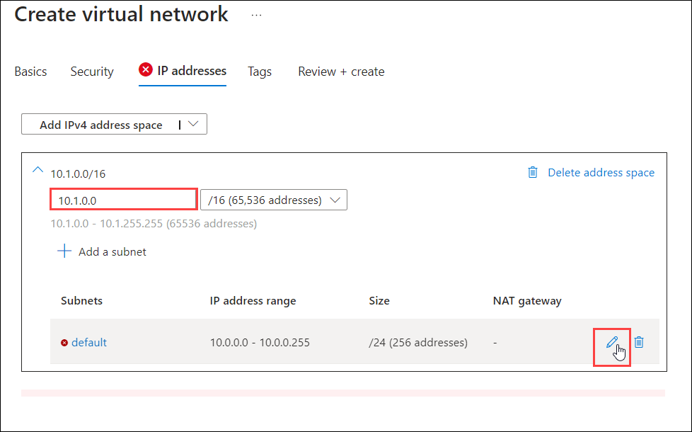

1.  On the **Edit Subnet** page, follow the below-mentioned instructions:

    - **Starting address** : Enter **10.1.0.0 (1)**
    - Click on **Save (2)**

    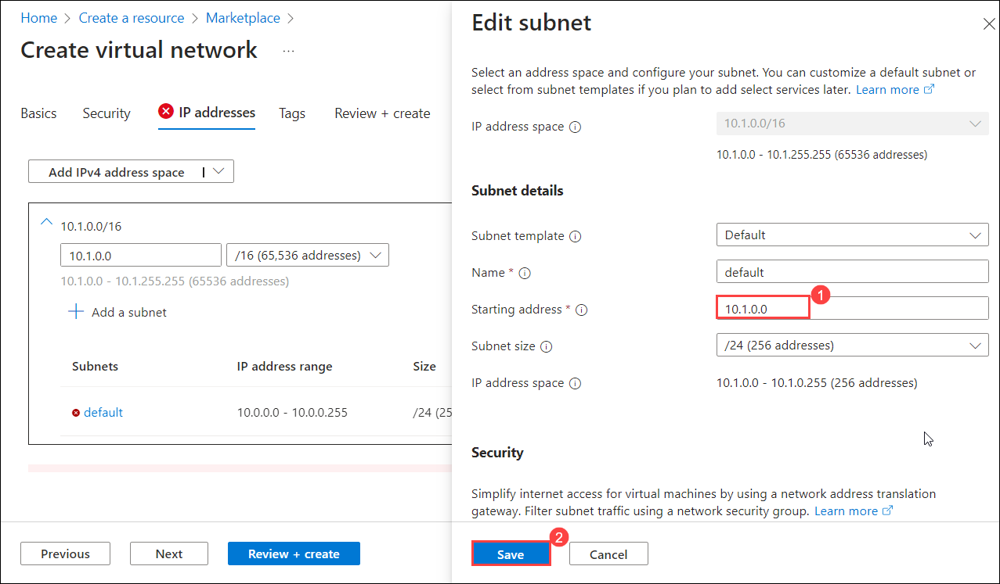

1. Click on **Review + create**

   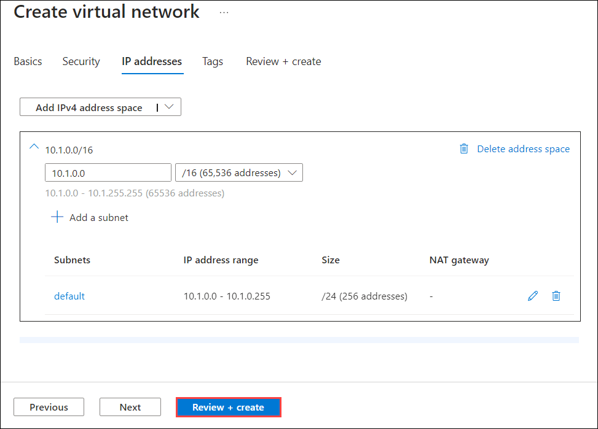

1. Review the configuration and click on **Create**.

   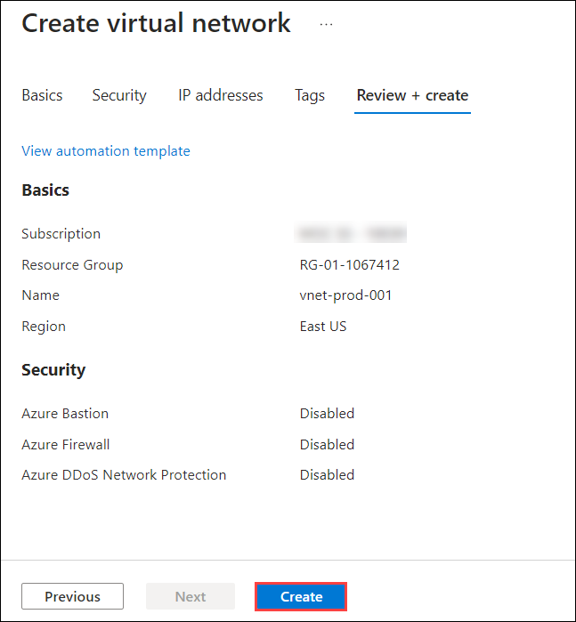

1. Monitor the deployment status by selecting the **Notifications Bell (1)** icon at top of the portal. In a minute or so, you should see a confirmation of the successful deployment. Select **Go to resource (2)**. This action will redirect you to the page.

   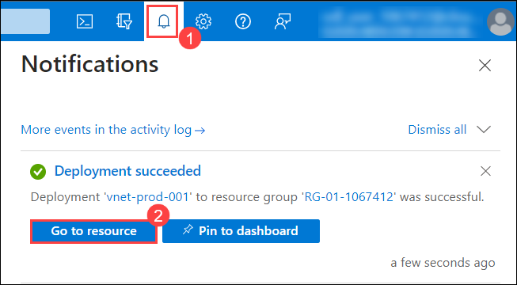

1. From upper left corner Azure Portal select the **menu (1)** icon with three lines as highlighted below and then select **+ Create a resource (2)**.

      
     
1.  In the search box, type **Virtual Network (1)** and select **(2)** to open it.

     
     
1.  Within the Marketplace page, from the Virtual Network card, click on **Create (1)** and select **Virtual Network (2)**.

     

1.  On the **Basics** tab of **Create virtual network**, enter the following information:

    -  **Subscription (1):** Select your Subscription
  
    -  **Resource group (2):** Select **RG-01-<inject key="DeploymentID" enableCopy="false"/>** resource group from the drop down list

    -  **Name (3):**  Enter **vnet-prod-002**

    -  **Location (4):** Select **(US) West US**

    - Click on **Next(5)**
  
    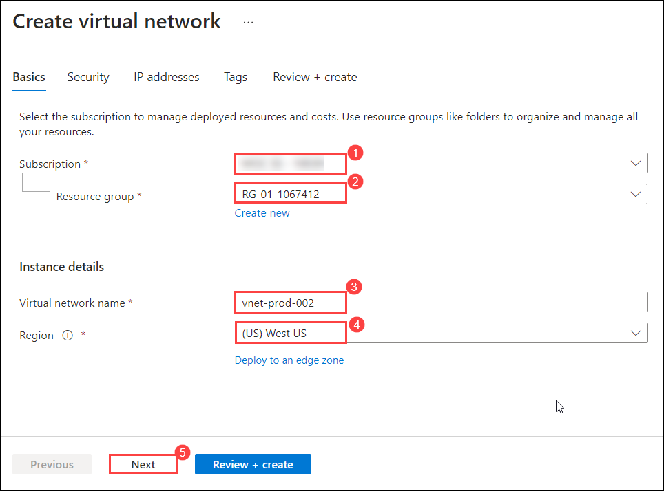

1. Leave everything as **default** under **Security** tab and click on **Next**.

    

1. On the **IP address** tab enter the following information:

    - **IPv4 address space** : Replace the existing IP address with **10.2.0.0/16 (1)**
    - **Subnets** : Click on edit symbol **(2)** next to default Subnet.
  
    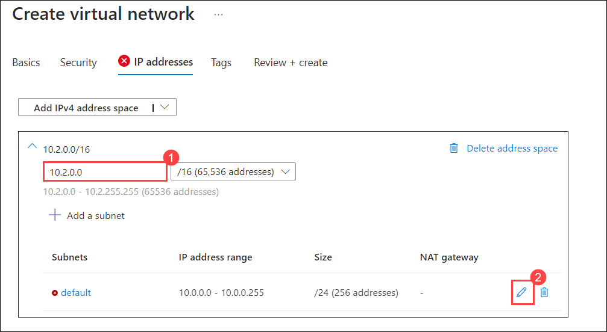

1. On the **Edit Subnet** page, follow the below-mentioned instructions:

   - **Starting address** : Enter **10.2.0.0 (1)**
   - Click on **Save (2)**

   

1. Click on **Review + create**

   

1. Review the configuration and click on **Create**.

   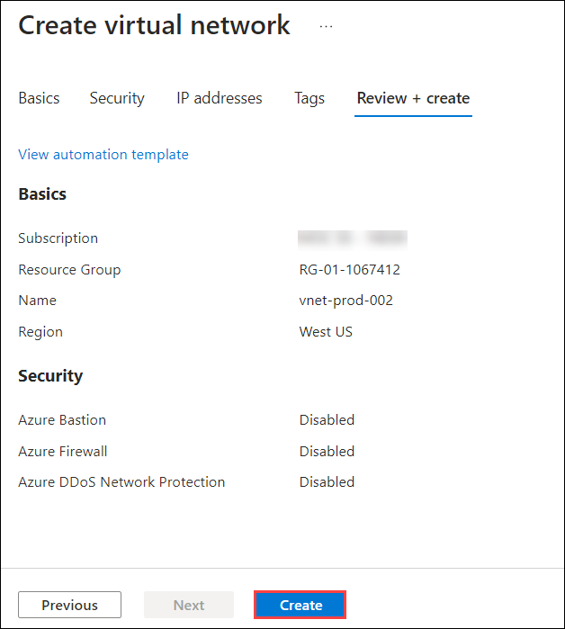

1. Monitor the deployment status on the **vnet-prod-002** deployment overview page. In a minute or so, you should see a confirmation of the successful deployment and then click on **Go to resource**. This action will redirect you to the resource overview page.

   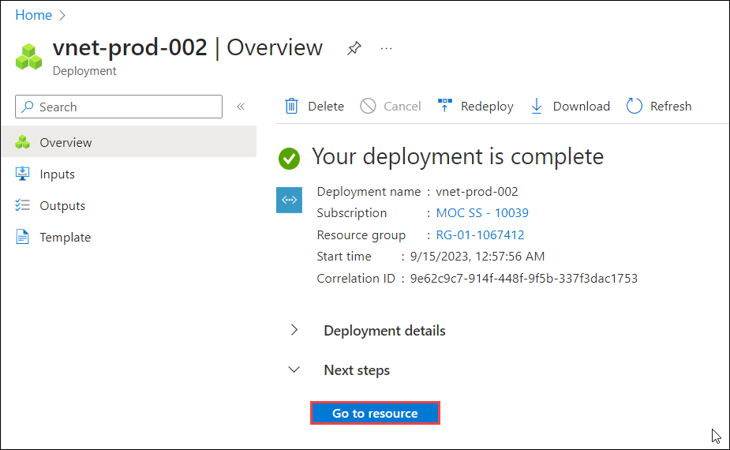

## Task 2: Create Virtual WAN and configure Network Hub for workloads

1. In the search bar of the Azure portal, type **Virtual wan (1)**, then click on **Virtual WANs** under **Services**.

      

2. On the **Virtual WANs** page, click on **+ Create**.

      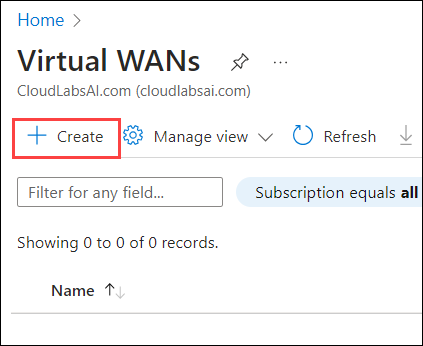

3. On the **Basics** tab of **Create WAN**, enter the following information to create a WAN:

    -  **Subscription (1):** Select your Subscription
  
    -  **Resource group (2):** Select **RG-01-<inject key="DeploymentID" enableCopy="false"/>** resource group from the drop down list

    -  **Region (3):**  Select **(US) West US**

    -  **Name (4):** Enter **vwan-prod-001**
  
    -  **Type (5):** Select **Standard** from the dropdown
  
    -  Click on **Next : Review + create (5)**
  
   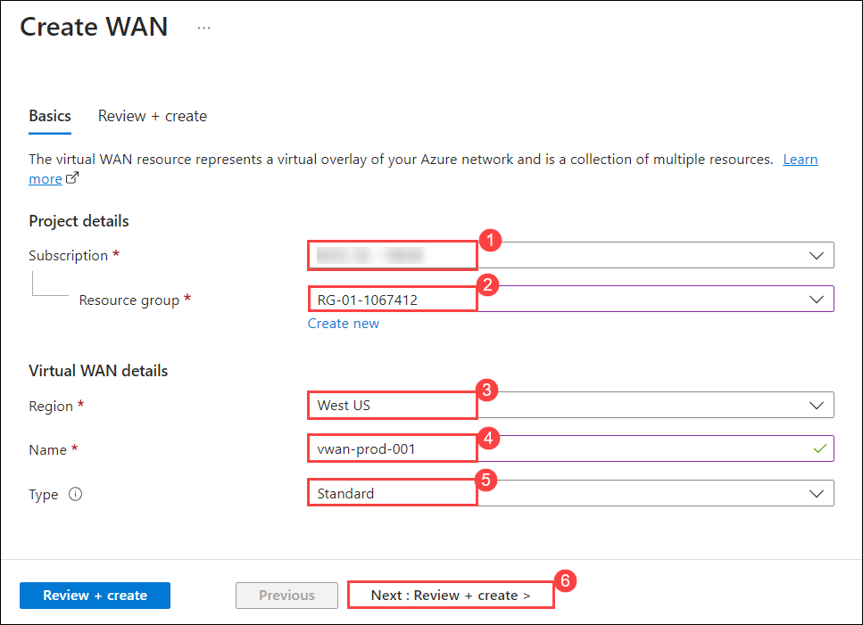

4. Review the configurations and click on **Create**.

      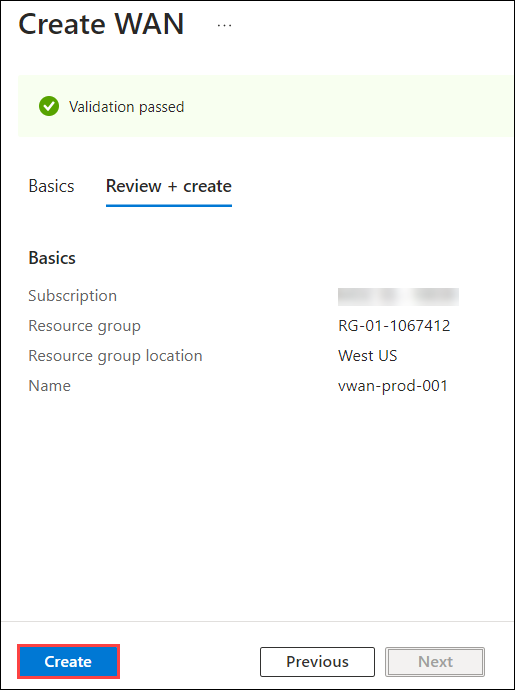

5. Monitor the deployment status on the **VirtualWanDeployment | overview** page. In a minute or so, you should see a confirmation of the successful deployment and then click on **Go to resource**. This action will redirect you to the resource overview page.

      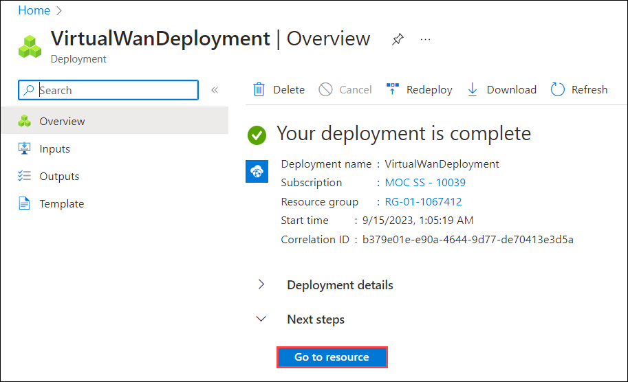

6. On the **Basics** tab of **vwan-prod-001 | Hubs** page, select **Hubs (1)** under the **Connectivity** section from the left navigation pane and then click on **+ New Hub (2)**.

      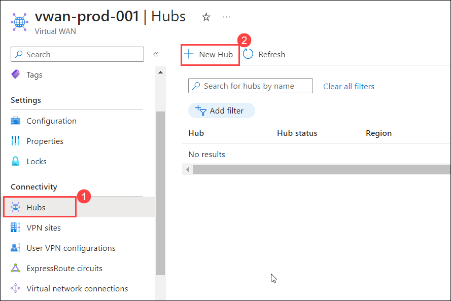

 7. On the **Create virtual hub** page, enter the following information to create a virtual hub:

     -  **Region:** Select **West US (1)**
       
     -  **Name:** Enter **vwan-hub-prod-001 (2)**
   
     -  **Hub private address space:** Enter **10.3.0.0/16 (3)**
    
     -  **Virtual hub capicity:** Select **2 Routing Infrastructure Units, 3 Gbps Router, Supports 2000 VMs (4)** from the dropdown
   
     -  **Hub routing prefernece:** Select **VPN (5)** from the dropdown
   
     -  Click on **Next : Site to site (6)**
   
    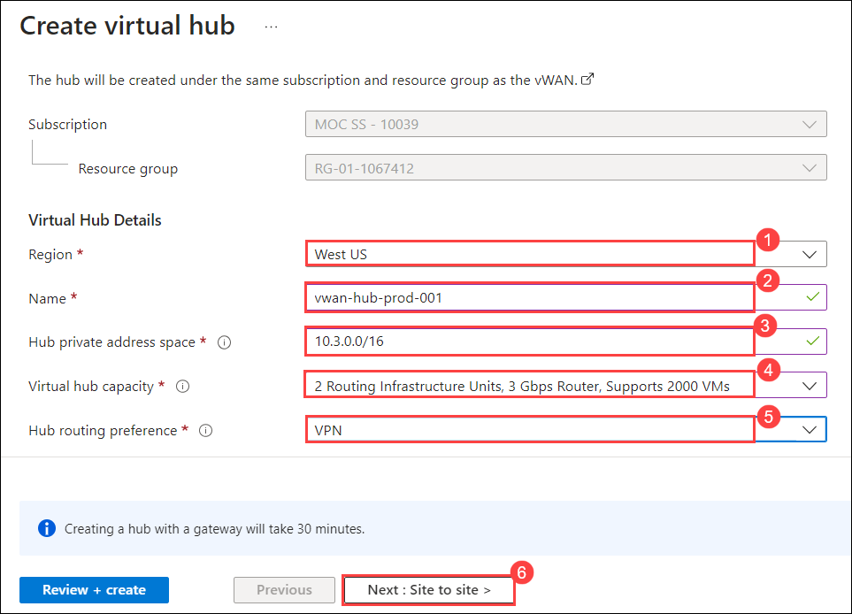

7. On the **Site to site** tab of the **Create virtual hub** page, execute the following:

     - **Do you want to create a Site to site (VPN gateway):** Ensure to select **Yes (1)**
  
     -  **Gateway scale units:** Select **1 scale unit - 500 Mbps x 2 (2)** from the dropdown
  
     -  **Routing prefernece:** Select **Internet (3)**
  
     -  Click on **Review + create (4)**
  
    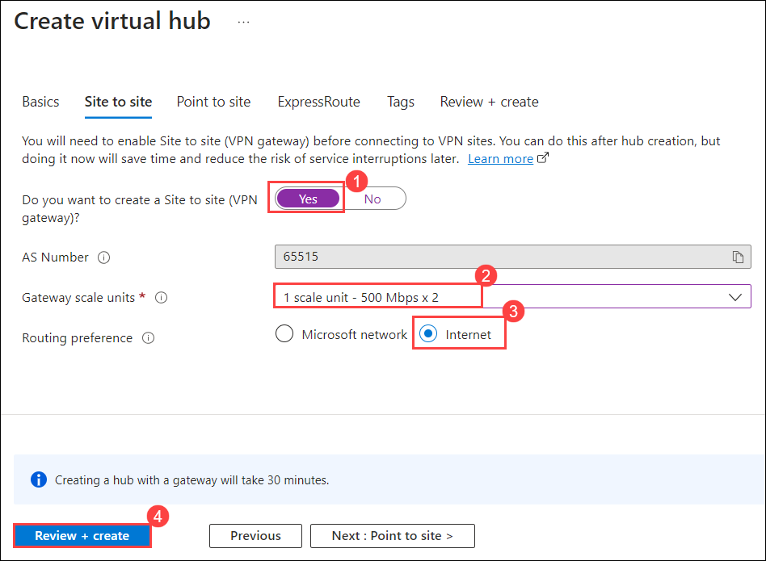

8. Review the configurations and click on **Create**.

   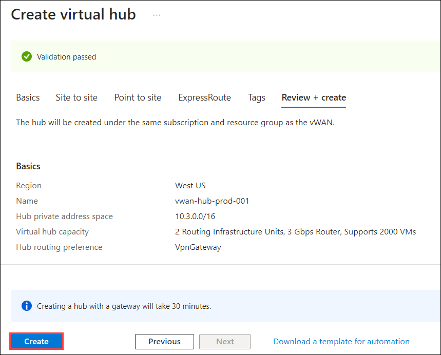
