# Exercise 5: Provision private access to PaaS resources 

## Task 1: Configure Private endpoint for PaaS resources

1. From the **Azure Portal**, search for **Private DNS Zones (1)** and select it **(2)** from results.

   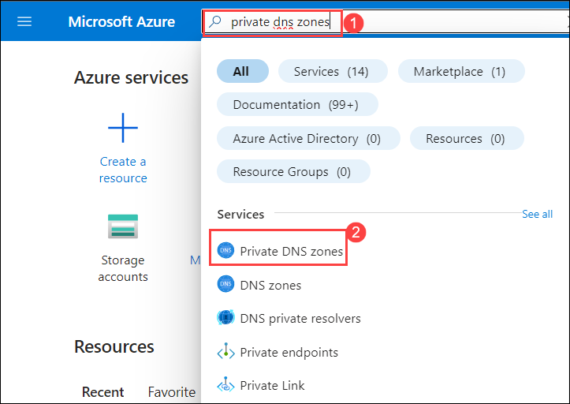

1. On **Private DNS zones** page, click on **+ Create**.

   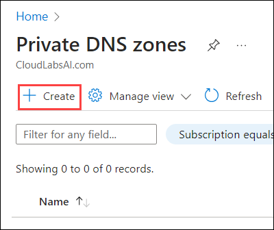

1. On **Basics** tab of Create Private DNS zone, follow the below instructions:

    - **Subscription** : Leave it as **default (1)**
    - **Resource group** : Select **RG-01-<inject key="DeploymentID" enableCopy="false"/> (2)** from the drop-down
    - **Name** : Enter **dns<inject key="DeploymentID" enableCopy="false"/>.com (3)**
    - Click on **Review Create (4)**
  
    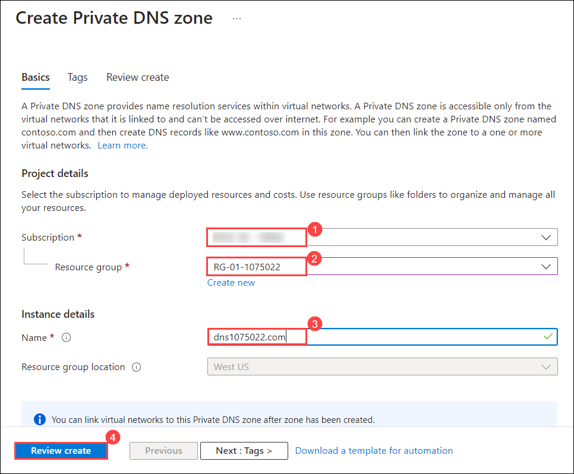

1. Review the configuration and click on **Create**.

    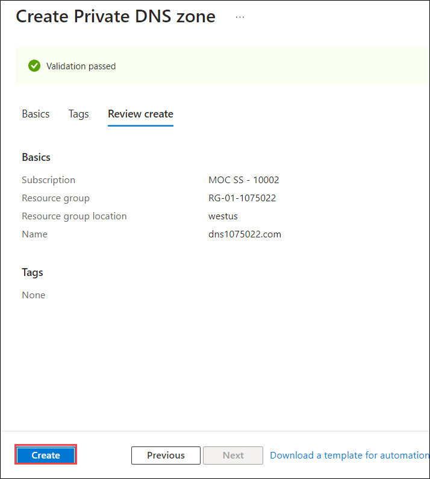

1. Once the deployment is succeded, click on **Go to resource**.

    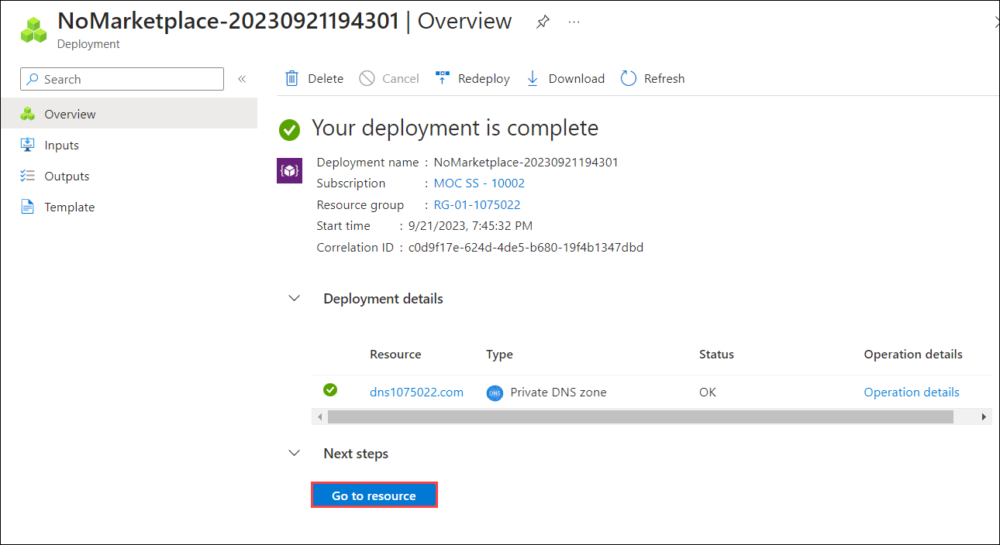

## Task 2: Setup DNS Configuration

1. On Private DNS zone page, click on **Virtual network links (1)** and click on **+ Add (2)**.

    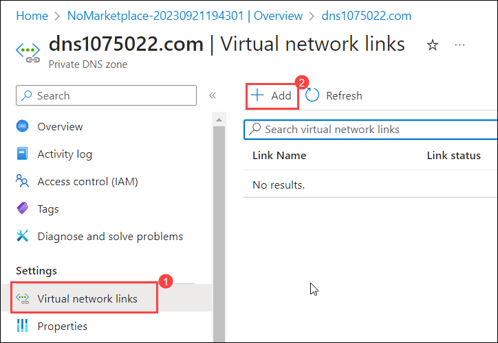

1. On **Add virtual network link** page, follow the below instructions:

   - **Link name** : Enter **vnet001 (1)**
   - **Subscription** : Leave it as **default (2)**
   - **Virtual network** : Choose **vnet-prod-001 (3)** from drop-down
   - **Configuration** : Check the box next to **Enable auto registration (4)**
   - Click on **Ok (5)**
  
    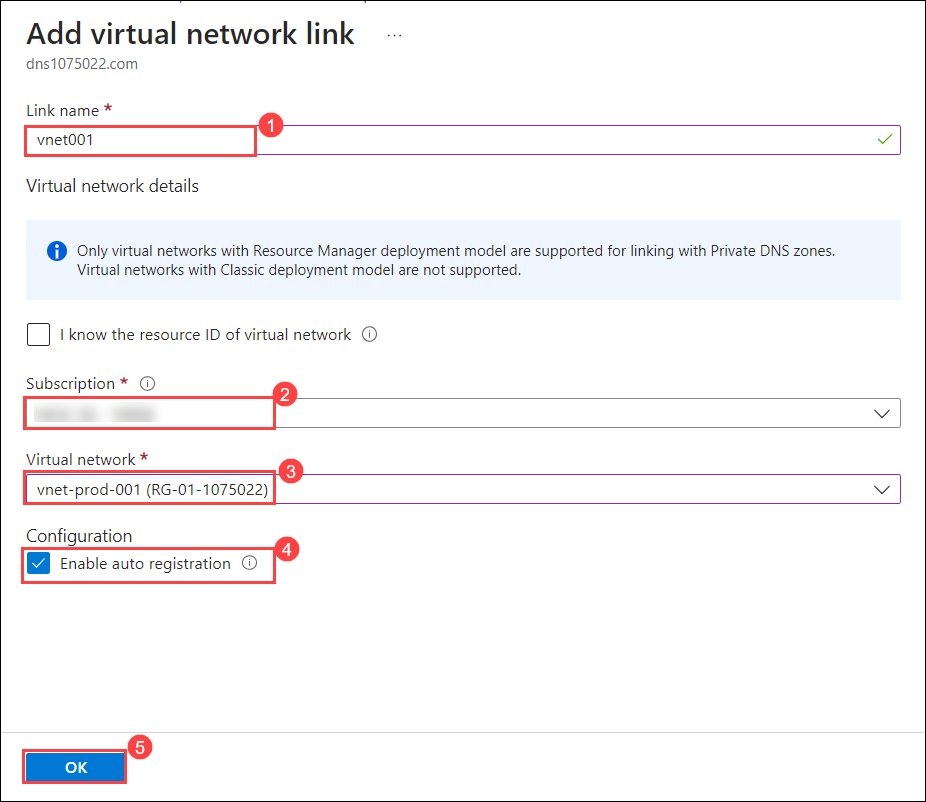

1. Now again, click on **Virtual network links (1)** and click on **+ Add (2)**.

    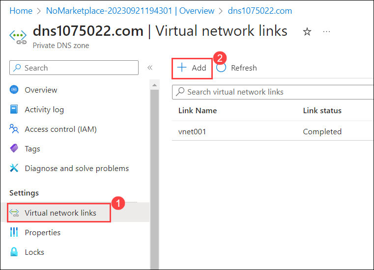

1. On **Add virtual network link** page, follow the below instructions:

   - **Link name** : Enter **vnet002 (1)**
   - **Subscription** : Leave it as **default (2)**
   - **Virtual network** : Choose **vnet-prod-002 (3)** from drop-down
   - **Configuration** : Check the box next to **Enable auto registration (4)**
   - Click on **Ok (5)**
  
    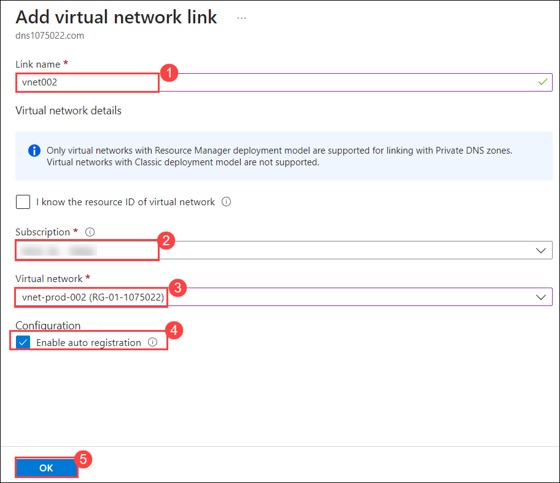

   > **Note:** Deployment will take 1-2 minutes.
   
1. On **Private DNS zone** page, navigate to **Overview (1)** tab and observe the Record Set values for both Virtual machines **(2)**.
   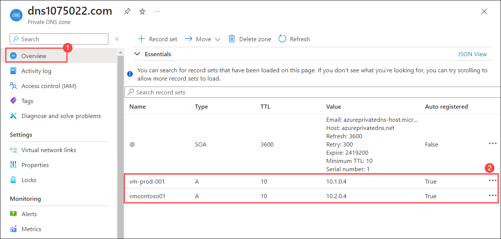

1. Now, navigate back to the virtual machine **vm-prod-001** and browse the private endpoint URL **vmcontoso01.dns<inject key="DeploymentID" enableCopy="false"/>.com** to access the web page.

   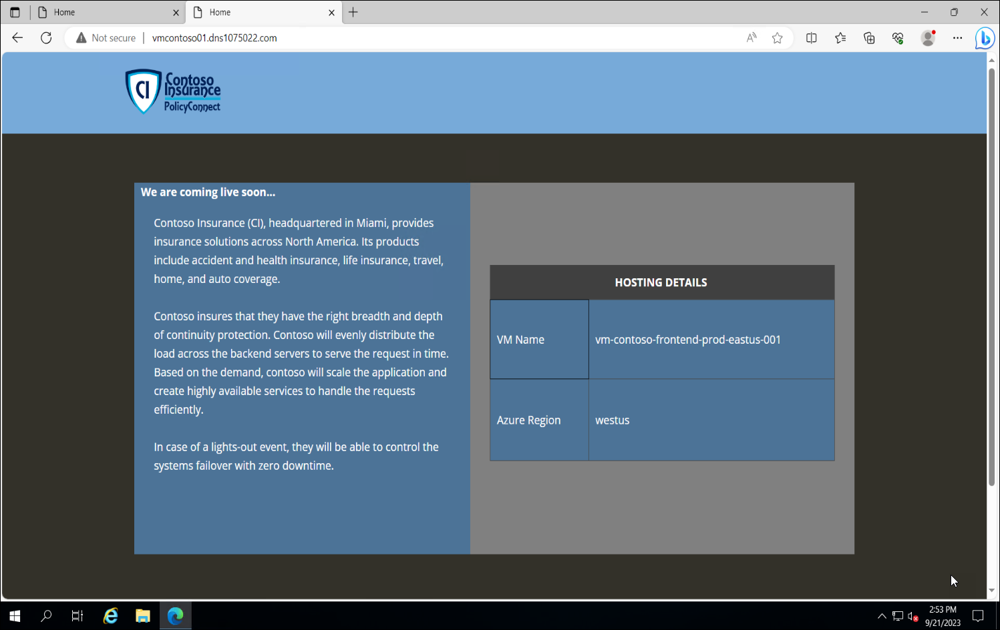
