# Exercise 2: Expand to a second Azure Region

In this exercise, you'll 

## Task 1: Create secondary Hub and Spoke network and infrastructure. 

1. In the search bar of the Azure portal, type **Virtual WANs (1)**, then click on **Virtual WANs (2)** under **Services**.

      

1. On the **Virtual WANs** page, select **vwan-prod-001**.

      

1. On the **vwan-prod-001** Page, select **Hubs (1)** under connectivity, then click on **+ New Hub (2)**.

      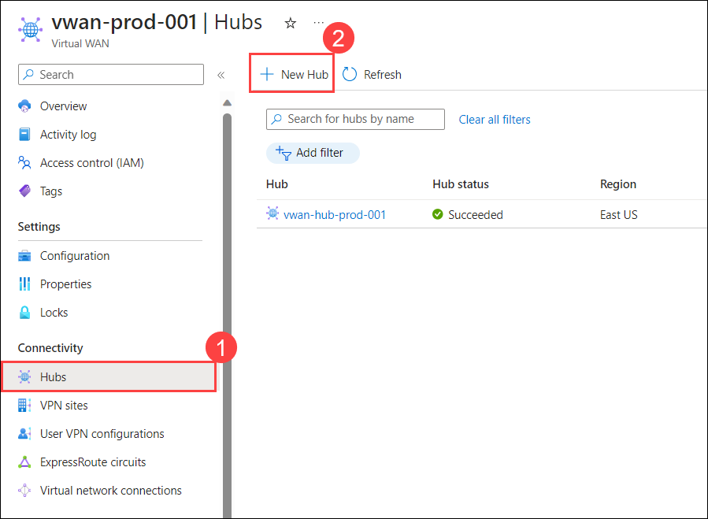

1. On the **Basics** page, fill in the following information:

   - **Subscription (1)**: Leave as it as default 
   - **Resource group (2)**: Select **Sharedservices-RG-<inject key="DeploymentID" enableCopy="false"/>**
   - **Region (3)**: Select **West US**
   - **Name (4)**: Enter **vwan-hub-prod-002**
   - **Hub private address space (5)**: Enter **10.6.0.0/16**
   - **Virtual hub capacity (6)**: Select **2 Routing Infrastructure Units, 3 Gbps Router, Supports 2000 VMs**
   - **Virtual routing preference (7)**: Select **VPN**
   - Click on **Next : Site to site > (8)**

      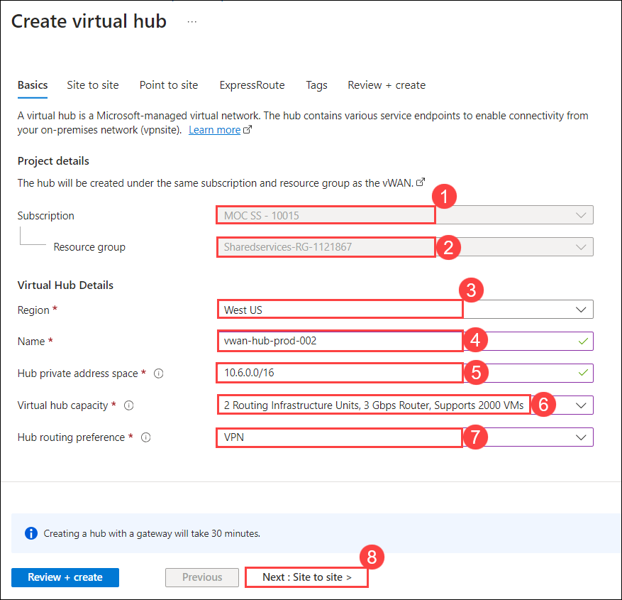 

1. On the **Site to site** page, fill in the following information:

   - **Do you want to create a Site to site(VPN gateway)  (1)**: Select **Yes** 
   - **Gateway scale units (2)**: Select **1 scale unit - 500 Mbps * 2** 
   - **Routing preference (3)**: Select **Internet**
   - Click on **Review + create (4)**

      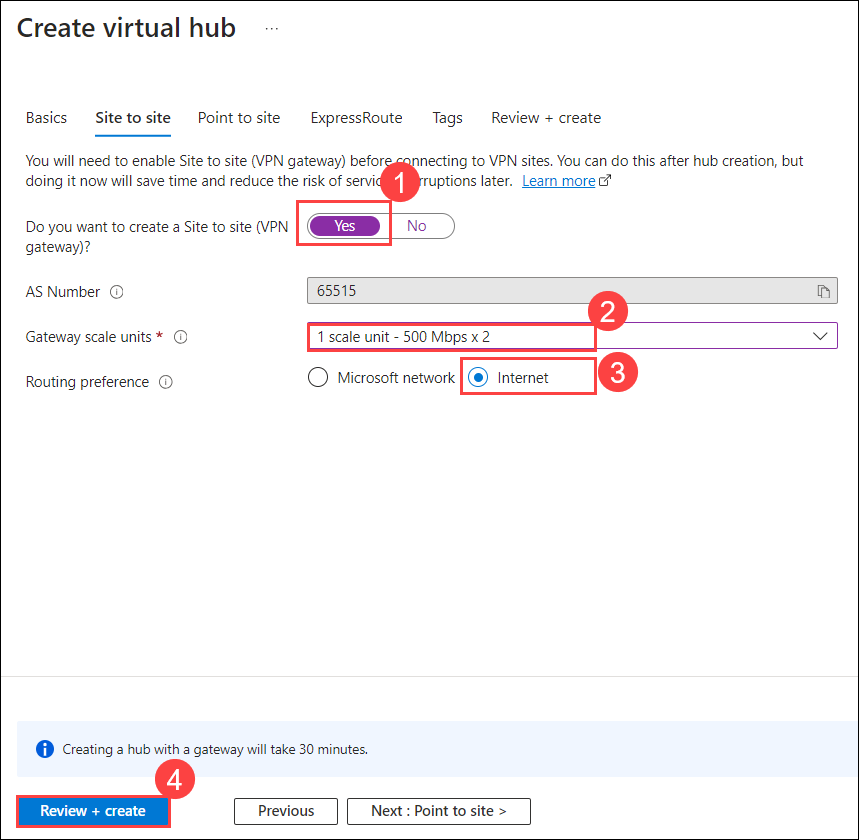

1. Review the configuration, and click on **Create**.

      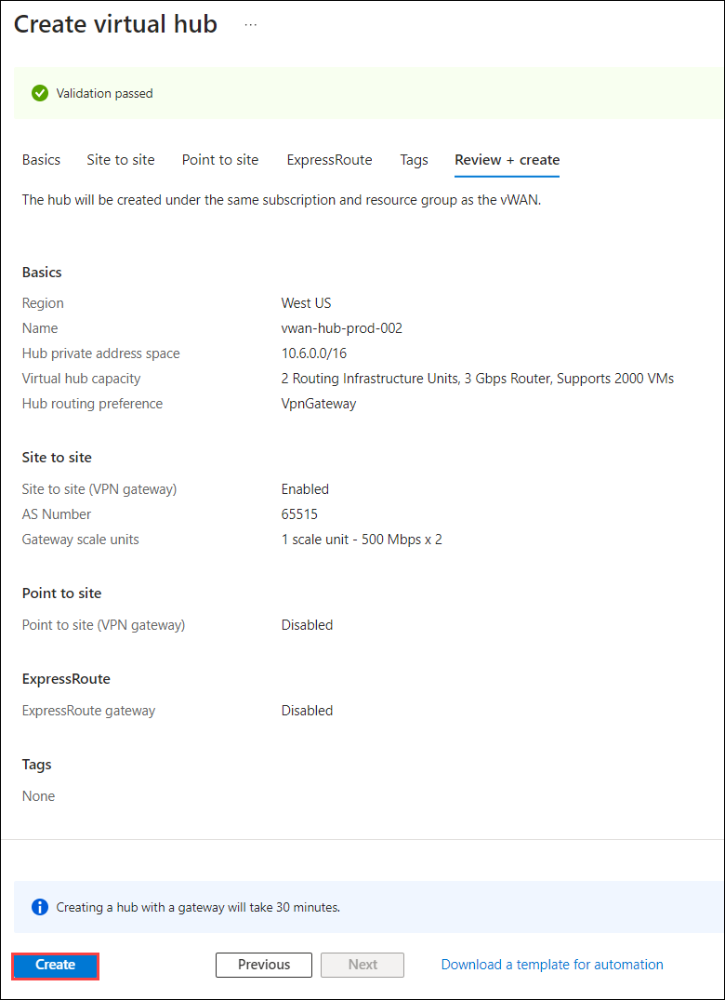

      >**Note**: Deployment to create a hub with a gateway will take 30 minutes.

1. Navigate to the **vwan-prod-001**| **Virtual network connections (1)** under the **Connectivity** section and click on **+ Add connection (2)**

      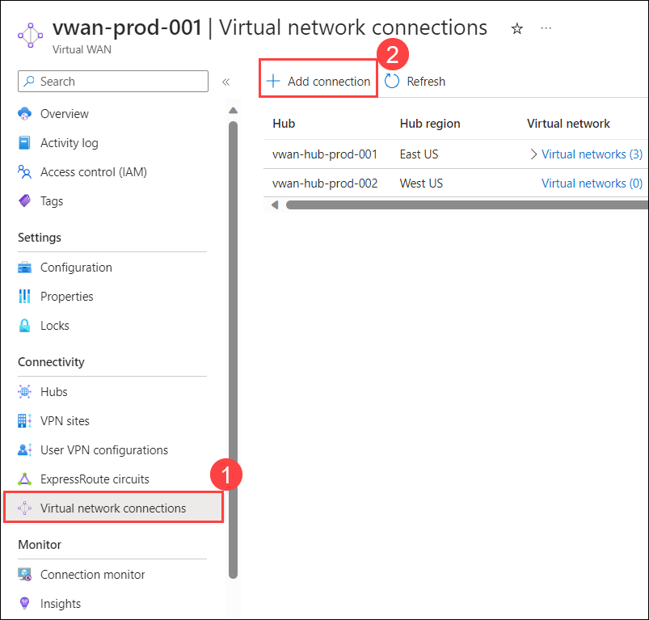

1. On the **Add Connection** page, enter the following values:

    - **Connection Name (1):** Enter **vwan-vnet-003**

    - **Hubs (2):** Select **vwan-hub-prod-002**

    - **Subscriptions (3):** Select your subscription
    
    - **Resource group (4):** Select **Prod-RG2-<inject key="DeploymentID" enableCopy="false"/>** resource group from the drop down list

    - **Virtual network (5):** Select **vnet-spoke3-<inject key="DeploymentID" enableCopy="false"/>** from the drop down list

    - Under **propagate to none**, make sure its selected to **No (6)**

    - Click on **Create (7)**.

        

1. After adding the creation, you receive a **Notifications (1)** stating **Successfully added peering (2)**.

    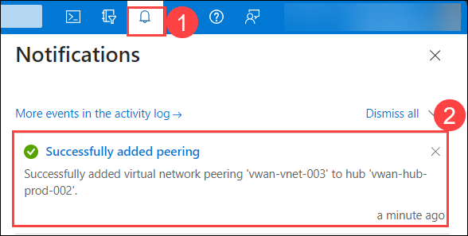

1. To add a second connection, click on **+ Add Connection** and enter the following values:

     - **Connection Name (1):** Enter **vwan-vnet-004**

     - **Hubs (2):** Select **vwan-hub-prod-002**

     - **Subscriptions (3):** Select your subscription
    
     - **Resource group (4):** Select **Prod-RG2-<inject key="DeploymentID" enableCopy="false"/>** resource group from the drop down list

     - **Virtual network (5):** Select **vnet-spoke4-<inject key="DeploymentID" enableCopy="false"/>** from the drop down list
       
     - Under **propogate to none**, make sure its selected to **No (6)**
       
     - Click on **Create (7)**.
    
          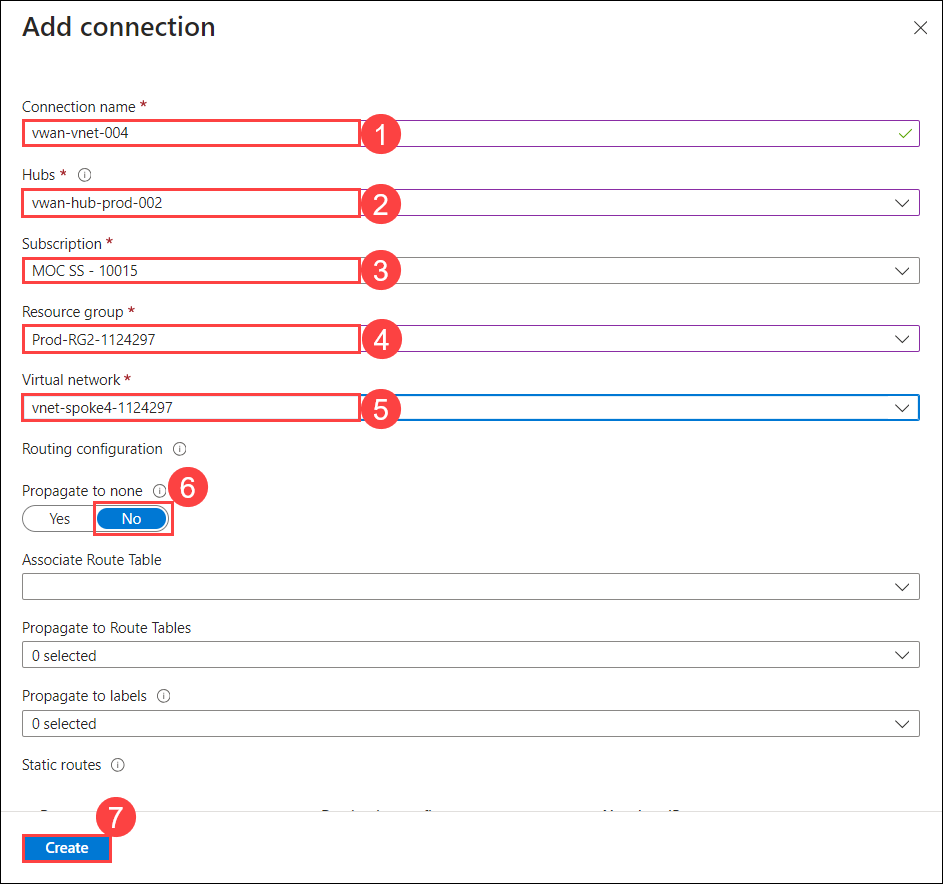

1. After adding the creation, you receive a **Notifications (1)** stating **Successfully added peering (2)**.

     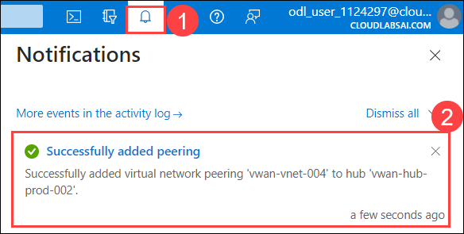

1. Go back to **vwan-prod-001 | Virtual network connection**, click on the drop-down symbol next to **Virtual networks (1)**, you can see **vnet-spoke3-<inject key="DeploymentID" enableCopy="false"/> (2)** and **vnet-spoke4-<inject key="DeploymentID" enableCopy="false"/> (2)** created.

    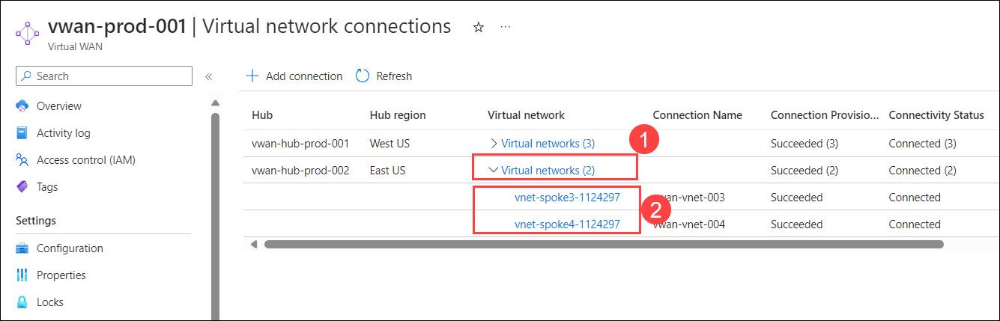

1. In the **Search resources, services, and docs**, enter **Virtual network gateways**, and then select **Virtual network gateways** from the results.

    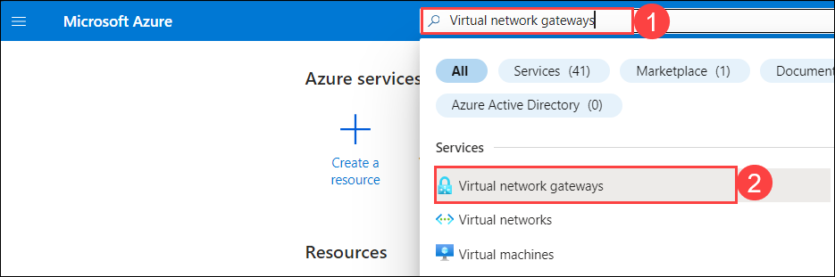

1. On the **Virtual network gateways** page, click on **+ Create**.

   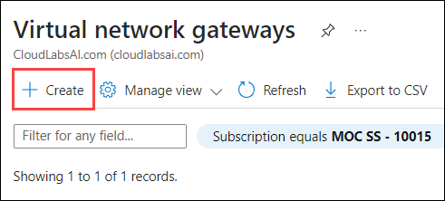

1. On the **Create virtual network gateway** page, fill the following information:
   
   - **Subscription (1)**: Leave as it as default

   - **Name (2)**: Enter **vpn-gateway-prod-002**

   - **Region (3)**: Select **West US**

   - **Gateway type (4)**: Select **VPN**

   - **SKU (5)**: Select **VpnGw2**

   - **Generation (6)**: Select **Generation2**

   - **Virtual network (7)**: Click on **Create virtual network**

     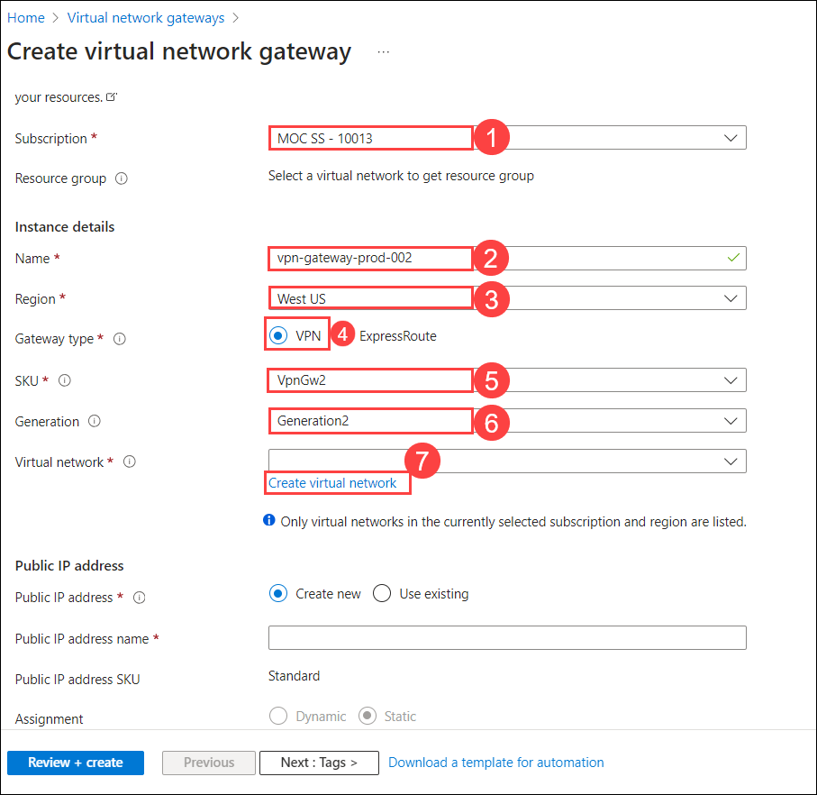

1. On the **Create virtual network** blade, fill the following information:
   
   - **Name (1)**: Enter **GatewayVnet-region2**

   - **Resource group (2)**: Select **Prod-RG2-<inject key="DeploymentID" enableCopy="false"/>**

   - **Address range (3)**: Enter **10.9.0.0/16**

   - **Subnet name (4)**: Enter **Gatewaysubnet**

   - **Address range (5)**: Enter **10.9.0.0/24**

   - Click on **OK (6)**

     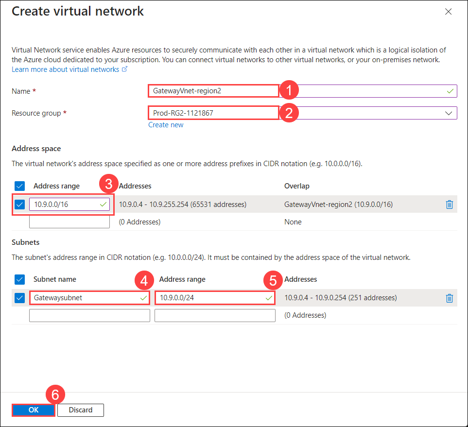

1. Once the virtual network is created, fill the following information:

   - **Public IP address (1)**: Select **Use existing**

   - **Choose public IP address (2)**: Select **onprem-pip-vpn-gateway-002**

   - **Enable active-active mode (3)**: Select **Disabled**

   - **Configure BGP (4)**: Select **Disabled**

   - Click on **Review + create (5)**

     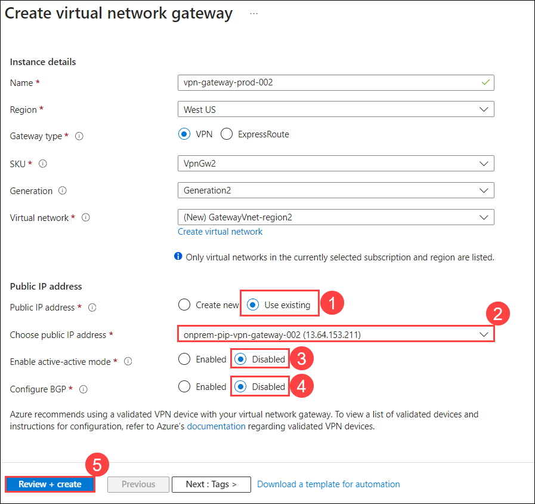

1. Review the configuration, and click on **Create**.

      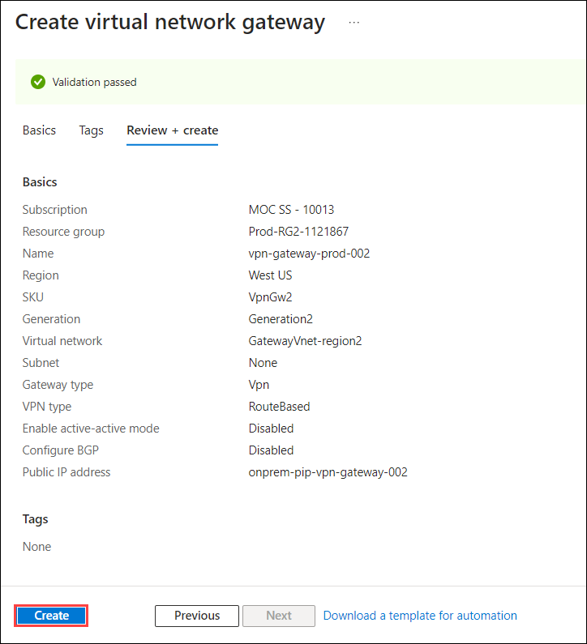

## Task 2: Configure network peering between primary and secondary Hub. 

1. In the search bar of the Azure portal, search **Public IP addresses  (1)**, then select **Public IP addresses  (2)** under **Services**.

   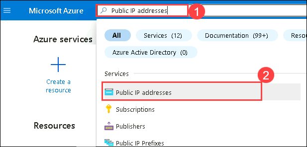

1. Select the Azure virtual network gateway Public IP addresses **onprem-pip-vpn-gateway-002**.

     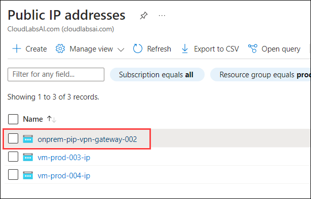

1. On the right side of the overview pane view find the IP address and hover the right side of the **Public IP address** to copy to the clipboard or record it on notepad.

   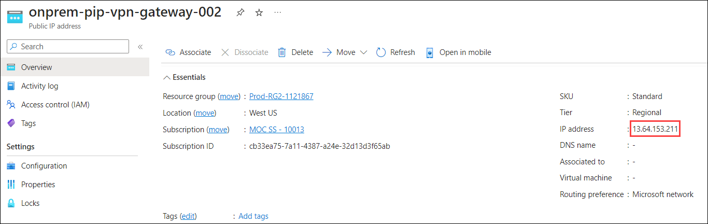

1. On the **vwan-prod-001** Page, select **VPN sites (1)** under connectivity, then click on **Create site (2)**.

    

1. On the **Basics** page, fill in the following information:

   - **Subscription (1)**: Leave as it as default 
   - **Resource group (2)**: Select **Sharedservices-RG-<inject key="DeploymentID" enableCopy="false"/>**
   - **Region (3)**: Select **West US**
   - **Name (4)**: Enter **on-prem-2**
   - **Device vender (5)**: Enter **generic**
   - **Private address space (6)**: Enter **LabVM-<inject key="DeploymentID" enableCopy="false"/>** address space i.e. `10.1.0.0/16`
   -  Click on **Next : Links > (7)**

      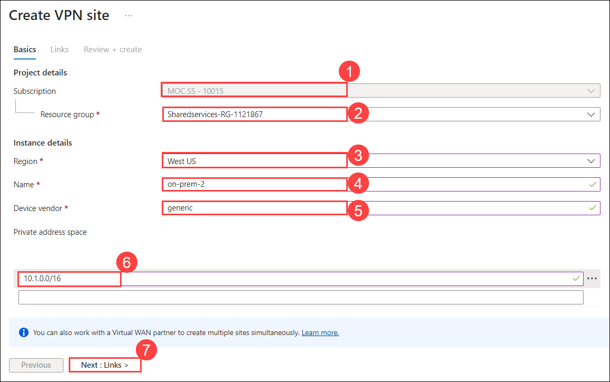

1. On the **Links** page, fill in the following information:
  
    - **Link name (1)**: Enter **Onprem-ISP-1**
    - **Link speed (2)**: Enter **1000**
    - **Link provider name (3)**: Enter **ISP-provider**
    - **Link IP address/FQDN (4)**: Enter **Public IP of onprem-pip-vpn-gateway-002** that you copied in step 9.
    - Click on **Next : Review + Create > (5)**

      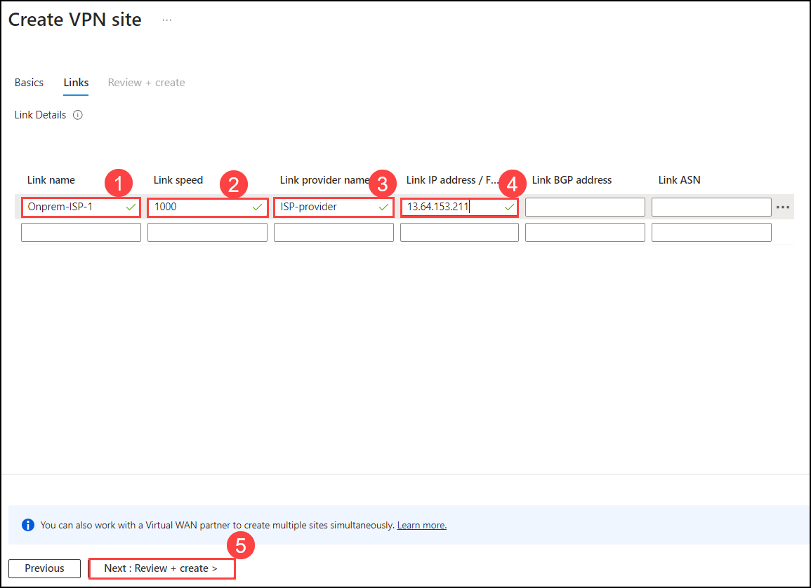

1. Review the configuration, and click the **Create**.

      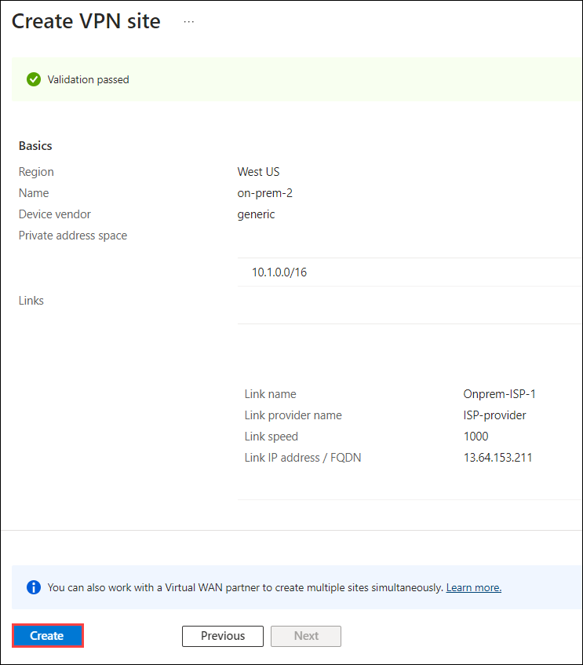

1. Go back to the **Basics** tab of **vwan-prod-001** page, select **Hubs (1)** under the **Connectivity** section from the left navigation pane and then click on **vwan-hub-prod-002 (2)**.

      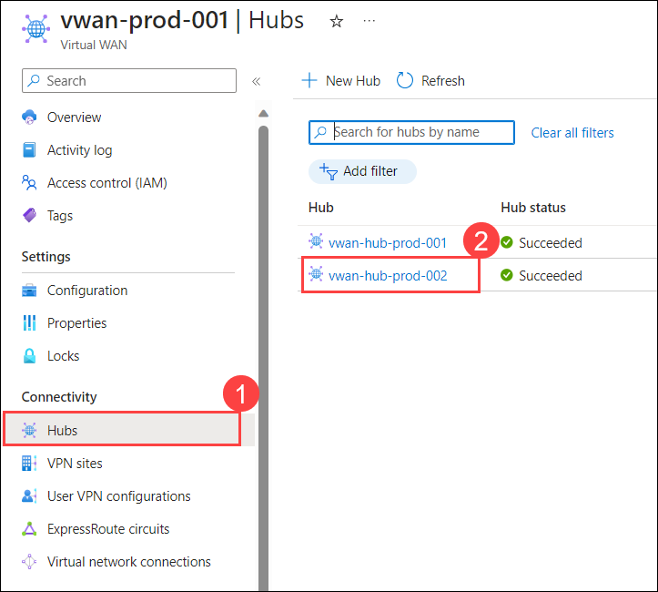

1. Select **VPN (site to site) (1)** Under the hub, perform the following steps:

   - Click the **View/Configure (2)**. 
   - Under the Edit VPN Gateway, record in Notepad the **Public IP address for VPN Gateway instance 0 (3)**. This Public IP will be used in later on-premises VPN step configuration.
   - Click on **Cancel (4)**. 

      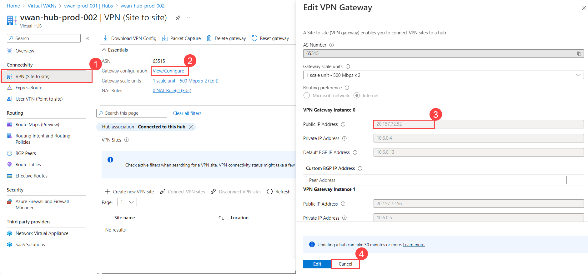

1. On the **VPN (site to site)** Under Gateway configuration click on **Clear all filters**.

   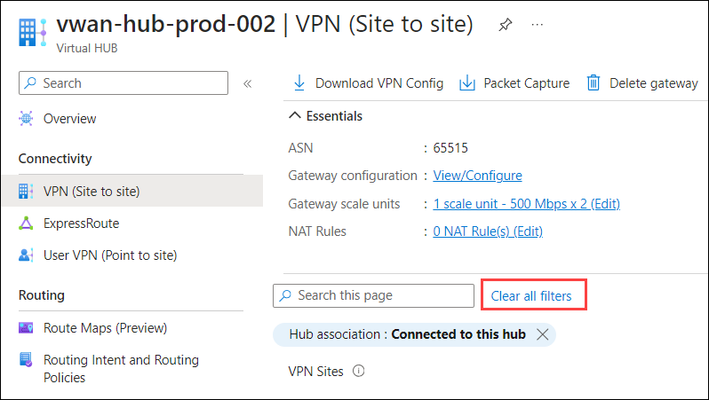

1. Select the VPN site **on-prem (1)** then click on the **Connect VPN sites (2)**.

    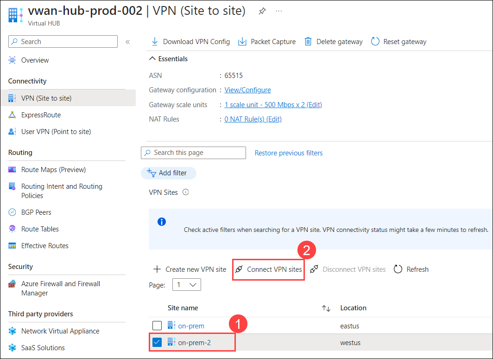

1. On the **Connect sites** Page, enter the following details.

   - **Pre-shared key PSK (1)** : Enter **0123456789**

   - Click on **Connect (2)**. 

      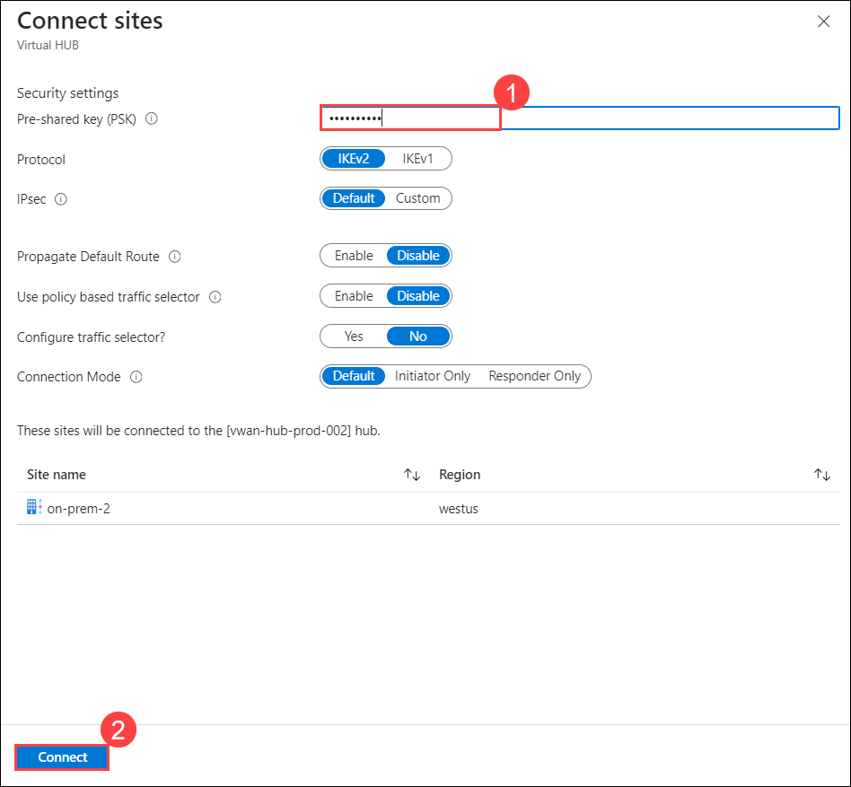

     >**Note**: Record the Pre-shared key PSK in Notepad as you will be using it a step later to complete the VPN connectivity from the on-premises VPN configuration. 

1. Wait for the Connection to be **completed**.

    

1. In the search box, search **Local network gateway (1)** and select **Local network gateways (2)** from the results.

     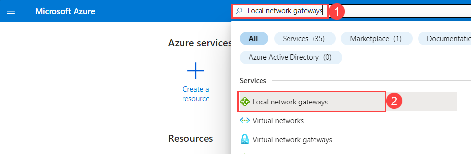

1. On the **Local network gateways** page, click on **+ Create**. 

    

1. On the **Basics** page, fill in the following information:
   
   - **Subscription (1)**: Leave as it as **default** 
   - **Resource group (2)**: Select **Prod-RG2-<inject key="DeploymentID" enableCopy="false"/>**
   - **Region (3)**: Select **West US**
   - **Name (4)**: Enter **lng-prod-002**
   - **Endpoint (5)**: Select **IP address**
   - **IP address (6)**: Enter **Public IP address of VPN Gateway instance 0** 
   - **Address space (s) (7)**: Enter 
    
      - Address space of **vnet-spoke1-<inject key="DeploymentID" enableCopy="false"/> (10.2.0.0/16)** 
      - Address space of **vnet-spoke2-<inject key="DeploymentID" enableCopy="false"/> (10.3.0.0/16)**
      - Address space of **vnet-spoke3-<inject key="DeploymentID" enableCopy="false"/> (10.7.0.0/16)**
      - Address space of **vnet-spoke4-<inject key="DeploymentID" enableCopy="false"/> (10.8.0.0/16)**

   -  Click on **Review + create (8)**

      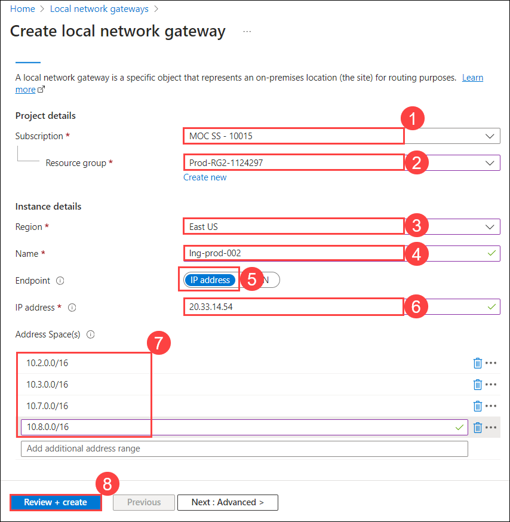

1. Review the configuration, and click the **Create**.
  
   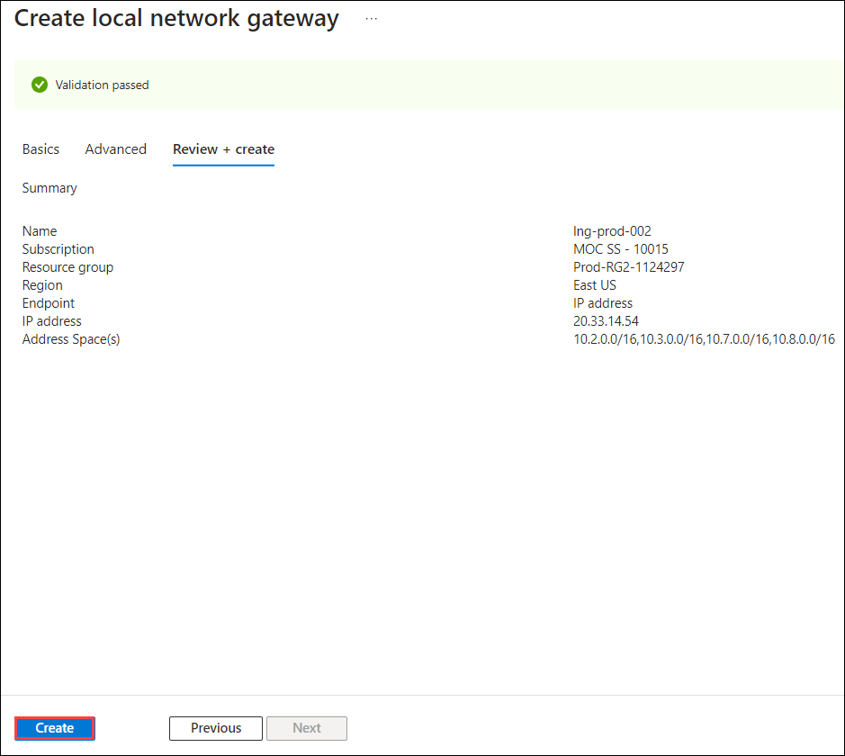

1. Monitor the deployment status on the **lng-prod-002** deployment overview page. In a minute or so, you should see a confirmation of the successful deployment and then click on Go to the resource. This action will redirect you to the resource overview page.

   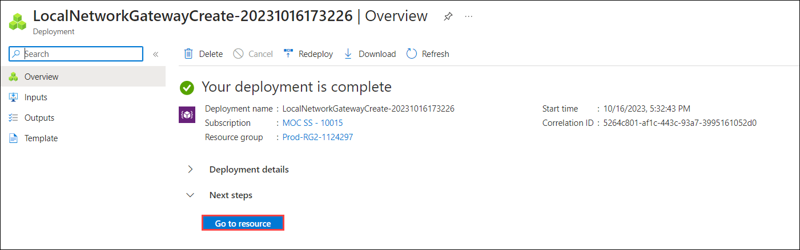

1. On the **lng-prod-002** page, select **Connections (1)** which is under **Settings** blade and click on **+ Add (2)**.

   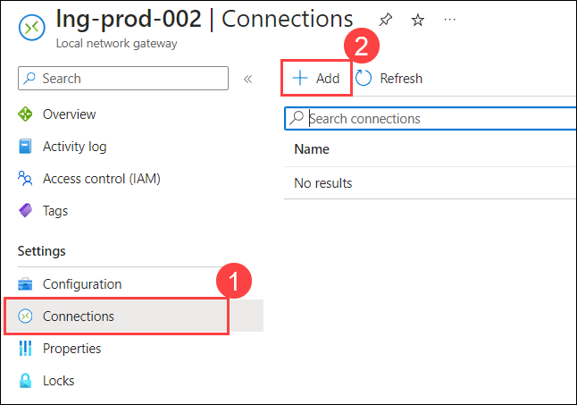

1. On the **Basics** tab, enter the following information:

   - **Subscription (1)**: Leave it as **default**
   - **Resource group (2)**: Select **Prod-RG2-<inject key="DeploymentID" enableCopy="false"/>** from the drop-down.
   - **Connection type (3)**: Select **Site-to-site (IPsec)** from the drop-down.
   - **Name (4)**: Enter **vpn-connection-002**
   - **Region (5)**: Select **East US** from the drop-down.
   -  Click on **Next : Settings > (6)**   

      

1. On the **Settings** tab, enter the following information:

   - **Virtual network gateway (1)**: Select **vpn-gateway-prod-002** from the drop-down.
   - **Local network gateway (2)**: Select **lng-prod-002** from the drop-down.
   - **Shared key(PSK) (3)**: Enter **0123456789**
   - Click on **Review + create (4)**

     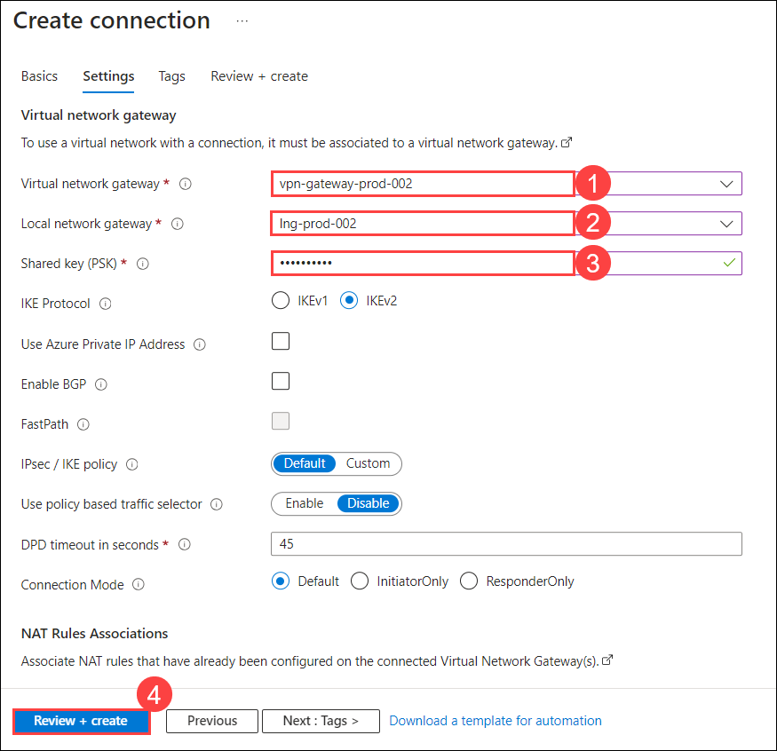
  
1. Review the configuration, and click on the **Create**.
  
   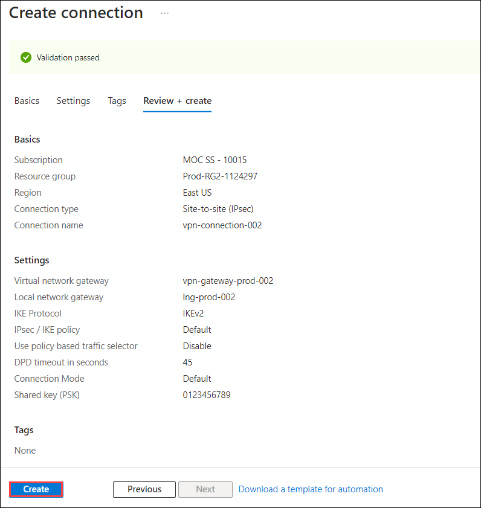

1. Wait for the Deployment to be **completed**.

    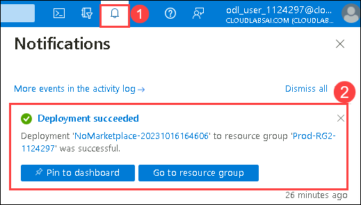

1. From the Azure Portal, type **Virtual network gateway (1)** in the search box and select **Virtual network gateways (2)** from the results.

   
   
1. On the **Virtual network gateways** page, select **vpn-gateway-prod-002**.

   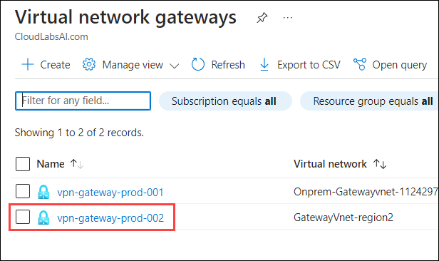

1. On the **vpn-gateway-prod-002** page, select **Connections (1)** review the vpn-connection-002 shows **Connected (2)**. 
    
   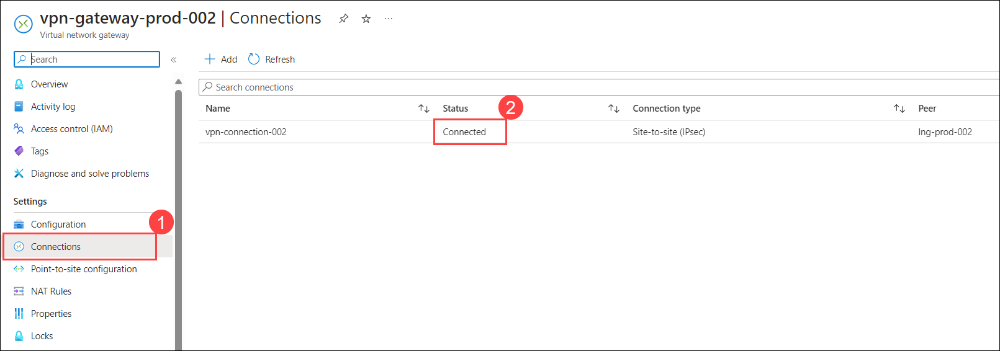

   **Note**: This may take a few minutes to connect. Refresh the page if needed. 

1. Click on the **vpn-connection-002** and review additional information, then close the connection. 

   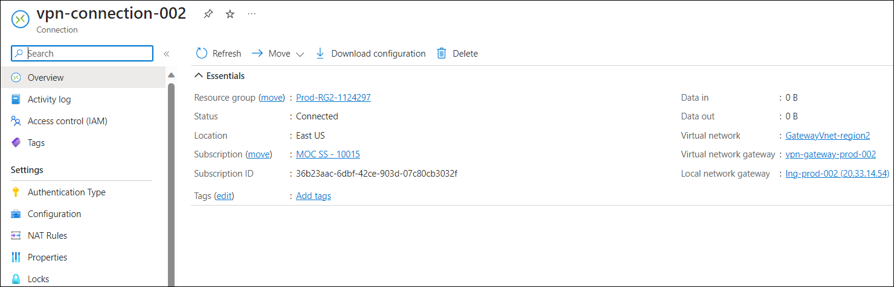

1. In the search bar of the Azure portal, type **Virtual WANs (1)**, then click on **Virtual WANs** under **Services**.

      

1. On the **Virtual WANs** page, select **vwan-prod-001**.

     

1. On the **Basics** tab of **vwan-prod-001** page, select **Hubs (1)** under the **Connectivity** section from the left navigation pane and then click on **vwan-hub-prod-002 (2)**.

      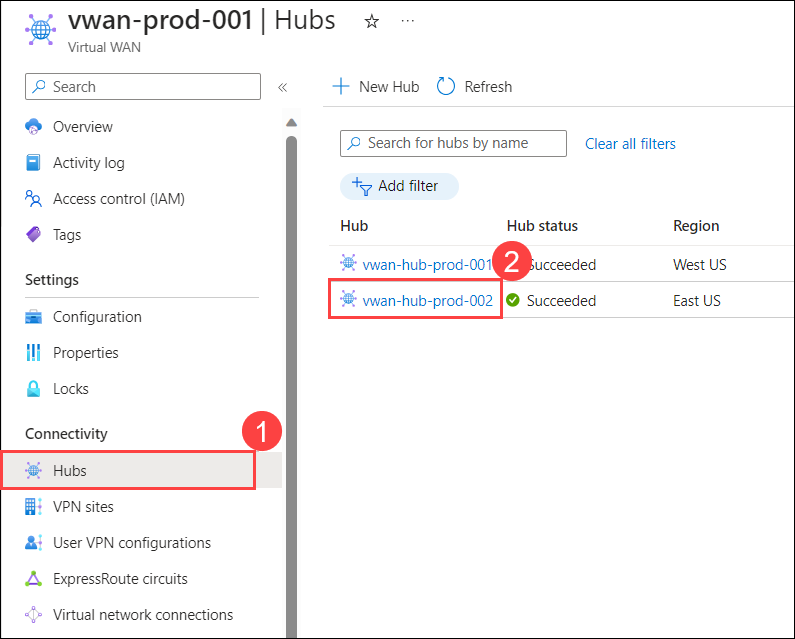

1. Under Connectivity select **VPN (site to site) (1)**. Inspect the VPN Site is successfully **Connected (2)**. 
  
   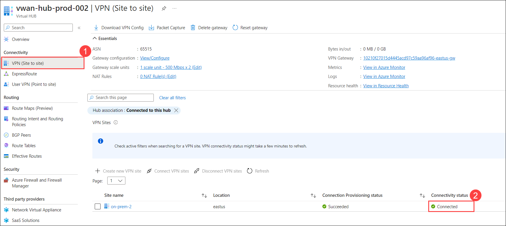

   >**Note**: VPN site may take some time to get connected,  Keep refreshing the page until the status changes to **Connected**.

## Task 3: Test inter-VM connectivity among primary and secondary region

